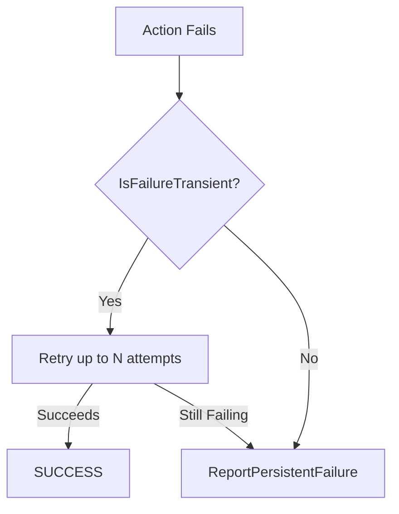

# Behavior Trees for ROS2 — Unit 5: Stochastic Behavior Trees and Automated Planning

The BTs you've built so far are fully deterministic: given the same blackboard state, a tick always produces the same result. Real robots operate under uncertainty — sensors are noisy, actions sometimes fail for reasons outside the tree's model. This unit covers ways to let BTs express that uncertainty, and how automated planning can generate or reconfigure tree structure rather than requiring every tree to be hand-authored.

The flowchart below captures the decision logic from this unit's "handling flaky actions" pattern: only transient failures get retried, so persistent ones are reported immediately instead of masked.



## Why "stochastic" nodes

A purely deterministic tree either always tries an action or never does; it can't naturally express "retry, but assume this has a 70% chance of transient failure so don't give up after one attempt" or "occasionally probe a fallback path even when the primary one has been working, in case conditions changed." Two patterns fill this gap:

- **Randomized selection**: a control-flow node that picks among children with weighted probability rather than strict left-to-right priority — useful for exploration behaviors or load-balancing between equally valid strategies.
- **Confidence-gated conditions**: a `Condition` node backed by a probabilistic sensor estimate (e.g. object-detection confidence) that returns `SUCCESS` only above a threshold, and can be tuned as more data comes in.

```cpp
class ConfidentDetection : public BT::ConditionNode
{
public:
  using BT::ConditionNode::ConditionNode;

  static BT::PortsList providedPorts()
  {
    return { BT::InputPort<double>("confidence_threshold", 0.8, "min detection confidence") };
  }

  BT::NodeStatus tick() override
  {
    double confidence = getLatestDetectionConfidence();  // from perception pipeline
    double threshold = getInput<double>("confidence_threshold").value();
    return confidence >= threshold ? BT::NodeStatus::SUCCESS : BT::NodeStatus::FAILURE;
  }
};
```

Wrapping this in a `Retry` decorator with a bounded attempt count gives you graceful degradation: try a few times as the robot repositions for a better view, then fall back rather than looping forever.

## Handling flaky actions without masking real failures

A common anti-pattern is wrapping every action in an unconditional `Retry` "just in case." This hides genuine failures (a truly unreachable goal will simply retry N times before eventually failing anyway, wasting time) and makes debugging harder. A better pattern distinguishes *transient* failures (network hiccup, momentary occlusion) from *persistent* ones (goal genuinely unreachable) by inspecting the failure reason on the blackboard and only retrying the transient category:

```xml
<Fallback>
  <Sequence>
    <IsFailureTransient failure_code="{last_error}"/>
    <Retry num_attempts="3">
      <MoveToGoal goal="{target}"/>
    </Retry>
  </Sequence>
  <ReportPersistentFailure/>
</Fallback>
```

## Automated planning feeding into Behavior Trees

Hand-authoring a tree works well when the task structure is known in advance. When the set of subtasks or their ordering needs to be *computed* per situation (e.g. a warehouse robot given an arbitrary list of items to fetch in an unknown order), a classical planner (PDDL-style, or a task-and-motion planner) can generate a plan — a sequence of high-level actions — which is then compiled into a BT structure at runtime rather than written by hand.

The typical architecture is: planner produces a totally ordered (or partially ordered) action sequence → a translation layer converts that sequence into a `Sequence`/`Fallback` skeleton with each planned action mapped to an existing registered BT node → the resulting tree is ticked exactly like a hand-written one. This keeps the execution layer (the tree, with its reactivity and interruption handling) separate from the deliberation layer (the planner, which only needs to reason about *what* to do, not *how* to robustly execute it tick by tick).

This is also the conceptual link between BTs and behavior-planning research: the BT is the *reactive executor*, and the planner is the *deliberative* component that decides the tree's shape. You don't need to implement a full PDDL planner for this course — the goal is to recognize the boundary and be able to reason about which side of it a given design decision belongs on.

## Try it yourself

Extend the "fetch a coffee mug" tree from Units 2-4 with a confidence-gated detection condition (threshold as an input port) wrapped in a bounded retry, and add a `IsFailureTransient`-style branch so a genuinely missing mug reports failure immediately instead of retrying blindly. Then write two or three sentences describing how you would restructure this if, instead of one mug, the robot were given an arbitrary shopping list and had to plan an order to fetch multiple items.
