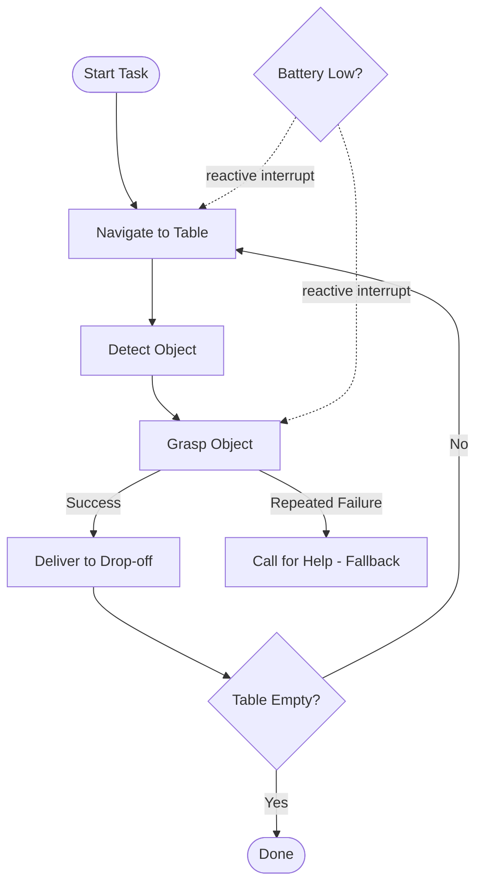

# Behavior Trees for ROS2 — Unit 6: Final Project

This unit consolidates everything from Units 1-5 into one original piece of work: designing, implementing, and testing a complete Behavior Tree for a ROS2 robot task of your choosing. There's no single "correct" tree — the goal is to demonstrate deliberate use of the design principles you've learned, not to reproduce a reference solution.

The flowchart below sketches the "tidy the table" suggested scope, showing how the required happy path, fallback, reactive interrupt, and repeat loop fit together.

## Project brief

Design a BT-driven behavior for a mobile manipulator (real or simulated) performing a task with at least these characteristics:

1. **A primary happy path** with at least three sequential steps (e.g. navigate → detect → grasp → deliver).
2. **At least one genuine fallback**, not just a retry — a materially different strategy when the primary approach fails (e.g. "ask for help" or "try an alternate object" rather than just repeating the same action).
3. **At least one reactive interrupt** — a condition (battery, obstacle, safety stop) that must be able to abort an in-progress action, using `ReactiveSequence` or `Parallel` as covered in Unit 3.
4. **At least one custom node wrapping a ROS2 action, service, or topic**, following the `RosActionNode`/`RosServiceNode` pattern from Unit 4.
5. **Blackboard data flow** between at least two nodes (Unit 3), with ports correctly typed and documented.

## Suggested scope if you need a concrete starting point

If you'd rather not invent a task from scratch, "tidy the table" is a good default: navigate to a table, detect any object left on it, pick it up, carry it to a drop-off zone, and repeat until the table is empty or a maximum number of attempts is reached — with a battery-check interrupt and a "call for help" fallback if grasping repeatedly fails on the same object.

## Implementation checklist

- Write the tree as XML (`BTCPP_format="4"`), organized into at least two subtrees so the top level reads as a short, readable sequence of named phases.
- Implement or stub every custom node class in C++, including correct `providedPorts()` declarations.
- Write a small `main()` (or a test harness) that registers all nodes with a `BT::BehaviorTreeFactory`, loads the XML, and ticks it — this can run against stubbed/simulated action servers if you don't have real hardware or a full simulation available.
- Add at least one unit test that ticks a single subtree in isolation with a mocked blackboard input, verifying it returns the status you expect for both a success case and a failure case.
- If you have Groot2 available, capture (or at least describe) what the live tree view shows during a run — which nodes highlight as `RUNNING`, and how the tree recovers when you force one of the fallback branches.

## Self-review questions

Before considering the project done, answer these honestly:

- If I added a brand-new failure mode tomorrow (e.g. "gripper jams"), could I add it by inserting one new branch, or would it require rewiring transitions all over the tree? (This is the FSM-vs-BT test from Unit 1 — if the answer is "rewiring," the tree isn't structured well yet.)
- Does every blackboard key have an obvious single writer and a small number of readers, or is data flowing in ways that would confuse a teammate reading the XML cold?
- Does the top-level tree, read purely as XML with no comments, read like a sentence describing the task in priority order?

## Try it yourself

Build the project described above (or your own equivalent scope), then write a short design note — 4-6 sentences — explaining one specific decision where you chose a `Fallback` over a `Retry` decorator (or vice versa), and why the alternative would have been worse for your specific task. This is the single design judgment call this whole course has been building toward.
