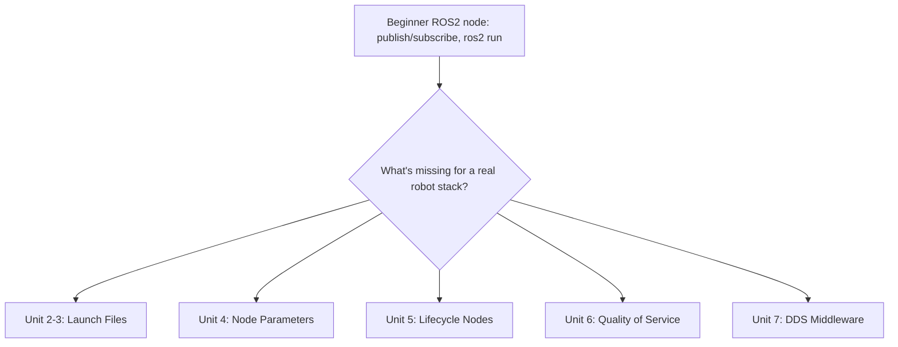

# Intermediate ROS2 (C++) — Unit 1: Course Introduction

This unit sets expectations before you dive in: what the course adds on top of a first ROS 2 course, a small taste of the kind of thing you'll be able to build by the end, and what you need already installed and understood to follow along comfortably.

The diagram below shows how this course extends a basic beginner-level node with the five areas of "production-grade machinery" it covers.



## What this course covers

A beginner ROS 2 course teaches you to write a node, publish and subscribe, and maybe call a service. This course is about the machinery that makes those nodes production-grade: launch files that scale past a single `ros2 run`, parameters that let you reconfigure a node without recompiling it, node lifecycles that let a system bring hardware up and down safely, Quality of Service settings that make communication reliable (or intentionally lossy) over real networks, and the DDS middleware that actually implements all of it under the hood. None of these topics are optional extras in a real robot stack — they show up in almost every non-trivial ROS 2 package, including Nav2 and MoveIt.

## Demo: controlling a robot's speed with a parameter

Here's the shape of what "parameters" buys you. Imagine a node that publishes `geometry_msgs/Twist` commands to drive a robot, with a `max_speed` parameter instead of a hardcoded constant:

```cpp
class SpeedController : public rclcpp::Node
{
public:
  SpeedController() : Node("speed_controller")
  {
    this->declare_parameter("max_speed", 0.5);
    timer_ = this->create_wall_timer(
      std::chrono::milliseconds(100),
      std::bind(&SpeedController::publish_cmd, this));
    pub_ = this->create_publisher<geometry_msgs::msg::Twist>("cmd_vel", 10);
  }

private:
  void publish_cmd()
  {
    auto msg = geometry_msgs::msg::Twist();
    msg.linear.x = this->get_parameter("max_speed").as_double();
    pub_->publish(msg);
  }
  rclcpp::TimerBase::SharedPtr timer_;
  rclcpp::Publisher<geometry_msgs::msg::Twist>::SharedPtr pub_;
};
```

Once this is running, you can change the robot's speed live, from another terminal, with no restart and no rebuild:

```bash
ros2 param set /speed_controller max_speed 1.2
```

That single command — and the plumbing that makes it work — is what Unit 4 covers in depth. The rest of the course builds out the surrounding tooling (launch files, lifecycle, QoS, DDS) that turns a demo like this into something you'd actually trust on a real robot.

## Skills you'll build

By the end of this course you should be able to: compose multi-node systems out of nested, reusable launch files written in Python, XML, or YAML; declare and validate node parameters, load them from YAML, and react to changes at runtime via callbacks; structure a node as a managed lifecycle node with explicit configure/activate/deactivate states; reason about QoS policies well enough to diagnose "why aren't my topics connecting"; and inspect and switch the DDS implementation your ROS 2 install is using.

## What you should already know

This is not a "learn to program" or "learn ROS 2 from zero" course. You should be comfortable writing and building a `rclcpp`-based C++ package with `colcon`, know your way around topics, services, and a basic `ros2 run`/`ros2 launch` workflow, and be at ease reading modern C++ (smart pointers, lambdas, templates at a basic level). If any of that feels shaky, a first ROS 2 course is worth revisiting before continuing here.

## Try it yourself

Build a minimal `rclcpp` node with one `declare_parameter` call and one timer-driven publisher, run it, and use `ros2 param list` and `ros2 param set` from a second terminal to change its behavior without restarting it. Note down what happens and what questions it raises — you'll answer most of them by the end of Unit 4.
