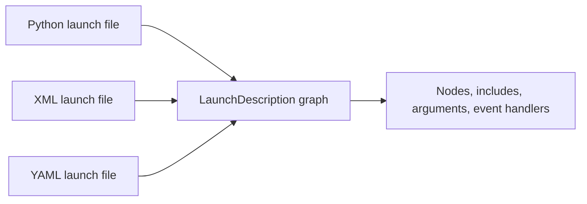

# Intermediate ROS2 (C++) — Unit 3: XML and YAML Launch Files

ROS 2 launch files don't have to be Python. This unit looks at the XML and YAML front ends, when each one is a better fit than Python, and how the same launch description looks across all three.

The diagram below shows how all three front ends parse down into the same internal launch graph, which is why they can be mixed and included from one another.



## Three ways to write a launch file

Under the hood, every launch file — Python, XML, or YAML — is parsed into the same internal `LaunchDescription` graph of actions (nodes, includes, arguments, event handlers). Python is the most expressive front end since it's a real programming language: conditionals, loops, and helper functions are all available. XML and YAML are declarative, restricted subsets aimed at the common case — starting nodes, remapping topics, setting parameters — without needing to read Python to understand what a launch file does. Which one a project uses is often a house style choice rather than a technical requirement; being able to read all three is what matters, since you will encounter all three in other people's packages.

## Python launch files, as a baseline

You've already seen the Python form:

```python
from launch import LaunchDescription
from launch_ros.actions import Node

def generate_launch_description():
    return LaunchDescription([
        Node(
            package='my_robot_driver',
            executable='driver_node',
            name='driver',
            parameters=[{'port': '/dev/ttyUSB0'}],
            remappings=[('scan', 'front_scan')],
        ),
    ])
```

## XML launch files

The same launch description in XML reads closer to a configuration file than to code:

```xml
<launch>
  <node pkg="my_robot_driver" exec="driver_node" name="driver">
    <param name="port" value="/dev/ttyUSB0"/>
    <remap from="scan" to="front_scan"/>
  </node>
</launch>
```

Run it exactly the same way as a Python launch file — the `ros2 launch` command dispatches on file extension:

```bash
ros2 launch my_robot_driver driver.launch.xml
```

XML supports `<include>`, `<arg>`, and `<let>` (for local variables) as direct analogs of Python's `IncludeLaunchDescription`, `DeclareLaunchArgument`, and plain variables, so the nesting patterns from Unit 2 carry over unchanged.

## YAML launch files

YAML drops the tag syntax in favor of a plain data structure, which some people find easier to read and diff in version control:

```yaml
launch:
  - node:
      pkg: my_robot_driver
      exec: driver_node
      name: driver
      param:
        - name: port
          value: /dev/ttyUSB0
      remap:
        - from: scan
          to: front_scan
```

```bash
ros2 launch my_robot_driver driver.launch.yaml
```

## Choosing between them

Reach for Python when the launch logic needs real computation — conditionally including a subsystem based on a launch argument, building a node list from a loop, or reading an external file to decide what to start. Reach for XML or YAML when the launch file is fundamentally a static list of nodes and parameters and you'd rather it read like configuration than like code; this also makes such files easier to generate or edit from non-Python tooling. Mixing front ends across one project is fine — an XML file can `<include>` a Python one and vice versa, since they all compile down to the same launch graph.

## Try it yourself

Take the launch file you built in Unit 2's exercise and rewrite the leaf `sensor.launch.py` as both `sensor.launch.xml` and `sensor.launch.yaml`. Point `bringup.launch.py`'s `IncludeLaunchDescription` at each version in turn (swap the `PythonLaunchDescriptionSource` for `XMLLaunchDescriptionSource` / `YAMLLaunchDescriptionSource`) and confirm the system behaves identically regardless of which front end the included file uses.
