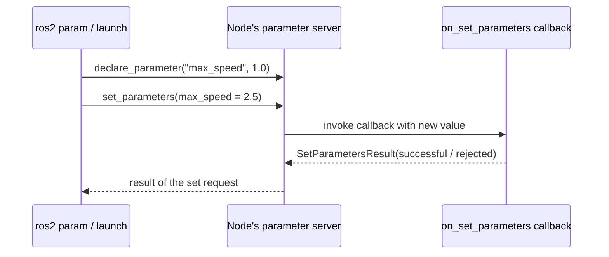

# Intermediate ROS2 (C++) — Unit 4: Node Parameters

Parameters are how a ROS 2 node exposes tunable state without hardcoding it or wiring up a bespoke service. This unit covers how they work, how to declare and read them in C++, how to manage them from the outside, and how to react when they change at runtime.

The sequence diagram below shows what happens when an external tool sets a parameter on a node that has a validation callback registered.



## How parameters work in ROS 2

Every node has its own parameter server built into it — unlike ROS 1, where a single global parameter server held everything, ROS 2 parameters are local to the node that declared them and are exposed over a small set of standard services (`list_parameters`, `get_parameters`, `set_parameters`, `describe_parameters`) that any other node or CLI tool can call. A parameter must be declared, with a name, a default value, and (optionally) a `ParameterDescriptor` describing its type and constraints, before it can be get or set — reading an undeclared parameter is an error, which catches typos early.

## A minimal parameter node

```cpp
#include "rclcpp/rclcpp.hpp"

class ParamDemo : public rclcpp::Node
{
public:
  ParamDemo() : Node("param_demo")
  {
    this->declare_parameter("robot_name", "unnamed");
    this->declare_parameter("max_speed", 1.0);

    std::string name = this->get_parameter("robot_name").as_string();
    double speed = this->get_parameter("max_speed").as_double();
    RCLCPP_INFO(this->get_logger(), "robot_name=%s max_speed=%.2f", name.c_str(), speed);
  }
};

int main(int argc, char ** argv)
{
  rclcpp::init(argc, argv);
  rclcpp::spin(std::make_shared<ParamDemo>());
  rclcpp::shutdown();
  return 0;
}
```

Build and run it, then work with it from another terminal — this is the same node the CLI examples below operate on.

## Interacting with parameters from the command line

```bash
ros2 param list /param_demo
ros2 param get /param_demo max_speed
ros2 param set /param_demo max_speed 2.5
ros2 param describe /param_demo max_speed
```

`set` only works at runtime on an already-declared parameter of matching type; it will not create new parameters or silently change a `double` into a `string`.

## Loading and dumping parameters from YAML

Rather than setting parameters one at a time, dump the current state to a file and reload it later:

```bash
ros2 param dump /param_demo > param_demo.yaml
ros2 param load /param_demo param_demo.yaml
```

The dumped file follows a simple structure you'll also use directly in launch files:

```yaml
param_demo:
  ros__parameters:
    robot_name: "rover1"
    max_speed: 2.5
```

## Setting parameters via the command line on node startup

`ros2 run` and `ros2 launch` both accept an initial parameter file (or inline overrides) so a node starts already configured, without a separate `set` call after the fact:

```bash
ros2 run my_pkg param_demo --ros-args --params-file param_demo.yaml
ros2 run my_pkg param_demo --ros-args -p max_speed:=3.0
```

In a Python launch file, the equivalent is `Node(..., parameters=[os.path.join(pkg_share, 'config', 'param_demo.yaml')])`.

## Parameter callbacks

Reading a parameter once at startup misses later changes. Register a callback to react live:

```cpp
this->declare_parameter("max_speed", 1.0);
param_callback_handle_ = this->add_on_set_parameters_callback(
  [this](const std::vector<rclcpp::Parameter> & params) {
    rcl_interfaces::msg::SetParametersResult result;
    result.successful = true;
    for (const auto & p : params) {
      if (p.get_name() == "max_speed" && p.as_double() < 0.0) {
        result.successful = false;
        result.reason = "max_speed must be non-negative";
      }
    }
    return result;
  });
```

The callback runs synchronously before the change is accepted, so it can also validate and reject a bad value — this is the mechanism behind the constraints you saw in `ros2 param describe`.

## Try it yourself

Extend the `ParamDemo` node above with a `add_on_set_parameters_callback` that rejects any `robot_name` shorter than 3 characters, and confirm with `ros2 param set /param_demo robot_name ab` that the set is refused while `ros2 param set /param_demo robot_name rover1` succeeds.
