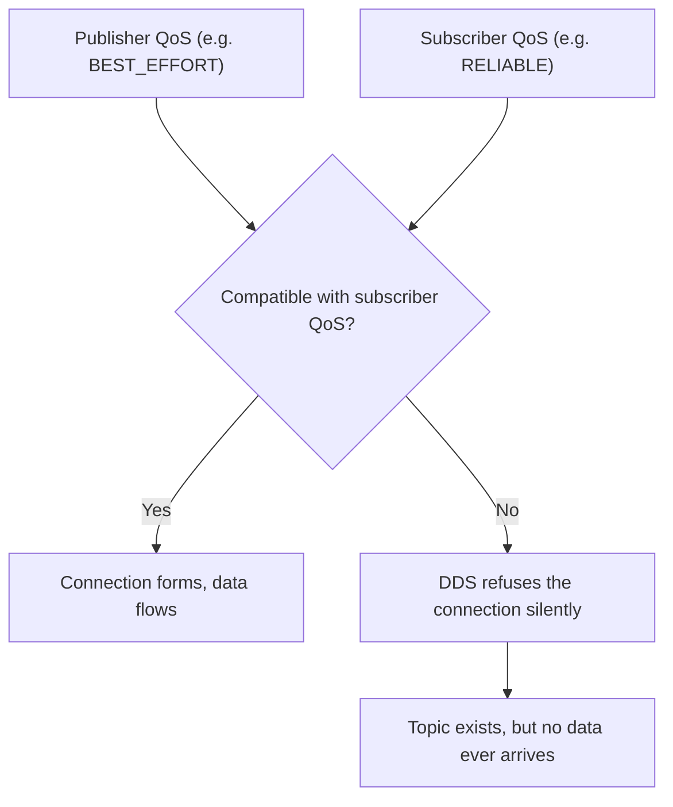

# Intermediate ROS2 (C++) — Unit 6: Quality of Service

"Why is my subscriber not receiving anything, even though the publisher is clearly running?" is one of the most common ROS 2 debugging questions, and the answer is very often Quality of Service (QoS). This unit covers what QoS is, the individual policies that matter most, how mismatches break communication, and how QoS interacts with recording.

The flowchart below shows the compatibility check DDS performs between a publisher's and a subscriber's QoS settings, and why a mismatch fails silently instead of raising an error.



## What QoS is and why it matters

ROS 2 communication is built on DDS, which was designed for distributed real-time systems where you often need to trade reliability for latency, or bound how much history a late-joining subscriber can catch up on. QoS is the set of policies, attached to every publisher and subscriber, that make those tradeoffs explicit instead of hardcoded. A camera feed doesn't need every single frame delivered — dropping old, unreplayed frames under load is preferable to falling behind — while a one-off configuration message must arrive exactly once. QoS is how you tell ROS 2 which behavior you want.

## Understanding QoS compatibility

The catch: a publisher and subscriber can only talk to each other if their QoS settings are **compatible**, not merely equal. A publisher offering `RELIABLE` delivery can serve a `RELIABLE` or `BEST_EFFORT` subscriber, but a `BEST_EFFORT` publisher cannot satisfy a subscriber that demands `RELIABLE` — DDS will refuse to form the connection at all, silently from the application's point of view. This is the single most common cause of "the topic exists but no data arrives," and it's why checking QoS is one of the first steps in that debugging path.

```bash
ros2 topic info /scan --verbose
```

This prints the QoS profile of every publisher and subscriber on a topic, which is usually enough to spot a mismatch immediately.

## Default QoS policies

Most nodes use one of ROS 2's built-in QoS profiles rather than tuning every field by hand:

```cpp
#include "rclcpp/qos.hpp"

// Common defaults
auto reliable_qos = rclcpp::QoS(10);                    // reliable, volatile, keep-last-10
auto sensor_qos = rclcpp::SensorDataQoS();               // best-effort, suited to high-rate sensor streams
auto latching_qos = rclcpp::QoS(1).transient_local();     // "latched" — new subscribers get the last value
```

- **Durability** controls whether late-joining subscribers can get data published before they subscribed. `VOLATILE` (default) means no — only new messages count. `TRANSIENT_LOCAL` keeps the last N messages so a subscriber that starts after the publisher still receives them; it's the standard choice for things like a robot's static description or a map that's published once.
- **Deadline** is the maximum expected period between messages on a topic. Set it, and DDS notifies you (via a callback) if a publisher misses it — useful for detecting a sensor that's silently stopped publishing rather than only noticing when downstream logic starts acting on stale data.
- **Lifespan** bounds how long a message stays valid after publication; once its lifespan expires, a subscriber that hasn't consumed it yet will never receive it. This prevents acting on data that's aged past usefulness, distinct from durability which is about *whether* old data is kept at all.
- **Liveliness** and its paired **lease duration** let a publisher assert "I'm still alive" on a schedule, so subscribers (or the DDS layer) can detect a publisher that has hung or crashed without relying on the data stream itself to reveal that.

## QoS and rosbag2

Recording with `ros2 bag record` captures the QoS profile of each topic alongside the data, and by default `ros2 bag play` tries to honor it on playback. A common gotcha: a bag recorded from a `TRANSIENT_LOCAL` topic (like a map) can be replayed with a compatible `TRANSIENT_LOCAL` profile so that a subscriber starting after playback begins still gets the "latched" message, exactly as it would live.

## Try it yourself

Write two small nodes: a publisher using `rclcpp::QoS(10).reliable()` and a subscriber requesting `rclcpp::QoS(10).best_effort()`. Run both and confirm — using `ros2 topic info --verbose` and the absence of received messages — that they fail to connect. Then fix it by matching the subscriber's reliability to the publisher's, and confirm data starts flowing.
