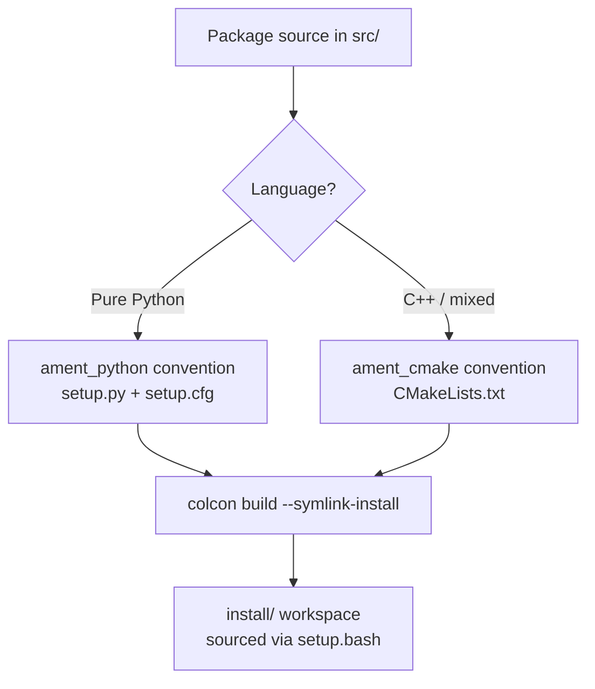

# Intermediate ROS2 — Unit 2: ROS2 Build System

ROS 2 replaced ROS 1's `catkin` with **ament** and **colcon**, and split package builds along language lines: `ament_python` for pure-Python packages and `ament_cmake` for C++ (or mixed) packages. This unit focuses on getting the Python build system right, since that's what trips up developers coming from ROS 1's more monolithic build.

The diagram below shows how a package's language determines its build convention, and how `colcon build` turns that into an installable workspace.



## colcon and ament: who does what

`colcon` is the build *tool* — it walks your workspace, figures out the dependency order between packages, and invokes the right build backend for each one. `ament` is the *convention* — a set of CMake macros and Python packaging rules that let colcon (and other tools) discover a package's type, dependencies, and installed files consistently. You almost never call `ament` directly; you interact with it through `colcon build` and through the metadata you declare in `package.xml` and `setup.py`/`CMakeLists.txt`.

```bash
colcon build --symlink-install
colcon build --packages-select my_pkg
colcon test --packages-select my_pkg
```

`--symlink-install` is the option you'll use constantly during development: instead of copying Python files and config into `install/`, it symlinks them, so editing a `.py` file takes effect immediately without a rebuild.

## Anatomy of an ament_python package

A Python package needs three files beyond your actual code: `package.xml` (ROS-level metadata and dependencies), `setup.py` (the actual Python packaging config, since ament_python packages are real Python packages under the hood), and `setup.cfg` (tells `setup.py` where to install entry points).

```python
# setup.py
from setuptools import setup

package_name = 'my_pkg'

setup(
    name=package_name,
    version='0.1.0',
    packages=[package_name],
    data_files=[
        ('share/ament_index/resource_index/packages', ['resource/' + package_name]),
        ('share/' + package_name, ['package.xml']),
        ('share/' + package_name + '/launch', ['launch/my_launch.py']),
    ],
    install_requires=['setuptools'],
    entry_points={
        'console_scripts': [
            'counter = my_pkg.counter:main',
        ],
    },
)
```

The `entry_points` block is what makes `ros2 run my_pkg counter` work — it maps the executable name to a `main()` function, replacing the ROS 1 pattern of a loose script with a shebang line. The `data_files` list is what makes non-Python assets (launch files, config, URDF) discoverable under `install/share/my_pkg/` — anything you want `ros2 launch` or `ros2 pkg prefix` to find later must be listed here explicitly.

## Dependencies in package.xml

`package.xml` declares dependencies for the tooling (`rosdep`, colcon's dependency ordering) separately from `install_requires`, which is for pip. Runtime ROS dependencies go under `<exec_depend>`, build-only ones under `<build_depend>`, and packages needed for both under `<depend>`.

```xml
<depend>rclpy</depend>
<depend>std_msgs</depend>
<test_depend>ament_flake8</test_depend>
<test_depend>ament_pep257</test_depend>
```

Getting this wrong doesn't usually break a local build (Python imports fail loudly at runtime instead), but it does break `rosdep install --from-paths src --ignore-src -y`, which is how CI and other developers bootstrap your workspace's system dependencies.

## Workspace layout and overlays

A colcon workspace has `src/` (your checked-out packages), `build/` (intermediate build artifacts), `install/` (what gets sourced), and `log/`. Sourcing `install/setup.bash` (or `.zsh`) makes packages available; sourcing it *on top of* another already-sourced workspace creates an **overlay** — packages in the overlay shadow same-named packages underneath, which is how you develop against a stable base install without touching it.

```bash
source /opt/ros/<distro>/setup.bash   # underlay
colcon build --symlink-install
source install/setup.bash              # overlay
```

## Try it yourself

Create a fresh `ament_python` package with `ros2 pkg create --build-type ament_python my_pkg`, add a trivial node with one console-script entry point, and build it with `colcon build --symlink-install`. Confirm `ros2 run my_pkg <your_entry_point>` works, then edit the node's source file (without rebuilding) and re-run it — the change should take effect immediately because of the symlink install.
