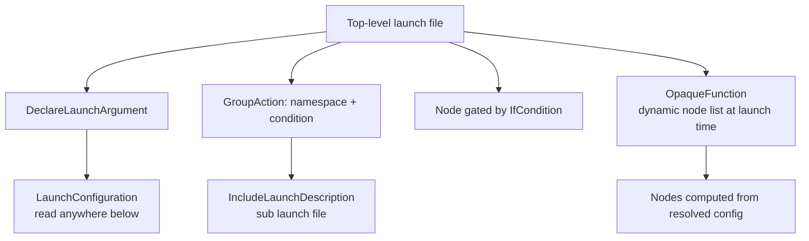

# Intermediate ROS2 — Unit 3: Advanced Launch Files

A basic launch file starts a couple of nodes with fixed arguments. A real launch file needs to be reusable across environments — different robots, different simulators, different namespaces — without being copy-pasted and hand-edited each time. This unit covers the Python launch API in depth, since it's the most expressive of the formats ROS 2 supports (XML and YAML, covered next unit, are declarative subsets of the same underlying model).

The diagram below shows how the building blocks covered in this unit compose into a single top-level launch file.



## Launch arguments and substitutions

`DeclareLaunchArgument` defines a parameter to the launch file itself, settable from the command line; `LaunchConfiguration` reads it back anywhere else in the file. Substitutions are lazily-evaluated placeholders — they aren't strings until launch actually runs, which is what lets one launch file adapt to different invocations.

```python
from launch import LaunchDescription
from launch.actions import DeclareLaunchArgument
from launch.substitutions import LaunchConfiguration
from launch_ros.actions import Node

def generate_launch_description():
    use_sim_time = LaunchConfiguration('use_sim_time')
    return LaunchDescription([
        DeclareLaunchArgument('use_sim_time', default_value='false'),
        Node(
            package='my_pkg',
            executable='counter',
            name='counter',
            parameters=[{'use_sim_time': use_sim_time}],
        ),
    ])
```

```bash
ros2 launch my_pkg counter.launch.py use_sim_time:=true
```

Other common substitutions you'll reach for: `PathJoinSubstitution` for building filesystem paths portably, `EnvironmentVariable` for reading env vars, and `PythonExpression` for small inline computations that don't warrant a helper function.

## Composing launch files

Real systems are launched by combining smaller launch files rather than writing one giant one. `IncludeLaunchDescription` pulls in another launch file (optionally passing it its own arguments); `GroupAction` applies shared settings — a namespace, a set of remappings, a condition — to everything nested inside it.

```python
from launch.actions import IncludeLaunchDescription, GroupAction
from launch.launch_description_sources import PythonLaunchDescriptionSource
from launch_ros.actions import PushRosNamespace

nav = IncludeLaunchDescription(
    PythonLaunchDescriptionSource(['/path/to/nav2_bringup/launch/bringup_launch.py']),
    launch_arguments={'use_sim_time': use_sim_time}.items(),
)

grouped = GroupAction([PushRosNamespace('robot1'), nav])
```

This is exactly how large bringup files (Nav2's, MoveIt's) are structured — a thin top-level file that includes and namespaces several sub-launch files rather than declaring every node itself.

## Conditional launching and event handlers

`IfCondition`/`UnlessCondition` gate whether an action runs at all, based on a substitution evaluating truthy. `OnProcessExit` and similar event handlers let you sequence actions — e.g., don't start a controller until a simulator process has actually exited or a node has reached a certain state — instead of guessing with a fixed delay.

```python
from launch.conditions import IfCondition
from launch.actions import RegisterEventHandler, LogInfo
from launch.event_handlers import OnProcessExit

Node(package='my_pkg', executable='rviz_node', condition=IfCondition(LaunchConfiguration('use_rviz')))

RegisterEventHandler(
    OnProcessExit(target_action=some_process, on_exit=[LogInfo(msg='simulator exited')])
)
```

## OpaqueFunction for logic that substitutions can't express

Substitutions handle string-level logic; anything more complex (branching that builds different lists of nodes, reading a file to decide what to launch) needs `OpaqueFunction`, which defers execution of a plain Python function until launch time, with full access to already-resolved `LaunchConfiguration` values.

```python
from launch.actions import OpaqueFunction

def launch_setup(context, *args, **kwargs):
    robot_name = LaunchConfiguration('robot_name').perform(context)
    nodes = [Node(package='my_pkg', executable='driver', name=f'{robot_name}_driver')]
    return nodes

LaunchDescription([DeclareLaunchArgument('robot_name'), OpaqueFunction(function=launch_setup)])
```

## Try it yourself

Write a launch file that declares a `robot_count` argument (default `1`) and, using `OpaqueFunction`, launches that many instances of a simple node, each with a unique name like `robot_0`, `robot_1`, etc. Confirm with `ros2 node list` that the right number of uniquely-named nodes come up when you pass `robot_count:=3`.
