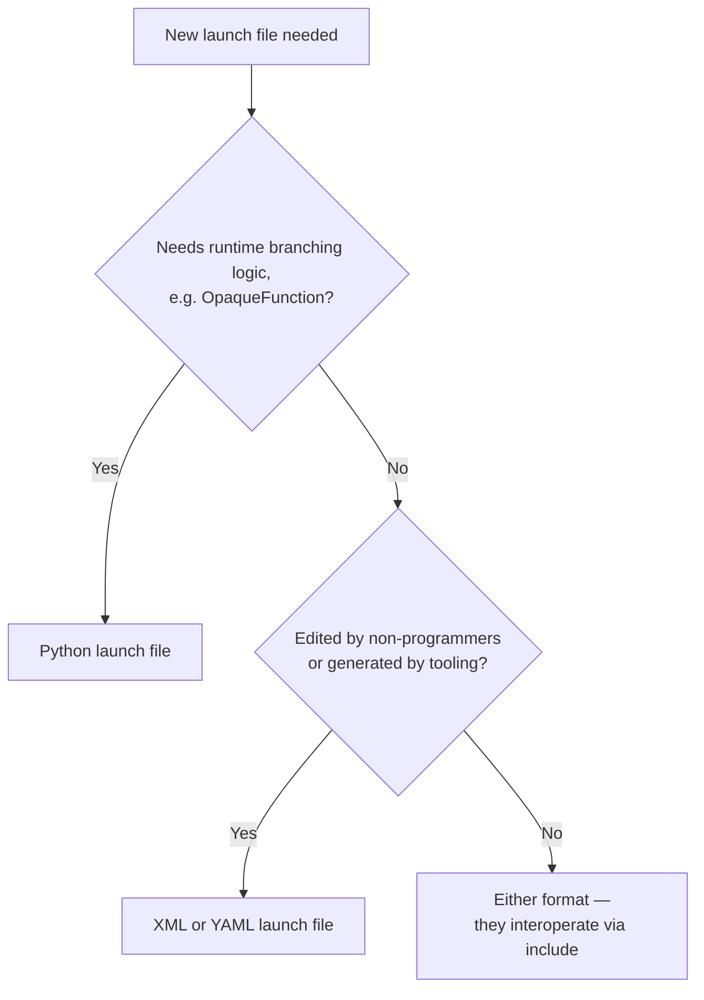

# Intermediate ROS2 — Unit 4: XML and YAML Launch Files

Python isn't the only launch format ROS 2 supports. XML and YAML launch files describe the same underlying model — nodes, arguments, substitutions, groups — but declaratively, without a general-purpose programming language available. They're common in packages ported from ROS 1 (whose `.launch` files were XML) and in configuration that's meant to be edited by non-programmers or generated by other tools.

The flowchart below captures the decision this unit builds toward: which launch format fits a given piece of a system.



## The same node, three ways

Here's the counter node from Unit 3, in XML:

```xml
<launch>
  <arg name="use_sim_time" default="false"/>
  <node pkg="my_pkg" exec="counter" name="counter">
    <param name="use_sim_time" value="$(var use_sim_time)"/>
  </node>
</launch>
```

And in YAML:

```yaml
launch:
  - arg:
      name: use_sim_time
      default: "false"
  - node:
      pkg: my_pkg
      exec: counter
      name: counter
      param:
        - name: use_sim_time
          value: "$(var use_sim_time)"
```

Both are invoked identically: `ros2 launch my_pkg counter.launch.xml` or `.launch.yaml`. The `$(var ...)` syntax is XML/YAML's equivalent of `LaunchConfiguration` — there's a small family of these substitution functions: `$(var name)`, `$(env NAME)`, `$(find-pkg-share pkg)`, and `$(eval 'expression')` for the rare inline computation.

## Includes, groups, and conditions

The composition tools from Unit 3 all have XML/YAML equivalents:

```xml
<launch>
  <group>
    <push-ros-namespace namespace="robot1"/>
    <include file="$(find-pkg-share nav2_bringup)/launch/bringup_launch.py"/>
  </group>

  <node pkg="my_pkg" exec="rviz_node" if="$(var use_rviz)"/>
</launch>
```

Note that `<include>` can pull in a Python launch file even from an XML one, and vice versa — the formats interoperate freely, so a large system can mix and match whichever format suits each piece.

## When to reach for which format

XML and YAML cannot express arbitrary branching logic the way `OpaqueFunction` can — there's no way to write "launch N nodes where N is computed from an argument" declaratively. Their advantage is that they're trivially easy to generate or template from outside Python (a build script, a robot's configuration UI, a CI job writing out a fleet manifest), and they read closer to a flat manifest than to code, which matters when non-developers need to edit them. A common real-world pattern is a Python launch file for the logic-heavy top-level bringup, including simpler XML or YAML files for the mostly-static leaf pieces.

## Try it yourself

Take the launch file you wrote in Unit 3's exercise (minus the `OpaqueFunction` part) and rewrite the single-robot version of it in both XML and YAML. Launch each with `ros2 launch` and confirm `ros2 node list` shows the same result as the Python version.
