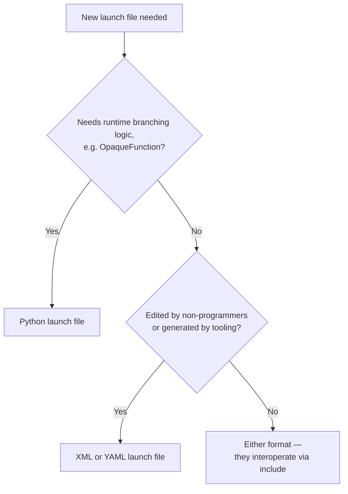

# Intermediate ROS2 — Unit 4: XML and YAML Launch Files

Python isn't the only launch format ROS 2 supports. XML and YAML launch files describe the same underlying model — nodes, arguments, substitutions, groups — but declaratively, without a general-purpose programming language available. They're common in packages ported from ROS 1 (whose `.launch` files were XML) and in configuration that's meant to be edited by non-programmers or generated by other tools. Under the hood, `ros2 launch` parses an XML or YAML file into the exact same `LaunchDescription` tree a Python file would build in code — the format is a different surface over one launch model, not a separate mechanism.

The flowchart below captures the decision this unit builds toward: which launch format fits a given piece of a system.



## The same node, three ways

Here's the counter node from Unit 3, in XML:

```xml
<launch>
  <arg name="use_sim_time" default="false"/>
  <node pkg="my_pkg" exec="counter" name="counter">
    <param name="use_sim_time" value="$(var use_sim_time)"/>
  </node>
</launch>
```

And in YAML:

```yaml
launch:
  - arg:
      name: use_sim_time
      default: "false"
  - node:
      pkg: my_pkg
      exec: counter
      name: counter
      param:
        - name: use_sim_time
          value: "$(var use_sim_time)"
```

Both are invoked identically: `ros2 launch my_pkg counter.launch.xml` or `.launch.yaml`. The `$(var ...)` syntax is XML/YAML's equivalent of `LaunchConfiguration` — there's a small family of these substitution functions: `$(var name)`, `$(env NAME)`, `$(find-pkg-share pkg)`, and `$(eval 'expression')` for the rare inline computation. There's also `<let name="..." value="..."/>` (XML) — a local variable that, unlike `<arg>`, isn't settable from the command line, useful for a computed value you want to reuse in several places without exposing it as a launch argument.

## Loading a parameters file

Passing individual `<param>` tags works for a handful of values, but real nodes are usually configured with a params YAML file (Unit 5 covers the file format in detail). XML and YAML launch files load one the same way a Python launch file does, via the node's `param` entry pointing at a file instead of a literal value:

```xml
<node pkg="my_pkg" exec="counter" name="counter">
  <param from="$(find-pkg-share my_pkg)/config/counter_params.yaml"/>
</node>
```

This is the pattern you'll see in most real bringup packages: a thin launch file that wires together nodes and namespaces, with the actual tuning values kept in a separate params file that ops or non-developers can edit without touching launch syntax at all. It also cleanly separates concerns — the launch file answers "what runs and how it's wired together," the params file answers "what values it runs with" — so a robot-specific tuning pass never touches the launch logic at all.

## Includes, groups, and conditions

The composition tools from Unit 3 all have XML/YAML equivalents:

```xml
<launch>
  <group>
    <push-ros-namespace namespace="robot1"/>
    <include file="$(find-pkg-share nav2_bringup)/launch/bringup_launch.py"/>
  </group>

  <node pkg="my_pkg" exec="rviz_node" if="$(var use_rviz)"/>
</launch>
```

`if`/`unless` attributes are the declarative equivalent of `IfCondition`/`UnlessCondition` — they take a substitution that must evaluate to `"true"` or `"false"` (as strings; there's no boolean type here). Note that `<include>` can pull in a Python launch file even from an XML one, and vice versa — the formats interoperate freely, so a large system can mix and match whichever format suits each piece. This is exactly what lets a Nav2- or MoveIt-style bringup stay mostly Python at the top while including simpler XML or YAML for static leaf pieces, or the reverse.

## When to reach for which format

XML and YAML cannot express arbitrary branching logic the way `OpaqueFunction` can — there's no way to write "launch N nodes where N is computed from an argument" declaratively; that always requires dropping into Python (or into an included Python launch file). Their advantage is that they're trivially easy to generate or template from outside Python — a build script emitting one launch file per robot in a fleet, a configuration UI writing out settings a technician edited by hand, a CI job assembling a manifest from a database — and they read closer to a flat description of "what runs" than to code, which matters when the person editing them isn't a ROS developer. A common real-world pattern is a Python launch file for the logic-heavy top-level bringup, including simpler XML or YAML files for the mostly-static leaf pieces, so the branching logic lives in exactly one place instead of being duplicated across formats.

One practical trade-off worth knowing before you commit to XML or YAML for a piece of your system: error messages from a malformed XML/YAML launch file tend to point at a line in the parsed file rather than at a Python traceback, which can be either easier or harder to debug depending on whether the mistake is a typo (easier) or a substitution that resolved to something unexpected (harder, since there's no debugger to step through). A second trade-off is verbosity for anything repetitive — spawning ten near-identical nodes in XML means writing ten near-identical `<node>` blocks by hand, where a Python file could loop over a list; if you find yourself copy-pasting the same block with only a name changed, that's usually the signal to move that piece into Python.

## Try it yourself

Take the launch file you wrote in Unit 3's exercise (minus the `OpaqueFunction` part) and rewrite the single-robot version of it in both XML and YAML. Launch each with `ros2 launch` and confirm `ros2 node list` shows the same result as the Python version. Then move one of the node's parameters into a separate `counter_params.yaml` file and load it with `<param from="..."/>` instead of an inline value, confirming `ros2 param get` still reports it correctly.
