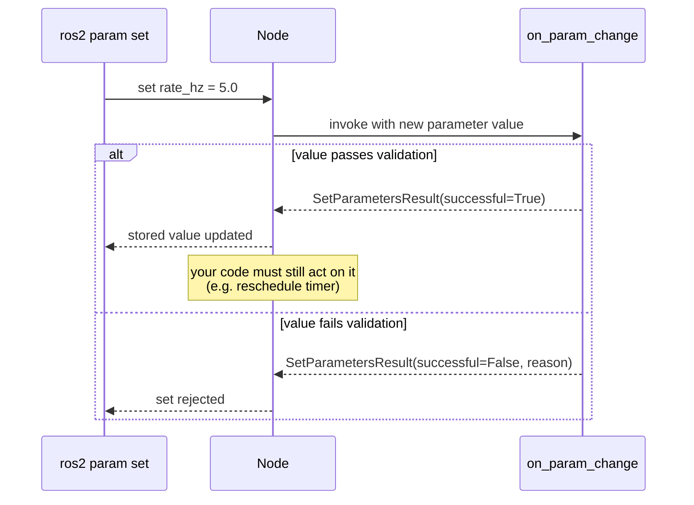

# Intermediate ROS2 — Unit 5: Node Parameters

Parameters are ROS 2's mechanism for configuring a node's behavior without hardcoding values or rebuilding — a publish rate, a topic name, a PID gain, a frame ID. This unit covers declaring, reading, setting, and reacting to parameters, plus the YAML files used to configure many nodes at once.

The sequence diagram below shows what actually happens when `ros2 param set` is used against a running node with a registered parameter callback.



## Declaring and reading parameters

Parameters must be declared before use — an undeclared parameter access raises an exception. Declaration also lets you set a default and, optionally, a descriptor with constraints (a range, a read-only flag, a description string).

```python
from rcl_interfaces.msg import ParameterDescriptor, FloatingPointRange

class Counter(Node):
    def __init__(self):
        super().__init__('counter')
        self.declare_parameter(
            'rate_hz', 2.0,
            ParameterDescriptor(
                description='Publish rate in Hz',
                floating_point_range=[FloatingPointRange(from_value=0.1, to_value=100.0)],
            ),
        )
        rate = self.get_parameter('rate_hz').value
        self.create_timer(1.0 / rate, self.tick)
```

## Setting parameters from outside the node

Parameters can be set at launch time (as seen in Units 3–4), from a YAML file, or live from the CLI:

```bash
ros2 param list /counter
ros2 param get /counter rate_hz
ros2 param set /counter rate_hz 5.0
ros2 param dump /counter > counter_params.yaml
```

A params YAML file, loaded via a launch file's `parameters=['path/to/file.yaml']` or `ros2 run` with `--ros-args --params-file`, looks like:

```yaml
counter:
  ros__parameters:
    rate_hz: 5.0
```

This file format is what makes it practical to configure dozens of parameters across several nodes for a specific robot or environment without touching any launch file — one YAML per robot, same launch files everywhere.

## Reacting to parameter changes at runtime

By default, calling `ros2 param set` on an already-running node updates the stored value but does nothing else — your code has to notice. Register a callback to validate or react to changes as they happen:

```python
from rcl_interfaces.msg import SetParametersResult

def on_param_change(self, params):
    for p in params:
        if p.name == 'rate_hz' and p.value <= 0:
            return SetParametersResult(successful=False, reason='rate_hz must be positive')
    return SetParametersResult(successful=True)

self.add_on_set_parameters_callback(self.on_param_change)
```

If you need the timer's actual period to change (not just the stored value), the callback needs to also cancel and recreate the timer — declaring a parameter does not wire it to behavior automatically; that wiring is always your code's responsibility.

## Dynamic vs. static parameters

Some parameters are only meaningful at startup (which topic to subscribe to, which hardware driver to load) — changing them live would require re-initializing half the node. Mark these read-only via the descriptor (`read_only=True`) so an accidental `ros2 param set` fails loudly instead of silently doing nothing. Reserve mutable parameters for values that genuinely make sense to tune while the node is running.

## Try it yourself

Add a `read_only` parameter (e.g. `frame_id`) and a mutable one (`rate_hz`) to a node. Confirm with `ros2 param set` that changing `frame_id` fails with a clear error, while changing `rate_hz` succeeds — then extend the parameter callback so changing `rate_hz` actually reschedules the node's timer at the new rate.
