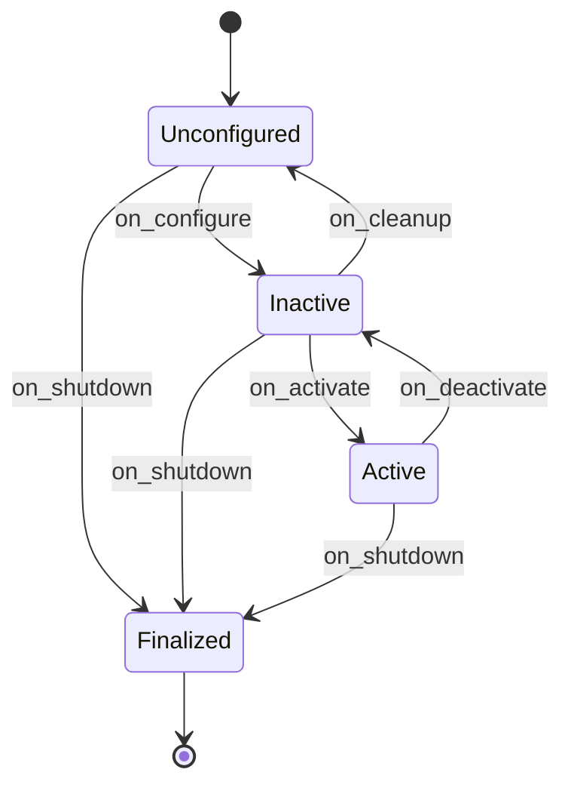

# Intermediate ROS2 — Unit 9: Lifecycle Nodes

Every node you've built so far starts doing its job the instant its process comes up — publishers publish, timers fire, as soon as `rclpy.spin` runs. Lifecycle (managed) nodes exist for the systems where that's not good enough: where you need a node to be *configured* before it's *active*, where several nodes must come up in a controlled order, or where you need to cleanly pause and resume a node's real work without killing its process. Nav2 (mentioned in Unit 1's course roadmap) is built almost entirely out of lifecycle nodes for exactly this reason.

The state diagram below shows the primary states a lifecycle node moves through and the transition callbacks that drive each change.



## The managed state machine

A lifecycle node moves through a fixed set of **primary states** — `Unconfigured`, `Inactive`, `Active`, `Finalized` — via transitions that your code hooks into: `on_configure`, `on_activate`, `on_deactivate`, `on_cleanup`, `on_shutdown`, `on_error`. Nothing happens automatically; an external caller (a lifecycle manager, or you by hand) has to trigger each transition.

```python
from rclpy.lifecycle import LifecycleNode, LifecycleState, TransitionCallbackReturn

class CounterLifecycle(LifecycleNode):
    def __init__(self):
        super().__init__('counter')

    def on_configure(self, state: LifecycleState) -> TransitionCallbackReturn:
        self.pub = self.create_lifecycle_publisher(Int32, 'count', 10)
        self.i = 0
        self.get_logger().info('configured')
        return TransitionCallbackReturn.SUCCESS

    def on_activate(self, state: LifecycleState) -> TransitionCallbackReturn:
        self.timer = self.create_timer(0.5, self.tick)
        return super().on_activate(state)

    def on_deactivate(self, state: LifecycleState) -> TransitionCallbackReturn:
        self.destroy_timer(self.timer)
        return super().on_deactivate(state)

    def tick(self):
        self.pub.publish(Int32(data=self.i))
        self.i += 1
```

The key discipline this enforces: `on_configure` allocates resources (publishers, subscriptions, parameters) but doesn't start doing work; `on_activate` is the only place actual work (timers firing, publishing) begins. This separation is exactly what lets a supervisor bring up a whole system's resources first, verify everything configured successfully, and only then flip everything to active together.

## Driving transitions from the CLI

```bash
ros2 lifecycle list /counter
ros2 lifecycle get /counter
ros2 lifecycle set /counter configure
ros2 lifecycle set /counter activate
```

`lifecycle list` shows the available transitions from the node's current state — you can't skip straight from `Unconfigured` to `Active`; you must pass through `Inactive` via `configure` first, which is the state machine enforcing the "resources exist before work starts" rule structurally rather than by convention.

## Coordinating multiple lifecycle nodes

For a real system, you don't want to `ros2 lifecycle set` half a dozen nodes by hand in the right order every time. `nav2_lifecycle_manager` (and the pattern it implements) is the standard approach: a manager node holds a list of lifecycle node names, walks them all through `configure` then `activate` in order at startup, and can walk them back through `deactivate`/`cleanup` on shutdown or on a detected fault — turning "bring the whole stack up correctly" into one service call instead of N manual steps.

## When lifecycle nodes are worth the extra ceremony

Plain nodes are simpler and are the right default for most of your own packages. Reach for lifecycle nodes when startup order genuinely matters (a controller must not activate before its hardware driver is configured), when you need runtime pause/resume without a process restart (temporarily halting a sensor driver without losing its configuration), or when you're integrating with a system — like Nav2 — that already expects its components to be managed nodes.

## Try it yourself

Convert the counter node from Unit 1 into a lifecycle node using the pattern above. Start it, then use `ros2 lifecycle set` to walk it through `configure` and `activate` by hand, confirming with `ros2 topic echo /count` that nothing publishes until after `activate`. Then `deactivate` it and confirm publishing stops without the process exiting.
