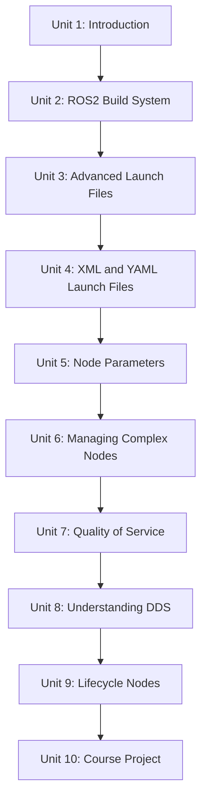

# Intermediate ROS2

This course picks up where basic ROS 2 leaves off, moving from "a node that runs" to "a node that belongs in a real system." It covers the ROS 2 build system in depth, the full range of launch-file techniques (Python, XML, and YAML), how to make nodes configurable through parameters, how to keep complex nodes responsive with multithreading and callback groups, and how ROS 2's transport actually works under the hood through Quality of Service and DDS. It closes with lifecycle (managed) nodes and a capstone project — a laser-scan-based circle detector — that draws on everything covered along the way.

The diagram below shows how each unit builds on the ones before it, from build system fundamentals through to the capstone project.

1. [Introduction](01-introduction.md) — A brief introduction to the contents of the course, with a practical demo.
2. [ROS2 Build System](02-ros2-build-system.md) — The `ament_python` build system and how colcon, ament, and package.xml fit together.
3. [Advanced Launch Files](03-advanced-launch-files.md) — Launch arguments, substitutions, composition, conditions, and `OpaqueFunction` in Python launch files.
4. [XML and YAML Launch Files](04-xml-and-yaml-launch-files.md) — Writing the same launch logic declaratively in XML and YAML.
5. [Node Parameters](05-node-parameters.md) — Declaring, reading, setting, and reacting to ROS 2 parameters, including params YAML files.
6. [Managing Complex Nodes](06-managing-complex-nodes.md) — Multithreaded executors and callback groups for nodes that must stay responsive.
7. [Quality of Service](07-quality-of-service.md) — Reliability, durability, and diagnosing QoS mismatches between publishers and subscribers.
8. [Understanding DDS](08-understanding-dds.md) — Peer-to-peer discovery, RMW implementations, and domain IDs underneath ROS 2's transport.
9. [Lifecycle Nodes](09-lifecycle-nodes.md) — Managed node states and transitions, and coordinating several lifecycle nodes together.
10. [Course Project](10-course-project.md) — Build a ROS 2 node that detects circular shapes from laser scan data.
