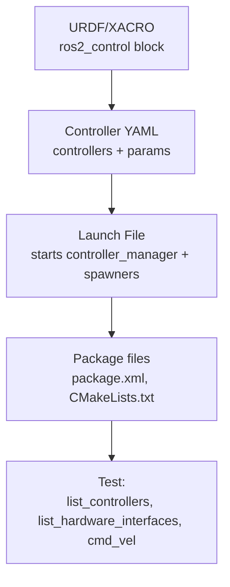

# ROS2 Control Framework — Unit 2: ROS2 Control Basics

Here you build your first complete `ros2_control` pipeline end to end: declaring hardware in your robot's description, configuring controllers in YAML, launching everything, and confirming it actually moves the robot. Every later unit assumes you can reproduce this pipeline from memory.

The diagram below shows the order the four pipeline pieces depend on each other, matching the build sequence this unit walks through.



## Anatomy of a ros2_control pipeline

A working pipeline touches four files in a robot package:

1. A **URDF/XACRO** that declares a `<ros2_control>` block describing the hardware interface plugin and the joints it exposes.
2. A **controller configuration YAML** (usually loaded as ROS parameters) that lists which controllers to instantiate and their settings.
3. A **launch file** that starts the controller manager (usually bundled with your simulator or robot driver) and spawns the configured controllers.
4. The **package** that ties these together (`package.xml`, `CMakeLists.txt` or `setup.py`) so ROS 2 tooling can find them.

Build these in order — hardware description first, then configuration, then the launch file that wires them together — because each step depends on names declared in the previous one.

## Declaring hardware in the URDF/XACRO

Inside your robot's XACRO, add a `<ros2_control>` tag alongside your existing `<link>`/`<joint>` tags. It names a hardware plugin and lists the joints with their command/state interfaces:

```xml
<ros2_control name="MyRobotSystem" type="system">
  <hardware>
    <plugin>gazebo_ros2_control/GazeboSystem</plugin>
  </hardware>
  <joint name="wheel_left_joint">
    <command_interface name="velocity"/>
    <state_interface name="position"/>
    <state_interface name="velocity"/>
  </joint>
  <joint name="wheel_right_joint">
    <command_interface name="velocity"/>
    <state_interface name="position"/>
    <state_interface name="velocity"/>
  </joint>
</ros2_control>
```

The `<plugin>` tag is what makes this portable: swap `gazebo_ros2_control/GazeboSystem` for your own custom hardware interface plugin (Unit 4) later without touching anything else in this file.

## The controller configuration YAML

Controllers are configured as ROS 2 parameters, conventionally in a `config/` directory:

```yaml
controller_manager:
  ros__parameters:
    update_rate: 100  # Hz

    joint_state_broadcaster:
      type: joint_state_broadcaster/JointStateBroadcaster

    diff_drive_controller:
      type: diff_drive_controller/DiffDriveController

diff_drive_controller:
  ros__parameters:
    left_wheel_names: ["wheel_left_joint"]
    right_wheel_names: ["wheel_right_joint"]
    wheel_separation: 0.4
    wheel_radius: 0.1
```

Every controller needs a `type` (the plugin's fully-qualified class name) under `controller_manager`, plus its own parameter block for tuning. The `joint_state_broadcaster` is a near-universal include — it publishes `/joint_states` from the state interfaces so RViz2 and `tf2` can consume it.

## Loading controllers with a launch file

The launch file starts the controller manager node with your YAML, then spawns each controller as a short-lived process that calls the controller manager's services:

```python
from launch import LaunchDescription
from launch_ros.actions import Node

def generate_launch_description():
    return LaunchDescription([
        Node(
            package="controller_manager",
            executable="spawner",
            arguments=["joint_state_broadcaster"],
        ),
        Node(
            package="controller_manager",
            executable="spawner",
            arguments=["diff_drive_controller"],
        ),
    ])
```

If you're using a simulator plugin (like `gazebo_ros2_control`), it typically starts the controller manager for you when the robot is spawned — you only add the spawner nodes above.

## Testing the pipeline

Launch your robot, then verify each layer independently:

```bash
ros2 control list_hardware_interfaces   # did the plugin claim the joints you declared?
ros2 control list_controllers           # are both controllers 'active'?
ros2 topic echo /joint_states           # is state actually flowing?
ros2 topic pub /diff_drive_controller/cmd_vel geometry_msgs/msg/Twist \
  '{linear: {x: 0.2}}' --once
```

If the robot doesn't move, work backwards through this list — a controller stuck `inactive`, or a hardware interface missing an expected joint, is the most common cause.

## Try it yourself

Take a URDF you already have (or a simple two-wheeled robot XACRO you write from scratch) and add the `<ros2_control>` block above with names matching your joints. Write a matching `diff_drive_controller` YAML, spawn both controllers, and confirm with `ros2 control list_controllers` that both reach the `active` state before publishing a `cmd_vel` command.
