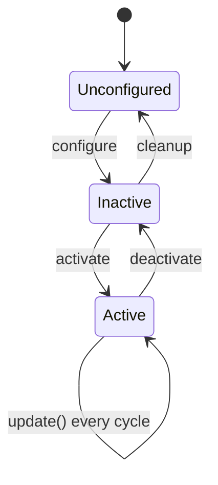

# ROS2 Control Framework — Unit 3: The Controller Manager

Now that you can bring up a working pipeline, this unit goes under the hood of the component that makes it tick: the controller manager. You'll learn what it actually does each cycle and the three ways you can interact with it — CLI tools, direct service calls, and the spawner script — so you're not limited to whatever a launch file happened to do for you.

The diagram below shows the lifecycle states the controller manager drives every controller through, and the calls (CLI, service, or spawner) that trigger each transition.



## The controller manager explained

The controller manager is a real-time-aware ROS 2 node with one job: run a fixed-rate loop that (1) reads the current state from every claimed hardware interface, (2) calls `update()` on every *active* controller in order, letting each write into the command interfaces it has claimed, and (3) writes those commands out to hardware. It also owns a **resource manager** that tracks which state/command interfaces exist and which controller currently "owns" (has claimed) each one — this is how it prevents two controllers from fighting over the same joint's command interface simultaneously.

Controllers themselves are managed as **lifecycle nodes** (`unconfigured → inactive → active`), which is why you'll see `configure` and `activate` as distinct steps rather than one big "start" action — you can load and configure a controller ahead of time, then activate it only when you're ready, and deactivate it without unloading it entirely.

## Interact with ros2_control using the command line

The `ros2 control` CLI wraps the controller manager's services in convenient subcommands you'll use constantly:

```bash
ros2 control list_hardware_interfaces      # what interfaces exist, and who owns them
ros2 control list_hardware_components      # loaded hardware plugins and their lifecycle state
ros2 control list_controllers -v           # loaded controllers, state, and claimed interfaces
ros2 control load_controller my_controller
ros2 control set_controller_state my_controller active
ros2 control switch_controllers \
  --activate my_controller --deactivate other_controller
```

`switch_controllers` is the important one for anything beyond a static setup: it atomically deactivates one controller and activates another in the same cycle, which matters when both claim the same command interface (you can't have two controllers commanding the same joint's velocity at once).

## Using service calls to interact with ros2_control

Every CLI subcommand above is a thin wrapper over a ROS 2 service the controller manager advertises. Calling them directly is useful from your own nodes/scripts, or when you need finer control than the CLI exposes:

```bash
ros2 service list | grep controller_manager
ros2 service call /controller_manager/list_controllers \
  controller_manager_msgs/srv/ListControllers
ros2 service call /controller_manager/switch_controller \
  controller_manager_msgs/srv/SwitchController \
  "{activate_controllers: ['my_controller'], deactivate_controllers: [], strictness: 1}"
```

From Python or C++ you'd create a service client for `controller_manager_msgs/srv/SwitchController` the same way you would for any other ROS 2 service — this is exactly how supervisory nodes implement things like "switch from position control to trajectory control when a new goal arrives."

## The spawner script

`ros2 run controller_manager spawner <controller_name>` is the tool launch files use to load, configure, and activate a controller in one shot, then exit. It's a convenience wrapper — not a long-running node — built on the same services above:

```bash
ros2 run controller_manager spawner diff_drive_controller \
  --controller-manager /controller_manager \
  --param-file config/diff_drive_controller.yaml
```

Useful flags: `--inactive` loads and configures but does not activate (handy when you want to activate later via `switch_controllers`), and `--controller-manager` lets you target a non-default namespace, which matters once you're running multiple robots.

## What else can the controller manager do?

Beyond spawning and switching, it also handles: reloading a controller's parameters without restarting the process, reporting per-controller update-rate and timing diagnostics (useful when debugging real-time performance), and gracefully handling a hardware interface going offline (controllers claiming its interfaces are deactivated rather than crashing the whole node).

## Try it yourself

With a pipeline from Unit 2 running, load a second instance of `joint_state_broadcaster` under a different name using `ros2 control load_controller`, leave it `inactive`, then use `ros2 control switch_controllers` to activate it while deactivating the original — watch `ros2 control list_controllers -v` before and after to confirm exactly one is active and see which interfaces each one claims.
