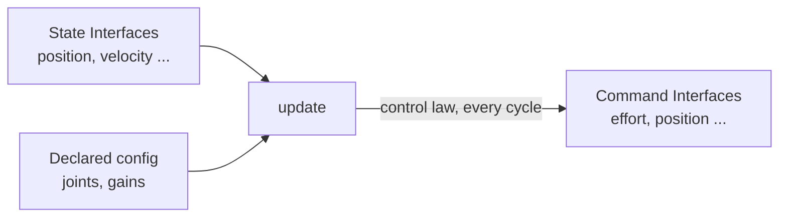

# ROS2 Control Framework — Unit 7: Create a Custom Controller

Unit 6 showed you what `ros2_controllers` already provides; this unit shows you how to write your own when none of those fit — for instance, a controller implementing a custom gait for a legged robot, a nonstandard control law, or logic that needs to read multiple sensor interfaces at once and compute something no stock controller does.

The diagram below shows the core data flow a custom controller implements inside `update()`: reading claimed state interfaces, and writing the result to claimed command interfaces.



## Your custom controller in 5 steps

Structurally this mirrors Unit 4's hardware interface recipe, because controllers are also `pluginlib`-loaded lifecycle classes: (1) create a package, (2) write a header/source pair implementing `controller_interface::ControllerInterface`, (3) declare which state/command interfaces you need, (4) implement `update()` with your control logic, (5) export as a plugin, build, and configure it via YAML.

## Header/Source Skeleton and the on_init()/on_configure() Methods

```cpp
// my_controller.hpp
#pragma once
#include "controller_interface/controller_interface.hpp"

namespace my_robot {
class MyController : public controller_interface::ControllerInterface {
public:
  controller_interface::CallbackReturn on_init() override;
  controller_interface::CallbackReturn on_configure(const rclcpp_lifecycle::State &) override;
  controller_interface::CallbackReturn on_activate(const rclcpp_lifecycle::State &) override;
  controller_interface::CallbackReturn on_deactivate(const rclcpp_lifecycle::State &) override;
  controller_interface::InterfaceConfiguration command_interface_configuration() const override;
  controller_interface::InterfaceConfiguration state_interface_configuration() const override;
  controller_interface::return_type update(const rclcpp::Time &, const rclcpp::Duration &) override;

private:
  std::vector<std::string> joint_names_;
};
}
```

`on_init()` declares any ROS parameters your controller needs (e.g., `joints`, gains); `on_configure()` reads them and validates they're usable — the same "fail fast before activation" pattern from the hardware interface unit.

## command_interface_configuration() and state_interface_configuration()

These two methods are what make a controller declarative about its dependencies: instead of grabbing interfaces by name at runtime and hoping they exist, you tell the resource manager up front exactly what you need, and it either grants the claim or refuses activation if another controller already owns one of those interfaces:

```cpp
controller_interface::InterfaceConfiguration MyController::command_interface_configuration() const
{
  controller_interface::InterfaceConfiguration config;
  config.type = controller_interface::interface_configuration_type::INDIVIDUAL;
  for (const auto & joint : joint_names_)
    config.names.push_back(joint + "/effort");
  return config;
}
```

`state_interface_configuration()` follows the same shape for the sensor interfaces you need to *read* (e.g., `position`, `velocity`) rather than command.

## get_ordered_interfaces() and matching claimed interfaces to joints

At runtime, the interfaces the controller manager hands you (in `on_activate()`'s loaned-interface lists) aren't guaranteed to be in the order you asked for. The `get_ordered_interfaces()` helper re-sorts a list of loaned interfaces to match a given joint-name order, so `update()` can safely index into `command_interfaces_[i]` and `state_interfaces_[i]` and know `i` refers to `joint_names_[i]` consistently every cycle.

## on_activate(), on_deactivate(), and the update() method

`on_activate()` is where you cache references into the (now-available) claimed interfaces using `get_ordered_interfaces()`; `on_deactivate()` releases anything that shouldn't persist. `update()` is the heart of the controller — called every control-loop cycle while active, it reads current state, runs your control law, and writes the result to the command interfaces:

```cpp
controller_interface::return_type MyController::update(
    const rclcpp::Time &, const rclcpp::Duration & period)
{
  for (size_t i = 0; i < joint_names_.size(); i++) {
    double error = target_positions_[i] - state_interfaces_[i].get_value();
    double effort = kp_ * error;  // trivial P controller as an example
    command_interfaces_[i].set_value(effort);
  }
  return controller_interface::return_type::OK;
}
```

Like `read()`/`write()` in a hardware interface, `update()` must stay fast and allocation-free — it runs on the same real-time-sensitive cycle.

## Registering, configuring, and testing your controller

Add `PLUGINLIB_EXPORT_CLASS(my_robot::MyController, controller_interface::ControllerInterface)`, a plugin description XML, and the corresponding `CMakeLists.txt`/`package.xml` entries — identical mechanics to Unit 4. Write a controller-manager YAML block naming your controller's `type`, update any simulator plugin configuration if you're testing in simulation, spawn it with `ros2 run controller_manager spawner`, and verify with `ros2 control list_controllers -v` that it claims exactly the interfaces you declared before sending it real setpoints.

## Try it yourself

Implement the trivial proportional controller shown in `update()` above for a single simulated joint with an `effort` command interface and a `position` state interface. Command a target position from a member variable (hardcode it for now), spawn the controller, and watch `ros2 topic echo /joint_states` to confirm the joint converges toward your target — then try changing `kp_` and observe how convergence speed and overshoot change.
