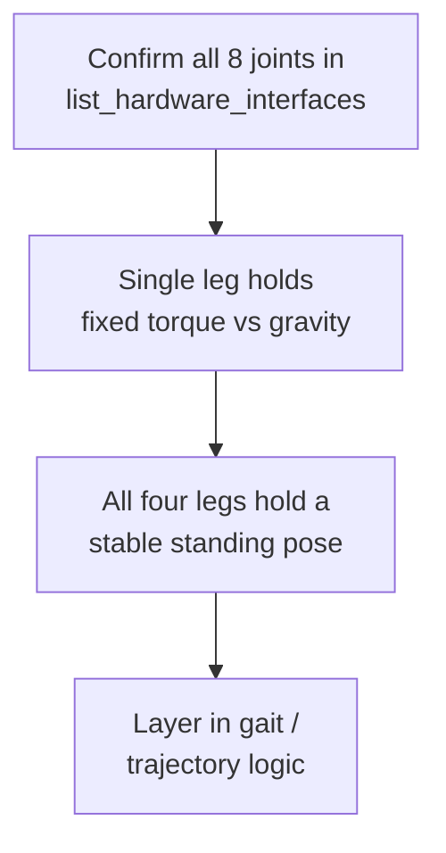

# ROS2 Control Framework — Unit 8: Final Project: Quadruped Robot Solo 8

This capstone applies everything from Units 1–7 to a single robot that stresses all of it at once: a legged platform where you must configure multiple hardware interfaces, choose the right controllers per leg, and reason about a control loop where sloppy timing has an immediate, visible consequence — the robot falls over.

The diagram below shows the incremental build order this capstone follows — each stage must be verified stable before moving to the next.



## Introducing the Solo quadruped and why legs are harder than wheels

Solo (an open-source quadruped research platform, in this case the 8-degree-of-freedom variant) has two actuated joints per leg (hip and knee), each torque-controlled — meaning your `<ros2_control>` hardware interfaces expose `effort` command interfaces, not `position`. This is the crux of what makes this project harder than the diff-drive robot from Unit 2: standing and walking require continuously computing torques from a leg model (or a whole-body controller) rather than sending occasional position setpoints, and an unstable control loop doesn't just drift — it drops the robot.

## Simulation setup and spawning/deleting the robot

Bring up Solo in your simulator of choice using its provided description package, and get comfortable spawning and deleting the model programmatically before writing any control code — you'll do this constantly while iterating:

```bash
ros2 run gazebo_ros spawn_entity.py -entity solo8 -topic robot_description
ros2 service call /delete_entity gazebo_msgs/srv/DeleteEntity "{name: 'solo8'}"
```

Being able to reset to a known standing pose quickly (rather than restarting the whole simulator) will save you significant iteration time once you're testing controller changes.

## Structuring your project

Reuse the package layout from earlier units directly: a `<ros2_control>` block per leg (or one block covering all 8 joints, if your hardware interface handles them uniformly), a controller-manager YAML choosing an `effort_controllers`-family controller (Unit 6) or a custom whole-body controller (Unit 7) per leg group, and a launch file that spawns the robot and controllers together. If the starter code for this project provides a partially-built package, read through its `<ros2_control>` declarations first — matching your controller's claimed interfaces to what's already exported is the same skill you practiced in Unit 6's exercise.

## Steps to complete the project

Work incrementally rather than attempting "standing and walking" in one leap:

1. Confirm all 8 joints appear correctly in `ros2 control list_hardware_interfaces` before writing any controller.
2. Get a single leg holding a fixed torque against gravity (a minimal "don't collapse" controller) before coordinating four legs.
3. Extend to all four legs holding a stable standing pose — this alone validates your joint-to-controller mapping is correct.
4. Only after standing is stable, layer in whatever gait or trajectory logic your project scope requires.

## Test that ros2_control works at each stage

At every stage above, re-run the same verification habit from Units 2–3: `ros2 control list_controllers -v` to confirm active state and claimed interfaces, `ros2 topic echo /joint_states` to confirm state is flowing, and small, deliberate torque commands (not your final controller) to sanity-check sign conventions — it's far easier to discover a leg joint is wired with inverted torque direction while it's twitching gently than while it's supposed to be standing.

## Expected outcome

By the end, you should have a Solo 8 configuration where all 8 joints report correct state, a controller (stock or custom) holds a stable standing pose against gravity without oscillating or drifting, and you can explain — in terms of hardware interfaces, controller manager, and controller — exactly which component is responsible for each part of that behavior. Walking gaits, if in scope for your version of the project, build on top of this stable foundation rather than replacing it.

## Try it yourself

Before touching Solo-specific code, sketch (on paper or in a text file) the `<ros2_control>` structure you'd expect for one leg: joint names, command interface type, state interface types. Then sketch which controller from Unit 6 (or a custom one from Unit 7) would claim those interfaces, and what topic or action you'd send it a setpoint through. Only after that design is on paper should you start editing the actual XACRO and YAML — the projects that go sideways in this unit are almost always the ones where interface names were never fully decided before code was written.
