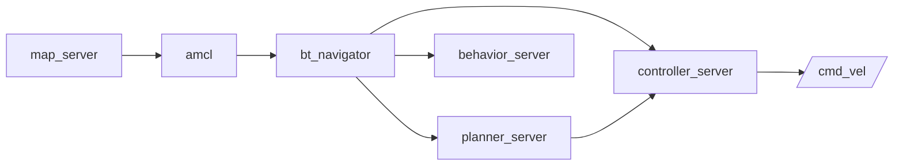

# ROS2 Navigation — Unit 1: Introduction to ROS 2 Navigation

This unit orients you to the Nav2 stack before you touch any code: what problem it solves, which pieces cooperate to solve it, and what the rest of the course will build on top of it. Everything that follows — mapping, localization, planning, obstacle avoidance, multi-robot fleets — is really just "how do these Nav2 pieces get configured and combined."

The diagram below shows how Nav2's core servers cooperate: `bt_navigator` orchestrates localization, planning, control, and recovery to turn a goal into motor commands.



## How robots navigate autonomously

Autonomous navigation is the loop of answering three questions continuously, at different rates: *Where am I?* (localization), *Where do I want to go, and how do I get there?* (planning), and *What do I do right now to make progress without hitting anything?* (control/obstacle avoidance). A robot needs a model of its environment (a map), a way to place itself inside that model (localization), a way to compute a route through it (a global planner), and a way to turn that route into safe, continuous velocity commands (a local controller). Nav2 — the navigation stack for ROS 2, successor to the ROS 1 `move_base`/`navigation` stack — is a collection of ROS 2 nodes that implement exactly this loop, each as a swappable, pluginized component talking over standard ROS 2 topics, services, and actions.

The stack is built around a handful of servers, each doing one job:
- `map_server` — serves a static map (an occupancy grid) to the rest of the system.
- A localization node (commonly `amcl`) — estimates the robot's pose within that map.
- `planner_server` — computes a global path from the robot's current pose to a goal.
- `controller_server` — follows that path, generating `cmd_vel` commands in real time while reacting to sensor data.
- `behavior_server` — provides recovery behaviors (spin, back up, wait) when the robot gets stuck.
- `bt_navigator` — orchestrates all of the above using a behavior tree, so the overall navigation logic (try to plan, retry on failure, run recoveries) is data, not hardcoded C++.
- `smoother_server` and `velocity_smoother` — optional stages that clean up paths and velocity commands.

All of these nodes are ROS 2 **lifecycle nodes**, and a **lifecycle manager** brings them up in the right order — you'll meet this properly in Unit 2.

## A hands-on taste: sending a navigation goal

You don't need to build anything yet to see the shape of the interaction. Once a Nav2-enabled robot (real or simulated) is up and its servers are active, sending it somewhere is a single action call:

```bash
ros2 action send_goal /navigate_to_pose nav2_msgs/action/NavigateToPose \
  "{pose: {header: {frame_id: 'map'}, pose: {position: {x: 2.0, y: 1.0, z: 0.0}, orientation: {w: 1.0}}}}"
```

Under the hood this one action call kicks off the entire loop described above: the behavior tree asks the planner for a path to `(2.0, 1.0)` in the `map` frame, hands that path to the controller, and monitors progress — retrying or invoking recovery behaviors if something goes wrong. You'll do this for real once you have a map and a running robot (Units 2–4); for now, just notice that the *interface* is a single, well-defined ROS 2 action, `nav2_msgs/action/NavigateToPose`, regardless of what robot or environment is underneath.

## What's ahead in this course

The remaining units follow the loop in order: Unit 2 builds a map with SLAM and introduces lifecycle nodes; Unit 3 localizes a robot inside that map with AMCL; Unit 4 covers path planning and how to send goals from the command line and from code; Unit 5 covers costmaps and obstacle avoidance, and ties every server together into one launch file; Unit 6 extends everything to fleets of robots sharing (or not sharing) a map. By the end you should be able to take an arbitrary mobile robot with a laser scanner and odometry, and get it navigating a mapped environment on its own.

## Robots and simulation

You do not need physical hardware to work through this course. Any ROS 2-compatible differential-drive or holonomic mobile robot with a 2D laser scanner (real or simulated in Gazebo or a similar simulator) and a working odometry source (wheel encoders, IMU fusion, etc.) is enough — Nav2 only cares that `/scan`, `/odom`, and TF are published correctly. If you have access to a real robot later, everything you learn transfers directly; the simulated and real workflows use the same launch files and parameter YAML.

## Try it yourself

Before moving on, install (or confirm you already have) `nav2_bringup` and a simulated robot of your choice, and run its multi-robot-capable demo simulation (many out-of-the-box Nav2 demos ship one). Once it's running, open RViz, click "Nav2 Goal" in the toolbar, and click a point on the map. Watch which topics light up in `ros2 topic list` and `ros2 node list` while the robot moves — you should see `/plan`, `/local_costmap/costmap`, and `/cmd_vel` all active. Write down the node names you see; you'll recognize every one of them by name in later units.
