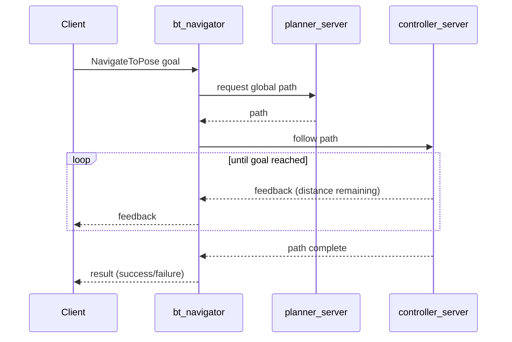

# ROS2 Navigation — Unit 4: How to Do Path Planning in ROS 2

With a map and a localized robot in place, this unit covers the part that actually gets the robot moving: computing a route (global planning), following it safely (local control), and the behaviors that keep both robust. You'll also learn the two ways — CLI and code — to actually send a robot somewhere.

The diagram below shows the action-based request/feedback/result exchange that happens every time a `NavigateToPose` goal is sent, and how it fans out to the planner and controller servers.



## Launching path planning for your robot

Path planning in Nav2 is split across two servers working together, both usually brought up via `nav2_bringup`'s navigation launch file alongside the lifecycle manager that activates them:

```bash
ros2 launch nav2_bringup navigation_launch.py
```

- `planner_server` hosts one or more **global planner** plugins (e.g. NavFn, Smac Planner) that compute a path from start to goal across the *global* costmap, ignoring dynamics — essentially "what's the shortest/best route through free space."
- `controller_server` hosts one or more **local controller** plugins (e.g. DWB, Regulated Pure Pursuit) that consume that global path and, at high frequency, compute actual `cmd_vel` velocity commands that track the path while respecting the robot's kinematics and reacting to obstacles the global plan didn't know about.

This split matters: global planning can be relatively slow and coarse because it re-runs occasionally, while local control must run fast (tens of Hz) because it's what keeps the robot from hitting things that just appeared.

## Planner parameters

Global planner behavior is configured per-plugin in your Nav2 params YAML. For the common NavFn planner, for example:

```yaml
planner_server:
  ros__parameters:
    planner_plugins: ["GridBased"]
    GridBased:
      plugin: "nav2_navfn_planner/NavfnPlanner"
      tolerance: 0.5
      use_astar: false
      allow_unknown: true
```

`tolerance` controls how close to the exact goal a plan is allowed to end (useful when the goal cell itself is marked occupied by sensor noise); `allow_unknown` controls whether the planner may route through unexplored map area, which matters a lot in partially-mapped environments.

## Controller parameters

The controller server's plugin (e.g. DWB) exposes parameters that shape *how* the robot moves along the path — not just whether it stays on it:

```yaml
controller_server:
  ros__parameters:
    controller_plugins: ["FollowPath"]
    FollowPath:
      plugin: "dwb_core::DWBLocalPlanner"
      max_vel_x: 0.5
      max_vel_theta: 1.0
      xy_goal_tolerance: 0.1
      yaw_goal_tolerance: 0.1
```

These directly trade off speed against smoothness and safety margin — a robot in a tight warehouse aisle needs much smaller velocity limits and tighter goal tolerances than one in an open warehouse floor.

## Behavior parameters

When the controller or planner can't make progress (path blocked, stuck against an obstacle), Nav2 falls back to **recovery behaviors** hosted by `behavior_server`: `Spin`, `BackUp`, `Wait`, and `DriveOnHeading` are common built-ins. The behavior tree (`bt_navigator`) decides when to invoke them — typically after a configurable number of planning or control failures — and each behavior has its own parameters (e.g. `Spin`'s rotation distance, `BackUp`'s distance and speed) that determine how aggressively the robot tries to free itself.

## Play with the parameters

Small parameter changes have outsized, very visible effects: raising `max_vel_x` too high on a robot with sluggish acceleration causes overshoot at corners; a `xy_goal_tolerance` that's too tight can cause the robot to oscillate forever trying to hit an exact point. Before writing any code, it's worth deliberately breaking things — set `max_vel_theta` very low and watch the robot struggle to turn into a corridor, then fix it — to build intuition for what each number actually controls.

## Sending a navigation goal from the command line

You already saw this in Unit 1; the full picture is that `/navigate_to_pose` is a `nav2_msgs/action/NavigateToPose` action server hosted by `bt_navigator`. The action interface gives you feedback (current distance remaining, elapsed time) and a result (success/failure) instead of a fire-and-forget message:

```bash
ros2 action send_goal /navigate_to_pose nav2_msgs/action/NavigateToPose \
  "{pose: {header: {frame_id: 'map'}, pose: {position: {x: 3.0, y: -1.0, z: 0.0}}}}" \
  --feedback
```

## Sending a navigation goal programmatically

From Python, the simplest path is Nav2's `nav2_simple_commander` API, which wraps the action client boilerplate:

```python
from nav2_simple_commander.robot_navigator import BasicNavigator
from geometry_msgs.msg import PoseStamped

nav = BasicNavigator()
nav.waitUntilNav2Active()

goal = PoseStamped()
goal.header.frame_id = 'map'
goal.pose.position.x = 3.0
goal.pose.position.y = -1.0
goal.pose.orientation.w = 1.0

nav.goToPose(goal)
while not nav.isTaskComplete():
    feedback = nav.getFeedback()
print(nav.getResult())
```

For finer control (or from C++), you can talk to the `ActionClient` for `nav2_msgs/action/NavigateToPose` directly, exactly like any other ROS 2 action client.

## Try it yourself

Send the same goal three times using three different `max_vel_x` values (e.g. 0.15, 0.5, 1.0 m/s if your robot supports it) and time how long each takes end to end. Then send a goal to a point you know is unreachable (inside a wall, or in unmapped space with `allow_unknown: false`) and observe, via `--feedback`, how Nav2 reports the failure rather than hanging forever.
