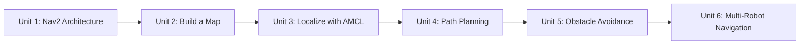

# ROS2 Navigation

This course walks through the Nav2 stack end to end — the ROS 2 navigation framework that lets a mobile robot build a map, figure out where it is inside that map, plan a route to a goal, and drive there while avoiding obstacles it never saw during mapping. Rather than treating Nav2 as a black box, each unit takes apart one stage of the pipeline (mapping, localization, planning, obstacle avoidance) so you understand what every server and parameter is actually doing, then the course closes by extending the same stack to run several robots at once.

The diagram below shows how each unit builds directly on the servers and concepts introduced in the previous one.

1. [Introduction to ROS 2 Navigation](01-introduction-to-ros-2-navigation.md) — The Nav2 architecture at a glance, a first hands-on navigation goal, and what the rest of the course covers.
2. [How to Build a Map](02-how-to-build-a-map.md) — Occupancy grid maps, SLAM with cartographer_ros, saving/serving maps, and lifecycle nodes.
3. [How to Localize the Robot in the Environment](03-how-to-localize-the-robot-in-the-environment.md) — AMCL, setting an initial pose three ways, and global localization.
4. [How to Do Path Planning in ROS 2](04-how-to-do-path-planning-in-ros-2.md) — Global planners, local controllers, recovery behaviors, and sending goals via CLI and code.
5. [How Obstacle Avoidance Happens in ROS2](05-how-obstacle-avoidance-happens-in-ros2.md) — Costmaps, global vs. local costmaps, layers, robot footprint, and assembling one navigation launch file.
6. [Multi-Robot Navigation](06-multi-robot-navigation.md) — Namespacing, per-robot mapping/localization/planning, inter-robot collision avoidance, and a fleet launch file.
