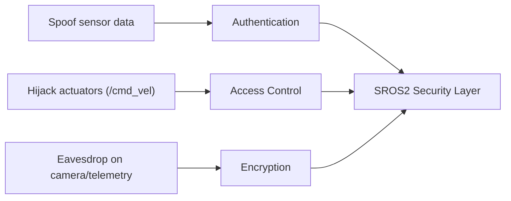

# ROS2 Security — Unit 1: Introduction to the Course

This unit sets the stage for the rest of the course: why a robotics middleware needs a security layer at all, what problem ROS 2 security actually solves, and how the pieces you're about to learn (authentication, access control, cryptography, keystores, enclaves) fit together before you touch a single command.

The diagram below maps each concrete threat from an open-by-default system to the SROS2 pillar that neutralizes it.

## Why security is not optional for a robot

Out of the box, ROS 2's default middleware (DDS, typically via an implementation like Fast DDS or Cyclone DDS) is designed for zero-configuration discovery on a local network. Any node on the same network segment can discover, subscribe to, publish on, or call services on any other node — there is no built-in authentication, no encryption, and no access control unless you turn it on. That's great for a lab bench with one robot and one laptop, and genuinely dangerous for anything that leaves the lab: a robot on a shared building network, a fleet on a warehouse Wi-Fi, or a machine reachable from the public internet.

Concretely, without security enabled, anyone who can reach the ROS domain can:
- Publish fake sensor data (spoof a LiDAR scan or odometry topic).
- Command actuators directly (publish to `/cmd_vel` and drive the robot).
- Read private data (camera feeds, location, telemetry).
- Impersonate a node entirely.

ROS 2's security layer (built on the DDS Security specification from the OMG) exists specifically to close these gaps: it adds mutual authentication between participants, encryption of traffic, and fine-grained access control over who can publish, subscribe, or call what.

## What "SROS2" actually is

You'll often see this called "SROS2" (Secure ROS 2). It isn't a separate ROS distribution — it's the `sros2` and `ros2security`-related tooling plus the underlying DDS-Security plugins, layered on top of a normal ROS 2 install. The important mental model:

- **Identity** — every participant (node) proves who it is via an X.509 certificate, issued by a Certificate Authority (CA) you control.
- **Access control** — a set of XML permission files declare exactly which topics/services/actions each identity may publish, subscribe to, or call.
- **Transport security** — once identity and permissions are established, DDS traffic itself can be encrypted so eavesdroppers on the network can't read it.

These three concerns map roughly to Authentication, Access Control, and Cryptography — the vocabulary used throughout this course.

## How the course is structured

The next two units build directly on this foundation:
- **Unit 2** walks through actually turning security on for a ROS 2 system — the environment variables and CLI steps needed before anything else works.
- **Unit 3** goes deep on the *materials* security depends on: the keystore (where keys and certificates live), enclaves (the identity a node runs as), certificates, and how to validate them — using a turtlebot3 simulation as the running example.

Because security is opt-in and disabled by default, the good news is you can't break a working, insecure setup just by reading this course — nothing changes until you deliberately enable it, which is exactly what Unit 2 covers.

## Try it yourself

Before writing any commands, sketch (on paper or in a text file) a simple threat model for a hypothetical delivery robot on a shared office Wi-Fi: list three things a malicious actor on the same network could do to it *today* with security disabled, and which of the three SROS2 pillars (authentication, access control, encryption) would stop each one. You'll refer back to this list once you enable security in Unit 2.
