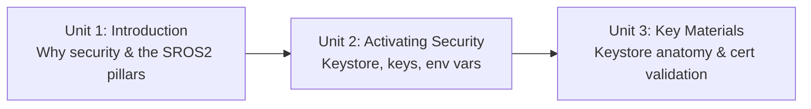

# ROS2 Security

ROS 2's DDS-based communication is open by default: any node on the network can discover, publish to, or subscribe to any other node's topics, with no authentication or encryption unless you explicitly turn it on. This course covers ROS 2's security layer (often called SROS2) end to end — enabling it, understanding the keystore/enclave/certificate model it relies on, and validating that it's actually protecting a running system, using a turtlebot3-style setup as the running example.

The diagram below shows how each unit builds on the previous one, from the conceptual "why" through to hands-on activation and finally the file-level internals.

1. [Introduction to the Course](01-introduction-to-the-course.md) — Why ROS 2 needs a security layer and how the course's pieces fit together.
2. [Activating security in ROS2](02-activating-security-in-ros2.md) — Creating a keystore and node identities, and enabling security for a live `ros2 run` session.
3. [Key Materials Explanation](03-key-materials-explanation.md) — The keystore's file layout, enclaves, and how to inspect and validate certificates by hand.
