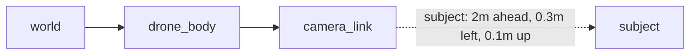

# TF ROS2 — Unit 1: Introduction to TF

Every robot with more than one moving part — a camera on a pan-tilt mount, an arm with joints, wheels that roll relative to a chassis — needs a consistent way to answer "where is X relative to Y?" This unit lays the conceptual groundwork for TF2, ROS 2's system for tracking coordinate frames and the transformations between them.

The diagram below shows the frame chain the drone example must compose to place a camera-relative observation into the world frame — exactly the chaining problem TF2 automates:



## The problem TF solves

Picture a drone with a camera that must keep a subject centered in frame. The camera reports "subject is 2m ahead, 0.3m left, 0.1m up" — but that's relative to the *camera*, not the drone's body, not the world. To fly the drone toward the subject, or to log where the subject actually is on a map, you need to chain together: camera → drone body → world. Do this by hand with matrix multiplication for every sensor and every joint and the bookkeeping becomes unmanageable and error-prone the moment a joint moves. TF2 exists to make this chaining automatic, time-aware, and queryable from any node in the system.

## Coordinate frames and reference frames

A **coordinate frame** is an origin plus three orthogonal axes (X, Y, Z) attached to some physical thing — a robot's base, a sensor, a map, a gripper's fingertip. A **transform** describes one frame's pose (translation + rotation) relative to another. TF2 models the whole robot (and its environment) as a **tree of frames**: every frame has exactly one parent, and a transform connects each child to its parent. To find the relationship between any two frames, TF2 walks up from each to their common ancestor and composes the transforms along the way — you never have to compute that chain yourself.

Typical frames you'll see in almost every ROS 2 robot: `map` (fixed world frame), `odom` (drifts slowly, tracks continuous motion), `base_link` (the robot's body), and one frame per sensor or joint (`camera_link`, `lidar_link`, `wheel_left_link`, ...).

## Conventions: the right-hand rule

ROS follows a strict convention so that transforms composed from different packages remain consistent: **right-handed coordinate systems**, with X forward, Y left, and Z up for a robot body frame (REP-103). Point your right hand's fingers from X toward Y and your thumb points along Z. Rotations are also right-handed: a positive rotation about an axis is counter-clockwise when looking from the positive end of that axis toward the origin. Getting this backwards is one of the most common sources of "my robot drives sideways in simulation" bugs, so it's worth internalizing early rather than debugging it later.

## Creating and visualizing a frame

You can publish a simple static transform from the command line to create a new frame relative to an existing one — here, a frame called `sensor_frame` offset 0.5m up and forward from `base_link`:

```bash
ros2 run tf2_ros static_transform_publisher \
  --x 0.5 --y 0 --z 0.5 --roll 0 --pitch 0 --yaw 0 \
  --frame-id base_link --child-frame-id sensor_frame
```

To see it, launch RViz2, add a **TF** display, and set the fixed frame (top-left `Global Options`) to `base_link` or `map`. Each frame appears as a small RGB axis triad (red=X, green=Y, blue=Z) with its name labeled, connected by lines showing the parent-child relationships — this is the fastest way to sanity-check that a transform you published is where you think it is.

```bash
rviz2
```

## Try it yourself

Publish two static transforms with `static_transform_publisher`: one frame `arm_base` offset from `base_link`, and a second frame `gripper` offset from `arm_base`. Open RViz2, add the TF display, and confirm you see all three frames connected in a chain. Then, using only the numbers you passed on the command line (not TF itself), work out by hand what `gripper`'s position would be relative to `base_link` — this is exactly the composition TF2 automates for you.
