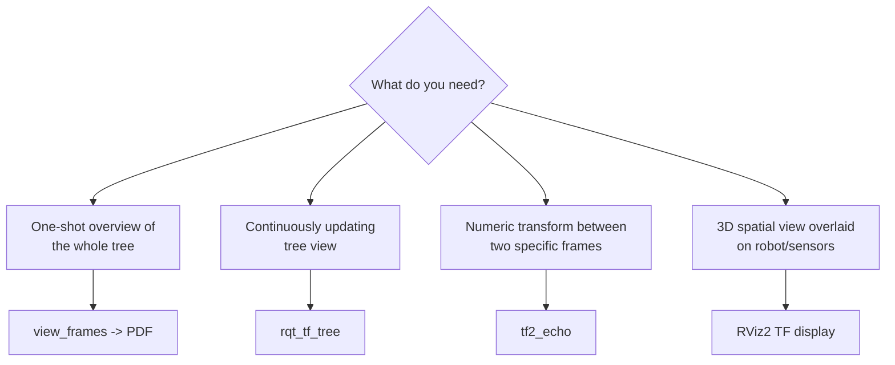

# TF ROS2 — Unit 2: TF Tools and Visualization

Knowing the theory of frames and transforms is only half the job — in practice you spend most of your TF time debugging: is this frame even being published? Is it connected to the tree I expect? Is the data fresh? This unit walks through the standard toolbox for inspecting a running TF tree.

The diagram below shows which tool to reach for depending on what you need to know about the tree:



## view_frames: a snapshot in PDF form

`view_frames` (part of `tf2_tools`) listens to `/tf` and `/tf_static` for a few seconds and generates a static diagram of the entire frame tree as a PDF — parent/child relationships, publishing rate, and how long ago each transform was last received:

```bash
ros2 run tf2_tools view_frames
# writes frames_<timestamp>.pdf into the current directory
```

This is the tool to reach for first when you inherit an unfamiliar robot stack: it answers "what frames exist and how are they wired together" in one shot, without needing RViz running. Its weakness is that it's a snapshot — if a frame is only published intermittently or a broadcaster crashes a second after you ran the command, you won't see it.

## rqt_tf_tree: the live version

`rqt_tf_tree` shows the same tree structure but continuously, as a graphical rqt plugin, updating as frames come and go:

```bash
ros2 run rqt_tf_tree rqt_tf_tree
```

Use this while actively developing a broadcaster — you can watch a new frame appear the moment your node starts publishing, and watch it turn red (indicating a stale transform) if your node crashes or slows down. It's the fastest way to confirm "is my broadcaster actually working right now."

## tf2_echo: inspecting one relationship in the terminal

Often you don't want the whole tree — you want the numeric transform between exactly two frames, updated live, without opening any GUI. `tf2_echo` prints translation and rotation (as a quaternion, RPY, and matrix) between a source and target frame every time it changes:

```bash
ros2 run tf2_ros tf2_echo base_link camera_link
```

```
At time 1721.432
- Translation: [0.100, 0.000, 0.250]
- Rotation: in Quaternion [0.000, 0.000, 0.000, 1.000]
- Rotation: in RPY (radian) [0.000, -0.000, 0.000]
```

This is invaluable for scripting and quick sanity checks — e.g. confirming a camera's mount offset matches your URDF before you trust anything downstream of it.

## Visualizing in RViz2

For spatial intuition rather than numbers, RViz2's **TF** display remains the primary tool: it renders every frame as an axis triad in 3D, live, overlaid on your robot model, sensor data, or map. Toggle "Show Names," "Show Axes," and "Marker Scale" in the display's properties to declutter a busy tree, and use "Filter" to show only frames matching a substring when you only care about part of the tree (e.g. typing `wheel` to isolate the four wheel frames on a mobile base).

```bash
rviz2
# Add -> By display type -> TF
```

## Try it yourself

With any robot description running (your own from Unit 1, or a sample robot's simulation), run `view_frames` to get the PDF overview, then open `rqt_tf_tree` side by side and watch it live. Finally, pick two non-adjacent frames from the tree (not directly parent-child) and run `tf2_echo` between them — confirm the translation values it prints are consistent with what you'd expect from summing the individual offsets along the chain connecting them.
