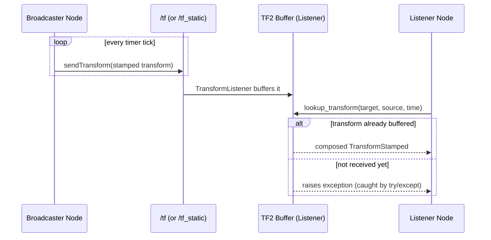

# TF ROS2 — Unit 3: Broadcast & Listen to TF Data

Viewing frames with the Unit 2 tools only works once something is publishing them. This unit covers the two halves of every TF relationship: **broadcasting** a transform onto `/tf` or `/tf_static`, and **listening** for it so a node can use it in its own logic — the pattern behind nearly every ROS 2 node that reasons about space.

The sequence below shows the broadcast/listen round trip over time, including the case where a lookup happens before any transform has arrived:



## Dynamic TF broadcaster (Python)

A frame whose pose changes over time (a moving robot, a rotating joint) is published on `/tf` by a **broadcaster** — typically inside a node that already knows the pose from odometry, joint encoders, or simulation. The core pattern with `tf2_ros`:

```python
import rclpy
from rclpy.node import Node
from tf2_ros import TransformBroadcaster
from geometry_msgs.msg import TransformStamped

class TurtleBroadcaster(Node):
    def __init__(self):
        super().__init__('turtle_tf_broadcaster')
        self.br = TransformBroadcaster(self)
        self.timer = self.create_timer(0.05, self.broadcast)

    def broadcast(self):
        t = TransformStamped()
        t.header.stamp = self.get_clock().now().to_msg()
        t.header.frame_id = 'world'
        t.child_frame_id = 'turtle1'
        t.transform.translation.x = 1.0
        t.transform.translation.y = 2.0
        t.transform.rotation.w = 1.0
        self.br.sendTransform(t)
```

Every broadcast carries a timestamp — TF2 is time-aware, so listeners can ask "where was this frame at time T," not just "where is it now," which matters for reasoning about slightly-stale sensor data.

## tf2_monitor: catching broadcaster problems

`tf2_monitor` reports the publish rate, delay, and any inconsistencies (like two nodes broadcasting conflicting parents for the same frame) for the whole tree or one chain:

```bash
ros2 run tf2_ros tf2_monitor
ros2 run tf2_ros tf2_monitor base_link turtle1   # just this chain
```

Reach for it when RViz shows a frame flickering or jumping — it will usually reveal a broadcaster publishing at a lower rate than you assumed, or a duplicate broadcaster fighting over the same child frame.

## Static transforms: three ways to publish the same thing

A **static transform** never changes (a sensor bolted to a chassis) — publishing it once on `/tf_static` (latched, so late-joining nodes still receive it) is more efficient than re-broadcasting every frame like a dynamic transform.

**Command line**, for quick one-offs or debugging:
```bash
ros2 run tf2_ros static_transform_publisher \
  --x 0.1 --y 0 --z 0.2 --roll 0 --pitch 0 --yaw 0 \
  --frame-id base_link --child-frame-id lidar_link
```

**Launch file**, for anything you want started reliably alongside the rest of your system:
```python
from launch import LaunchDescription
from launch_ros.actions import Node

def generate_launch_description():
    return LaunchDescription([
        Node(
            package='tf2_ros',
            executable='static_transform_publisher',
            arguments=['0.1', '0', '0.2', '0', '0', '0', 'base_link', 'lidar_link'],
        )
    ])
```

**Python script**, when the offset needs to be computed at runtime (e.g. read from a calibration file) rather than hard-coded:
```python
from tf2_ros import StaticTransformBroadcaster
# construct a TransformStamped as in the dynamic example, then:
StaticTransformBroadcaster(self).sendTransform(t)
```

## TF listener: consuming transforms

A **listener** queries the TF2 buffer for the transform between any two frames, letting TF2 do the tree-walking and composition for you:

```python
from tf2_ros import Buffer, TransformListener

class Follower(Node):
    def __init__(self):
        super().__init__('follower')
        self.tf_buffer = Buffer()
        self.tf_listener = TransformListener(self.tf_buffer, self)

    def get_offset(self):
        try:
            t = self.tf_buffer.lookup_transform('base_link', 'turtle1', rclpy.time.Time())
            return t.transform.translation
        except Exception as e:
            self.get_logger().warn(f'transform not available yet: {e}')
```

Note the `try/except` — early in a system's startup, or briefly after a network hiccup, the requested transform may not exist yet. Always handle that case rather than assuming `lookup_transform` succeeds.

## Try it yourself

Write a broadcaster node that publishes a frame `follower` whose X position oscillates over time (e.g. `sin(t)`), parented to `world`. Then write a separate listener node that looks up the transform from `world` to `follower` on a timer and logs the translation. Run both together and confirm the logged X value tracks the sine wave — this exercises the full broadcast/listen round trip across two independent nodes.
