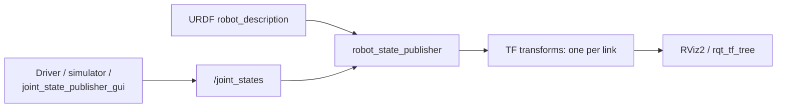

# TF ROS2 — Unit 4: Robot State Publisher

Hand-writing a broadcaster for every link of an articulated robot — an arm with six joints, say — quickly becomes unmanageable. `robot_state_publisher` solves this by reading your robot's URDF once and automatically broadcasting the entire kinematic chain's TF frames from a single stream of joint values. This unit shows how it fits together with simulation and joint state data.

The diagram below shows how `robot_state_publisher` combines the two inputs — fixed URDF geometry and live joint values — into the TF tree that RViz2 and `rqt_tf_tree` display:



## Why spawning a robot exposes the problem

Drop a multi-link robot model into a simulator without a running `robot_state_publisher` and you'll see the base frame in RViz but none of the arm/wheel/sensor links move relative to it as joints change — or they won't appear at all, because nothing is broadcasting their transforms. Spawning a robot into a Gazebo-family simulator makes this concrete: the simulator publishes raw **joint states** (position, velocity, effort per joint) on `/joint_states`, but something still has to turn "joint 3 is at 0.7 radians" into "here is the TF transform from link 3 to link 4." That translation step is exactly what `robot_state_publisher` performs.

```bash
ros2 launch <your_sim_package> spawn_robot.launch.py
ros2 topic echo /joint_states --once
```

## How robot_state_publisher works

`robot_state_publisher` takes two inputs: your robot's URDF (loaded once as the `robot_description` parameter) and the live `/joint_states` topic. From the URDF it already knows the *fixed* geometric relationship between every link and its parent joint; from `/joint_states` it gets the *current angle or displacement* of every movable joint. Combining the two, it broadcasts a full set of TF transforms — one per link — kept continuously up to date as joint values change, using forward kinematics computed straight from the URDF's kinematic tree.

```bash
ros2 run robot_state_publisher robot_state_publisher \
  --ros-args -p robot_description:="$(xacro my_robot.urdf.xacro)"
```

Or, more commonly, as a node inside a launch file so it starts alongside the rest of the robot's stack:

```python
from launch_ros.actions import Node

Node(
    package='robot_state_publisher',
    executable='robot_state_publisher',
    parameters=[{'robot_description': robot_description_content}],
)
```

Note what `robot_state_publisher` does **not** do: it doesn't move any joints or generate `/joint_states` itself. On real hardware that topic comes from your driver reading encoders; in simulation it comes from the physics engine; for a robot with no moving joints at all, a `joint_state_publisher` (or its GUI variant, useful for manually dragging sliders during development) can supply placeholder values.

```bash
ros2 run joint_state_publisher_gui joint_state_publisher_gui
```

## Putting it together

The full pipeline for an articulated robot's TF tree is: URDF → `robot_state_publisher` (static geometry + `/joint_states` → link transforms) alongside any sensor/base broadcasters from Unit 3 (dynamic, e.g. `map`→`odom`→`base_link`) → the complete tree visible in `rqt_tf_tree` or RViz2. Verify it end-to-end by checking that moving a joint (via the GUI, a real driver, or simulated motion) visibly moves the corresponding link's frame in RViz2 in real time — if it doesn't, check that `robot_description` was actually loaded (a common gap is forgetting to pass it as a parameter) and that `/joint_states` is actually being published with the joint names your URDF expects.

## Try it yourself

Take a URDF with at least one revolute joint (your Unit 1 frames, extended with a `<joint type="revolute">`, or any sample multi-link URDF), launch `robot_state_publisher` with it, and run `joint_state_publisher_gui` alongside it. Open RViz2 with the TF display on, drag the joint's slider in the GUI, and confirm the child link's frame rotates accordingly. Then run `tf2_echo` between the parent and child link frames while dragging the slider and watch the printed rotation values change live.
