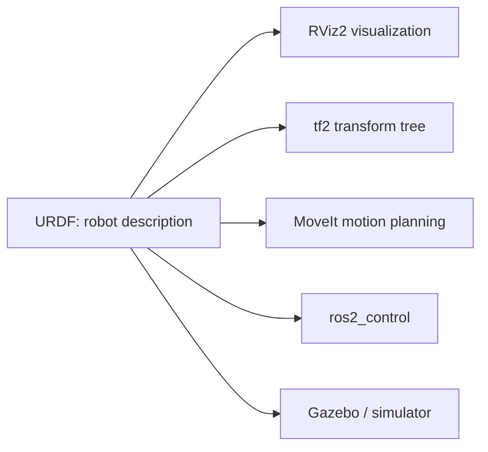

# URDF for Robot Modeling in ROS2 — Unit 1: Introduction

This unit sets expectations before you touch a single XML tag: why robots need a machine-readable body description at all, what this course will build up toward, and what you should already have installed and know.

The diagram below shows why a URDF matters: it is the single source of truth that every one of these separate ROS2 tools reads from.

## Why do you need URDFs?

Every piece of ROS2 tooling that reasons about a robot's physical shape — RViz2 for visualization, `tf2` for tracking coordinate frames, MoveIt for motion planning, `ros2_control` for driving joints, and Gazebo (or any other simulator) for physics — needs a common, structured answer to the question "what does this robot actually look like, and how are its parts connected?" URDF (Unified Robot Description Format) is that common answer: an XML dialect that describes a robot as a tree of rigid **links** connected by **joints**, each with a size, shape, mass, and range of motion.

Without a URDF, every tool would need its own bespoke description of the robot, and none of them would agree with each other. With a URDF, you write the robot's structure once, and RViz2, simulators, and planners all consume the same source of truth. This is the same reason a CAD assembly or a skeletal rig is useful outside of URDF: define the joints and links once, then reuse that model for visualization, physics, and motion planning without redefining geometry three separate times.

## Course outline and how the units build on each other

The course moves from concepts to a working simulated robot in five broad strokes:

1. Build a static visual model (links, joints, visualization in RViz2).
2. Complete a small hands-on project: model a two-wheeled robot from scratch.
3. Bring that model into a physics simulator (Gazebo Sim) so it can fall, collide, and be spawned.
4. Make it move — joint state publishers, differential drive, and `ros2_control` plugins.
5. Add sensors (lidar, camera, IMU) and, finally, learn to export a URDF straight from CAD software (Onshape) instead of hand-writing every dimension.

Along the way you'll pick up Xacro, the macro/templating layer that keeps large URDF files maintainable instead of becoming a wall of repeated XML.

## What this course is not

This course teaches robot *description*, not robot *behavior*. You will not cover motion planning algorithms, SLAM, or perception pipelines here — those depend on having a correct URDF but are separate skills covered elsewhere. Similarly, while you'll drive joints and add sensors in later units, the emphasis stays on getting the model itself right (correct frames, correct physics properties, correct sensor placement) rather than on the control or perception code that consumes it.

## Requirements

Before starting, you should have:

- A working ROS2 installation (any currently supported distribution) with `rviz2` and a simulator such as Gazebo Sim installed or installable.
- Comfort with the ROS2 command-line tools (`ros2 launch`, `ros2 topic`, `ros2 run`) and basic package structure (`package.xml`, `setup.py`/`CMakeLists.txt`).
- Basic XML literacy — you don't need to be an expert, but you should be comfortable reading nested tags and attributes.
- No prior robotics-specific knowledge is assumed; concepts like "link," "joint," and "TF frame" are introduced from first principles in the next unit.

## Try it yourself

Before writing any URDF, sketch on paper the link-and-joint tree for something mechanically simple you interact with daily (a desk lamp, a pair of scissors, a standing fan). Label each rigid part as a link and each place two parts rotate or slide relative to each other as a joint. Note which joint is fixed to the world (the "root") — you'll recognize this same tree structure as the shape every URDF file takes.
