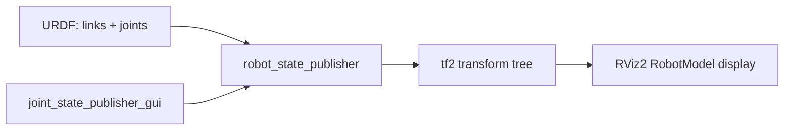

# URDF for Robot Modeling in ROS2 — Unit 2: Building a Robot Model with URDF

This is the core unit of the course: you'll learn the actual XML vocabulary of URDF — links, joints, materials, meshes — and how to see your model come alive in RViz2.

The diagram below shows how the links and joints you write in a URDF actually reach the screen, from joint angles all the way to the RViz2 display.



## What is a URDF file, and what is a LINK

A URDF file is an XML document, conventionally saved with a `.urdf` extension, that describes a robot as a **tree** (no cycles) of `<link>` elements connected by `<joint>` elements. A `<link>` represents one rigid body — a wheel, an arm segment, a sensor housing — and can carry up to three kinds of information:

```xml
<link name="base_link">
  <visual>
    <geometry><box size="0.4 0.3 0.1"/></geometry>
    <material name="blue"><color rgba="0 0 1 1"/></material>
  </visual>
  <collision>
    <geometry><box size="0.4 0.3 0.1"/></geometry>
  </collision>
  <inertial>
    <mass value="2.0"/>
    <inertia ixx="0.01" ixy="0" ixz="0" iyy="0.01" iyz="0" izz="0.02"/>
  </inertial>
</link>
```

`<visual>` is what gets rendered on screen and can use a different (often simpler) geometry than `<collision>`, which is what a physics engine uses for contact detection — keeping collision geometry simple (boxes, cylinders, spheres) instead of a detailed mesh keeps simulation fast. `<inertial>` supplies mass and the inertia tensor, which only matters once you simulate physics (Unit 4 onward); it can be omitted for a link that only needs to be visualized.

## Initial setup

A typical workflow lives inside an ordinary ROS2 package: create a package (e.g. `ros2 pkg create my_robot_description`), and put URDF files under a `urdf/` subdirectory and any mesh files under `meshes/`. Nothing about a URDF file requires ROS2 specifically — it's a standalone XML format — but ROS2 packaging conventions make it easy for other packages (and Gazebo) to find your robot's description via its package name rather than a hardcoded path.

## What is a JOINT, and joint types

A `<joint>` connects exactly one **parent** link to one **child** link and defines how the child can move relative to the parent:

```xml
<joint name="wheel_joint" type="continuous">
  <parent link="base_link"/>
  <child link="left_wheel"/>
  <origin xyz="0 0.2 0" rpy="0 0 0"/>
  <axis xyz="0 1 0"/>
</joint>
```

The `type` attribute determines the degrees of freedom:

- `fixed` — no motion at all; used to rigidly attach sensors or decorative parts.
- `revolute` — rotation around one axis, with limited range (needs `<limit>`).
- `continuous` — rotation around one axis with no limit, like a wheel.
- `prismatic` — sliding motion along one axis, with limits (like a linear actuator).
- `floating` and `planar` — 6-DOF and 2D-planar motion respectively, rarely used for a single joint in practice.

## TF frames, links, and special joint elements

Every link in a URDF automatically becomes a coordinate frame in ROS2's `tf2` transform tree, and every joint becomes the transform between a parent frame and a child frame. This is why the terms "link" and "frame" get used almost interchangeably once a robot is running: `robot_state_publisher` reads the URDF plus live joint angles and broadcasts the full `tf2` tree from it. Special elements like `<origin>` (offset and rotation between parent and child frame at rest) and `<limit>` (velocity, effort, and position bounds) refine exactly how that transform behaves.

## Materials, meshes, and moving joints interactively

`<material>` blocks (as shown above) give links flat RGBA colors for quick visualization; for a more realistic look, `<visual><geometry><mesh filename="package://my_robot_description/meshes/wheel.stl"/></geometry></visual>` references an external mesh file (STL, DAE, or OBJ) instead of a primitive shape.

To see any of this, launch `robot_state_publisher` with your URDF and pair it with `joint_state_publisher_gui`, which pops up a slider for every non-fixed joint so you can move them by hand and watch the model articulate live in RViz2 — the standard sanity check before ever touching a simulator:

```bash
ros2 run robot_state_publisher robot_state_publisher --ros-args -p robot_description:="$(xacro my_robot.urdf.xacro)"
ros2 run joint_state_publisher_gui joint_state_publisher_gui
rviz2
```

Wrapping these three commands in a single `<launch>` file is the standard next step once you've confirmed each piece works individually — you'll do exactly that at the end of this unit.

## Try it yourself

Model a simple two-link "pendulum": a fixed base link and one arm link connected by a `revolute` joint with limits of ±90 degrees. Give the base a box visual and the arm a cylinder visual with a different color, launch it with `joint_state_publisher_gui`, and confirm in RViz2 that dragging the slider swings the arm exactly to its two limits and no further.
