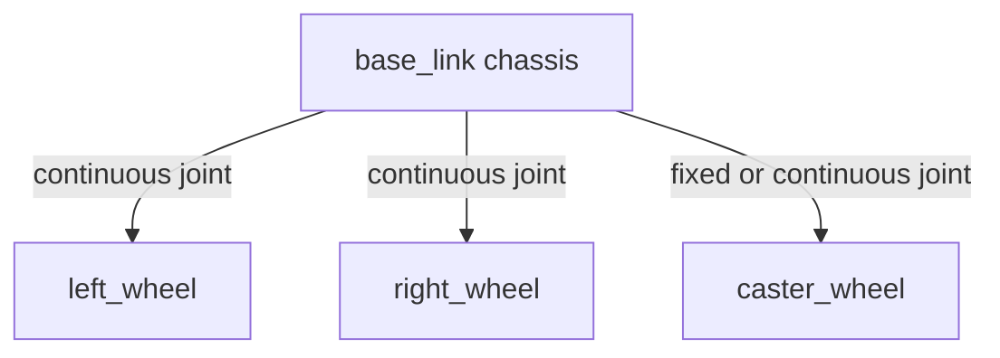

# URDF for Robot Modeling in ROS2 — Unit 3: MicroProject — Create URDF File for Two-Wheeled Robot

A short, focused project to consolidate everything from Unit 2 by building a complete, self-contained robot model from nothing rather than following along tag by tag.

The diagram below sketches the link/joint tree you're about to build: one chassis link with three child links, each attached by a different joint type.



## The robot you're building

The target is a minimal differential-drive robot: a rectangular `base_link` chassis, two `continuous`-jointed drive wheels mounted on the left and right sides, and one free-spinning `caster_wheel` at the front (or back) for balance, attached with a `fixed` or `continuous` joint depending on how much realism you want. This is the "hello world" of mobile robot modeling — nearly every mobile robot tutorial you'll encounter elsewhere starts from this same shape because it exercises every core URDF concept (links, joints, origins, axes, visual vs. collision geometry) without the complexity of a multi-link arm.

## Main objective

Working only from the vocabulary introduced in Unit 2, produce a single URDF (or URDF/Xacro) file with:

- A `base_link` with a box `<visual>` and matching `<collision>`, and a plausible `<inertial>` block.
- Two wheel links, each a cylinder, attached to `base_link` via `continuous` joints whose rotation `<axis>` runs along the wheel's own axle (commonly the Y axis if X is "forward").
- Correct `<origin>` offsets so the wheels sit symmetrically on either side of the chassis and touch the ground — this is the step where sign errors in `xyz` values most often show up as a robot floating above or clipping through the ground plane in RViz2.
- A caster link positioned at the end of the chassis opposite the drive wheels, wherever keeps the robot balanced, attached with an appropriate joint type.
- Distinct `<material>` colors so you can visually confirm each part is where you expect.

Validate the result the same way you did in Unit 2: launch `robot_state_publisher` + `joint_state_publisher_gui` + `rviz2`, add a `RobotModel` display in RViz2 pointed at the `robot_description` topic, and confirm the wheels spin freely around the correct axis when you move their sliders while the chassis and caster stay put. A quick syntax sanity check before even opening RViz2 is:

```bash
check_urdf my_two_wheeled_robot.urdf
```

which parses the file and prints the link/joint tree, catching malformed XML or an accidentally disconnected link before you spend time debugging a blank RViz2 view.

## Common mistakes to check for

Three errors show up disproportionately often in this exercise, so look for them specifically before moving on: a wheel `<axis>` set to the wrong axis (the wheel spins in place instead of rolling forward once you're driving it in later units), a `<collision>` geometry accidentally left off a link (the robot renders fine in RViz2 but falls straight through the floor once you reach Gazebo Sim in Unit 4), and mismatched left/right origin signs that leave one wheel mirrored onto the wrong side of the chassis.

## Try it yourself

Extend your two-wheeled robot with one more sensor mount: add a small fixed link on top of the chassis (a stand-in for a lidar or camera mount you'll wire up for real in Unit 6) attached with a `fixed` joint and a `<visual>` distinct in color from the rest of the robot. Re-run `check_urdf` and confirm the new link appears in the printed tree as a child of `base_link`.
