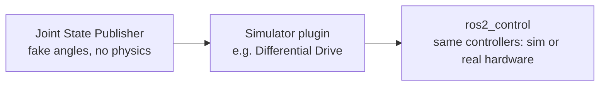

# URDF for Robot Modeling in ROS2 — Unit 5: Moving the Robot

A robot that only falls under gravity isn't very interesting. This unit covers the different mechanisms available for actually driving joints in simulation, from the simplest (fake it in RViz2) to the most production-realistic (`ros2_control`).

The diagram below orders the three ways to drive a joint from least to most realistic, matching the comparison this unit walks through.



## Possible approaches, compared

There are three broad tiers of "make a joint move," in increasing order of realism and complexity:

1. **Joint State Publisher (GUI or scripted)** — publishes fake joint angles directly to `/joint_states` with no physics involved. Good for visualization, useless for simulation, since nothing is actually being driven by a motor or force.
2. **Simulator-native movement plugins** (e.g. a Differential Drive plugin) — a Gazebo plugin attached to the robot in simulation directly commands wheel velocities from a `cmd_vel`-style topic, without going through ROS2's controller framework.
3. **`ros2_control`** — the standard ROS2 abstraction layer for hardware (real or simulated) interfaces, controllers, and command/state interfaces, designed so the exact same controller configuration can run against simulated joints or real motor hardware.

For quick prototyping, approach 2 is often the fastest path to a driveable robot; for anything you eventually want to run on real hardware, approach 3 is worth the extra setup because your controller code doesn't change when you swap simulation for reality.

## Joint State Publisher plugin and Differential Drive plugin

The **Joint State Publisher plugin** (a simulation-side plugin, distinct from the RViz2-only GUI tool from earlier units) publishes the true, physics-driven joint state from inside the simulator — this is what makes `/joint_states` (and therefore `tf2`, via `robot_state_publisher`) reflect what's actually happening physically rather than a fake slider value.

The **Differential Drive plugin** is the fastest way to get a two-wheeled robot driving: attach it to your robot with references to the left and right wheel joints, and it exposes a velocity command interface (subscribing to something like `cmd_vel`) that internally computes the individual wheel speeds needed to achieve the requested linear and angular velocity — you don't have to implement differential-drive kinematics yourself.

```xml
<gazebo>
  <plugin filename="gz-sim-diff-drive-system" name="gz::sim::systems::DiffDrive">
    <left_joint>left_wheel_joint</left_joint>
    <right_joint>right_wheel_joint</right_joint>
    <wheel_separation>0.4</wheel_separation>
    <wheel_radius>0.1</wheel_radius>
  </plugin>
</gazebo>
```

## Gazebo Sim ROS2 Control plugin and position/velocity control

The **Gazebo Sim ROS2 Control plugin** bridges `ros2_control`'s controller manager into simulation, exposing simulated joints as hardware interfaces exactly like a real robot driver would. On top of that you load controllers — a `JointPositionController` for "move this joint to a target angle" (useful for something like tilting a laser up and down), or a `JointVelocityController` for continuous rotation like a spinning sensor mount. Sending a command becomes a standard `ros2_control` interaction rather than a simulator-specific topic:

```bash
ros2 topic pub /position_controller/commands std_msgs/msg/Float64MultiArray "{data: [0.5]}"
```

## Moving a joint programmatically

For anything beyond one-off CLI commands, you'll want a small Python node that publishes commands on a timer or in response to other logic — the same pattern as any other ROS2 publisher, just targeting the controller's command topic:

```python
from std_msgs.msg import Float64MultiArray
# ... inside a Node subclass ...
self.pub = self.create_publisher(Float64MultiArray, '/velocity_controller/commands', 10)
msg = Float64MultiArray(data=[1.5])  # rad/s
self.pub.publish(msg)
```

This is exactly the shape you'd use to, for example, rotate a laser scanner mount continuously around its Z-axis at a fixed velocity.

## Try it yourself

Take your Unit 4 robot and attach a Differential Drive plugin referencing its two wheel joints. Drive it in a straight line and then in a circle by publishing two different `cmd_vel` messages from the CLI (`ros2 topic pub /cmd_vel geometry_msgs/msg/Twist ...`), and confirm the wheel rotation direction/speed you observe in simulation matches the linear/angular velocity you requested.
