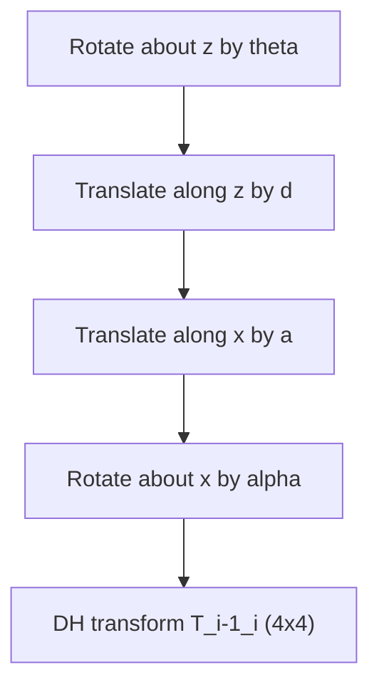

# Basic Arm Kinematics — Unit 3: Denavit-Hartenberg

Unit 2 gave you homogeneous transforms; this unit gives you a *systematic recipe* for assigning them to a real robot arm. The Denavit-Hartenberg (DH) convention reduces "where is frame i relative to frame i-1?" to filling in four numbers per joint, instead of re-deriving a transform by hand for every new robot design.

The diagram below shows the fixed four-step sequence the DH convention composes to build the per-link transform matrix:



## What will you learn in this unit?
You'll learn to draw a kinematic diagram of a manipulator, assign a coordinate frame to each joint using the DH rules, read off the four DH parameters per link, and assemble the generic 4x4 homogeneous matrix that the DH convention produces. By the end you can take any open kinematic chain (a non-branching sequence of revolute/prismatic joints — which covers the overwhelming majority of robot arms) and mechanically produce its per-link transforms.

## Create a Kinematic diagram of your robot
Before assigning any numbers, draw the robot: each joint as a labeled circle (revolute joints as a circle, prismatic joints as a box), each link as a line connecting them, and the axis of rotation/translation for every joint marked explicitly. This diagram is what you'll place DH frames onto in the next step. For a simple 3-DOF planar arm, the diagram is just three revolute joints in series with link lengths `l1`, `l2`, `l3` between them, all rotating about parallel axes (out of the page). Getting this diagram right — correctly identifying which axis each joint rotates about — is the step where most real-world DH mistakes originate, so it's worth sketching even for arms you already "know."

## DH parameters
The DH convention assigns a frame to each joint following two consistent rules (there are "distal"/"proximal" variants; pick one convention and stay consistent) so that the transform between consecutive frames is described by exactly **four parameters**:

| Parameter | Symbol | Meaning |
|---|---|---|
| Link length | `a` (or `r`) | distance between joint axes i-1 and i, along the common normal |
| Link twist | `alpha` | angle between joint axes i-1 and i, about the common normal |
| Link offset | `d` | distance along axis i between the common normals |
| Joint angle | `theta` | angle about axis i between the common normals |

For a **revolute** joint, `theta` is the variable (the joint's degree of freedom) and `a`, `alpha`, `d` are fixed by the robot's geometry. For a **prismatic** joint it's the reverse: `d` varies, the rest are fixed.

## Step 0 — Basics: finding the generic Homogeneous Matrix
The DH transform from frame i-1 to frame i is built as a product of four elementary transforms — rotate about z, translate along z, translate along x, rotate about x — applied in that fixed order. Composing them symbolically gives one reusable matrix template you plug the four parameters into for every joint:

```python
import numpy as np

def dh_transform(a, alpha, d, theta):
    ct, st = np.cos(theta), np.sin(theta)
    ca, sa = np.cos(alpha), np.sin(alpha)
    return np.array([
        [ct, -st * ca,  st * sa, a * ct],
        [st,  ct * ca, -ct * sa, a * st],
        [0,   sa,       ca,      d],
        [0,   0,        0,       1],
    ])
```

## Step 1 — Translation in d_i and Rotation in theta_i
The first half of the product handles motion *along and about the z-axis of frame i-1*: translate by `d` along z, then rotate by `theta` about z. This is the piece that captures the joint's own degree of freedom — for a revolute joint this is where the variable `theta` enters the matrix; for a prismatic joint it's where `d` enters instead. In matrix form this half is `Rot_z(theta) · Trans_z(d)`, and if you multiply it out you get exactly the left/top block of `dh_transform` above.

## Step 2 — Translation in r_i and Rotation in alpha_i
The second half handles motion *along and about the new x-axis*: translate by `a` along the (now rotated) x-axis, then rotate by `alpha` about x. This piece encodes the fixed geometry between consecutive joint axes — link length and twist — and doesn't change as the robot moves. In matrix form this half is `Trans_x(a) · Rot_x(alpha)`. The full DH transform is the product of both halves: `T = Rot_z(theta) · Trans_z(d) · Trans_x(a) · Rot_x(alpha)`, which is exactly what `dh_transform(a, alpha, d, theta)` computes above.

## Hands-on Practice!
Calculate the homogeneous matrix for one link of a simulated robot arm with `a = 0.5`, `alpha = 0`, `d = 0`, and a revolute joint currently at `theta = 30 degrees`:

```python
T1 = dh_transform(a=0.5, alpha=0, d=0, theta=np.radians(30))
print(T1)
# Expect a pure rotation-about-z block plus x-translation baked
# into the top-right — check T1[0,3] ≈ 0.5*cos(30°), T1[1,3] ≈ 0.5*sin(30°)
```

Verify the translation component matches `a * cos(theta)` and `a * sin(theta)` by hand, and confirm the rotation block matches a standard z-rotation matrix (since `alpha = 0` here).

## Conclusions
You now have a table of four DH parameters per joint and one function, `dh_transform`, that turns each row of that table into a 4x4 matrix. Unit 4 uses exactly this: multiply the per-link matrices together (`T_0_1 @ T_1_2 @ T_2_3 @ ...`) to get forward kinematics, and works backward from a desired end-effector transform to solve for the joint angles that produce it.

## Try it yourself
Build the DH parameter table (a, alpha, d, theta) for a 3-link planar revolute arm with link lengths 1.0, 0.8, and 0.6 (all `alpha = 0`, `d = 0`, `theta` variable), then multiply the three `dh_transform` matrices together for `theta = [30°, -20°, 45°]` to get the end-effector's full pose relative to the base.
