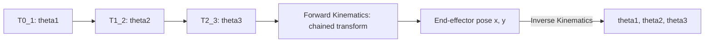

# Basic Arm Kinematics — Unit 4: Forward and Inverse Kinematics

This is where everything from Units 2 and 3 pays off. You'll chain DH transforms into full forward kinematics, then tackle the harder inverse problem — given a target end-effector pose, solve for the joint angles that produce it — for a simple planar arm, ending with a working Python IK solver driving a simulated trajectory.

The diagram below shows how the three per-link DH transforms chain into forward kinematics, and how inverse kinematics closes the loop back to joint angles:



## Forward Kinematics
Forward kinematics (FK) answers: given all joint values, where is the end effector? With the per-link DH matrices from Unit 3, FK is just matrix multiplication down the chain:

```python
import numpy as np
from dh import dh_transform  # the function you wrote in Unit 3

def forward_kinematics(dh_table, thetas):
    T = np.eye(4)
    for (a, alpha, d, _), theta in zip(dh_table, thetas):
        T = T @ dh_transform(a, alpha, d, theta)
    return T  # end-effector pose relative to the base frame

dh_table = [(1.0, 0, 0, 0), (0.8, 0, 0, 0), (0.6, 0, 0, 0)]
end_pose = forward_kinematics(dh_table, np.radians([30, -20, 45]))
print(end_pose[:3, 3])  # end-effector x, y, z
```

FK is always well-defined and unique — one set of joint angles gives exactly one pose — which is why it's the easy direction. It's also everything a joint-state publisher needs to know to compute where the arm's tip currently is.

## Inverse Kinematics
Inverse kinematics (IK) is the mirror image and the genuinely hard problem: given a desired end-effector position (and possibly orientation), find joint angles that achieve it. IK is harder than FK for three structural reasons: it may have **no solution** (the target is outside the arm's reach), **exactly one solution**, or **infinitely many solutions** (redundant arms, or a target reachable via multiple elbow configurations — "elbow up" vs. "elbow down"). Unlike FK, there's no single formula that works for every robot; solutions are either derived analytically per-robot (what this unit does, for a simple case) or found numerically/iteratively (Jacobian-based methods, used by tools like MoveIt for arbitrary manipulators, covered in later courses).

## Operational Space
Before solving, you need to be precise about what you're solving *for*. **Joint space** is the set of joint angles/displacements — the arm's own degrees of freedom. **Operational space** (a.k.a. task space or Cartesian space) is the space the task is specified in — typically end-effector position and orientation in Cartesian coordinates. FK maps joint space → operational space; IK maps the reverse. For a planar 3-link arm reaching for a 2D point, operational space is just `(x, y)` — two constraints — while joint space is `(theta1, theta2, theta3)` — three unknowns, meaning the arm has one redundant degree of freedom for pure position control (it can wiggle its "elbow" while keeping the end effector fixed).

## Inverse Kinematics Resolution
For a simple 2-link planar arm reaching a target `(x, y)` (ignoring orientation), the IK can be solved analytically in a sequence of algebraic steps:

1. **Simplify the problem.** Reduce to 2 links and 2D position-only IK first — the geometric intuition scales cleanly to 3+ links, but the algebra stays tractable at 2 links.
2. **Sum of squares for theta_2.** Using the law of cosines on the triangle formed by the base, elbow, and target: `cos(theta2) = (x^2 + y^2 - l1^2 - l2^2) / (2 * l1 * l2)`. This directly gives `theta2` (up to a sign ambiguity — that's the elbow-up/elbow-down choice).
3. **Division for theta_1.** With `theta2` known, `theta1` is solved from the two equations `x = l1*cos(theta1) + l2*cos(theta1+theta2)` and `y = l1*sin(theta1) + l2*sin(theta1+theta2)` using `atan2`, which correctly handles all quadrants (plain `atan` does not).
4. **Use orientation equations for theta_3.** If a third link controls end-effector orientation independently, its angle is solved once `theta1` and `theta2` are fixed, from the desired total orientation minus the sum already contributed by the first two joints.
5. **First partial solution.** Combine steps 2-4 into one candidate `(theta1, theta2, theta3)` — but remember step 2's sign ambiguity means there are actually two families of solutions.
6. **Relation between P2 and P3.** For redundant or 3+ link arms, express the elbow position `P2` in terms of the wrist position `P3` and the remaining free parameter, to pick a consistent, collision-free configuration among the redundant solutions.
7. **Final solution.** Assemble the fully resolved joint angles, and validate by plugging them back into forward kinematics — if `forward_kinematics(dh_table, solution)` doesn't reproduce the target, the algebra has a sign or convention error worth tracking down before moving on.

```python
def ik_2link(x, y, l1, l2, elbow_up=True):
    d2 = x**2 + y**2
    cos_t2 = (d2 - l1**2 - l2**2) / (2 * l1 * l2)
    cos_t2 = np.clip(cos_t2, -1.0, 1.0)  # guard tiny float errors at the reach limit
    sin_t2 = (1 if elbow_up else -1) * np.sqrt(1 - cos_t2**2)
    theta2 = np.arctan2(sin_t2, cos_t2)

    k1 = l1 + l2 * cos_t2
    k2 = l2 * sin_t2
    theta1 = np.arctan2(y, x) - np.arctan2(k2, k1)
    return theta1, theta2
```

## Hands-on Practice! — Part 1
Create a Python script that resolves the IK for a simulated planar arm and checks it against forward kinematics:

```python
l1, l2 = 1.0, 0.8
target = (1.2, 0.5)
theta1, theta2 = ik_2link(*target, l1, l2)
x, y = forward_kinematics_2link(l1, l2, theta1, theta2)  # from Unit 1
assert np.allclose((x, y), target, atol=1e-6)
print(f"theta1={np.degrees(theta1):.1f} deg, theta2={np.degrees(theta2):.1f} deg")
```

## Hands-on Practice! — Part 2
Use the IK solver to drive the end effector along a continuous elliptical trajectory around the arm's reachable workspace center, computing new joint angles at each timestep:

```python
import numpy as np

cx, cy = 1.0, 0.0      # ellipse center, within reach
rx, ry = 0.4, 0.2      # ellipse radii
for t in np.linspace(0, 2 * np.pi, 50):
    x = cx + rx * np.cos(t)
    y = cy + ry * np.sin(t)
    theta1, theta2 = ik_2link(x, y, l1, l2)
    # publish/apply theta1, theta2 to the simulated or real joints here
```

Each loop iteration is an independent IK call — there's no dependency on the previous timestep's solution, though in practice you'd bias `elbow_up` consistently across the trajectory to avoid the arm suddenly flipping configuration.

## Conclusions
You can now go both directions: FK turns joint angles into a pose by chaining DH matrices, and IK turns a target pose back into joint angles by solving the geometry analytically for a simple arm. This closes the loop that started in Unit 1's preview function, and it's the same conceptual pipeline (just numerical instead of closed-form) that underlies general-purpose IK solvers like MoveIt's for arbitrary manipulators.

## Try it yourself
Extend `ik_2link` to reject unreachable targets — check `d2 = x**2 + y**2` against `(l1 + l2)^2` (max reach) and `(l1 - l2)^2` (min reach) before computing `theta2`, and raise a clear error otherwise. Then confirm your extended solver correctly rejects `target = (5.0, 5.0)` for `l1 = l2 = 1.0`.
