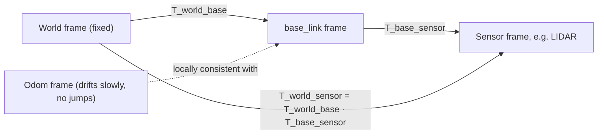

# Basic Kinematics of Mobile Robots — Unit 2: Rigid Body Motions

Every kinematic model you'll write in later units is really just a statement about how one rigid body's pose relates to another's. This unit builds the mathematical vocabulary — frames, rotations, and homogeneous transforms — that makes those statements precise and composable.

The diagram below shows how the frames used in this unit chain together via homogeneous transforms, exactly as `tf2` composes them under the hood.



## Frame of reference
A **frame** is a coordinate system attached to something: the world, the robot's chassis, a wheel, a sensor, a goal location. Every position or orientation you ever compute is only meaningful *relative to a frame* — "the robot is at (2, 3)" is meaningless until you say (2, 3) in which frame. Mobile robotics conventionally uses at least:
- a **world/map frame** — fixed, the map you navigate against,
- a **robot/base frame** (often `base_link` in ROS) — moves and rotates with the chassis,
- an **odom frame** — a locally-consistent frame that drifts slowly relative to the world but is smooth (no jumps), used for short-term control.

Keeping frames straight is the single most common source of bugs in real robotics code — a velocity computed in the wrong frame will make a robot drive sideways into a wall with perfectly "correct" math.

## Representing positions
A position is a vector `p = [x, y]ᵀ` (2D) or `[x, y, z]ᵀ` (3D) expressed relative to some frame's origin and axes. The same physical point has different coordinates in different frames — that's the whole reason transforms exist. In code, keep the frame explicit rather than implicit:

```python
import numpy as np

# position of the robot's LIDAR expressed in the base_link frame
p_lidar_in_base = np.array([0.15, 0.0])   # 15 cm forward of the chassis origin
```

## Representing rotations
In 2D, orientation is a single angle `θ`. In 3D it's genuinely 3-dimensional (roll, pitch, yaw or equivalent), and a **rotation matrix** `R` is the standard tool: a 2x2 (or 3x3) orthonormal matrix that maps a vector's coordinates from one frame to another. For 2D:

```
R(θ) = [ cos θ   -sin θ ]
       [ sin θ    cos θ ]
```

`R` is orthonormal (`RᵀR = I`, `det(R) = 1`), which is why rotations never stretch or shear — they only turn.

## Rotational transformations
To express a vector known in frame B (coordinates `p_B`) in terms of frame A, given B's orientation `θ` relative to A:

```python
def rotate(p_B, theta):
    R = np.array([[np.cos(theta), -np.sin(theta)],
                  [np.sin(theta),  np.cos(theta)]])
    return R @ p_B

p_A = rotate(p_lidar_in_base, theta=0.3)  # base_link rotated 0.3 rad relative to world
```

Note that rotating by `θ` and then by `-θ` returns you to the start — `R(θ)⁻¹ = R(-θ) = R(θ)ᵀ`, which is a cheap way to invert a rotation without a general matrix inverse.

## Composition of rotations
Rotations compose by matrix multiplication, and **order matters**: `R(θ1) @ R(θ2)` is a rotation by `θ1 + θ2` in 2D (rotations commute in the plane), but in 3D, composing rotations about different axes is *not* commutative — rotating "roll then pitch" gives a different final orientation than "pitch then roll". This is exactly why gimbal-order conventions matter and why libraries like `scipy.spatial.transform.Rotation` are strict about specifying axis order.

## Parameterization of rotations
3x3 rotation matrices have 9 numbers but only 3 degrees of freedom, so several more compact parameterizations exist:
- **Euler angles** (roll, pitch, yaw) — intuitive but suffer from *gimbal lock* (loss of a degree of freedom at certain orientations).
- **Axis-angle** — a unit vector (rotation axis) plus an angle.
- **Quaternions** — four numbers `(x, y, z, w)`, no gimbal lock, cheap to compose and interpolate; this is what ROS uses natively in `geometry_msgs/Quaternion`.

```python
from scipy.spatial.transform import Rotation as R

r = R.from_euler('z', 45, degrees=True)
print(r.as_quat())   # [x, y, z, w] — what you'd publish on a ROS pose topic
```

## Homogeneous transformation matrices
To combine rotation *and* translation into one operation (so you can chain frame-to-frame transforms with simple matrix multiplication), stack them into a homogeneous transform:

```
T = [ R   t ]      where R is the rotation, t is the translation vector,
    [ 0   1 ]      and points are represented in homogeneous coords [x, y, 1]ᵀ
```

```python
def homogeneous_transform(theta, tx, ty):
    T = np.eye(3)
    T[:2, :2] = [[np.cos(theta), -np.sin(theta)],
                 [np.sin(theta),  np.cos(theta)]]
    T[:2, 2] = [tx, ty]
    return T

T_world_base = homogeneous_transform(theta=0.3, tx=1.0, ty=2.0)
p_base = np.array([0.15, 0.0, 1.0])          # homogeneous point
p_world = T_world_base @ p_base
```

Chaining frames is now just matrix multiplication: `T_world_sensor = T_world_base @ T_base_sensor`. This is precisely what ROS's `tf2` library does under the hood every time you call a frame transform lookup.

## Let's practice!
Compute `T_world_base` for a robot at `(1.0, 2.0)` facing `θ = 90°`, then use it to find the world-frame coordinates of a LIDAR mounted at `(0.15, 0.0)` in the base frame. Sanity-check by hand: facing 90° means "forward" now points along world +y, so the LIDAR's world position should be roughly `(1.0, 2.15)`, not `(1.15, 2.0)`.

## Conclusions
You now have the shared language every kinematic model in this course will use: frames to say *relative to what*, rotation matrices/quaternions to say *facing which way*, and homogeneous transforms to combine both and chain them across multiple frames. Unit 3 uses exactly this machinery to derive the motion equations for nonholonomic wheeled robots.

## Try it yourself
Write a function `compose(T1, T2)` that returns `T1 @ T2`, then verify numerically that `compose(T, invert(T))` gives the identity matrix for a transform `T` of your choosing, where `invert` builds the inverse homogeneous transform (`Rᵀ`, `-Rᵀt`) rather than calling `np.linalg.inv`.
