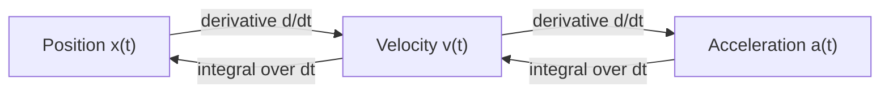

# Basic Maths for Robotics — Unit 3: Calculus

Calculus is how you go from "where is the robot" to "how fast is it getting there" and "what setting minimizes the error" — it underlies every trajectory, controller, and optimizer you will write. This unit covers functions, differentiation, multivariable extensions (gradients, Jacobians, Hessians), and integration.

The diagram below shows the differentiation chain (position to velocity to acceleration) and its inverse via integration, both covered in this unit.



## Functions and common functions
A function `f(x)` maps an input to an output; in robotics `x` is often time, joint angle, or a state vector, and `f(x)` is position, sensor reading, or cost. The functions that show up constantly:
- **Polynomials** (`x^2`, cubic splines) for smooth trajectory generation.
- **Trigonometric** (`sin`, `cos`) for anything involving rotation or oscillation.
- **Exponential/logarithmic** (`e^x`, `ln(x)`) for decay (battery discharge, filter gains) and information-theoretic quantities.

```python
import numpy as np

t = np.linspace(0, 2 * np.pi, 100)
position = np.sin(t)              # a joint oscillating sinusoidally
```

## Derivatives and differentiation rules
The derivative `f'(x)` (or `df/dx`) measures the instantaneous rate of change of `f` — geometrically, the slope of the tangent line. A function is **differentiable** at a point if that slope is well-defined there (no corners or jumps). The rules that let you differentiate compound expressions without going back to first principles:
- **Product rule**: `(uv)' = u'v + uv'`
- **Quotient rule**: `(u/v)' = (u'v - uv') / v^2`
- **Chain rule**: `f(g(x))' = f'(g(x)) * g'(x)` — essential for backpropagating through nested transforms (e.g. how joint angle affects end-effector position through a chain of trig functions).

In robotics, differentiating position with respect to time gives velocity, and differentiating velocity gives acceleration — `x(t) -> v(t) = x'(t) -> a(t) = v'(t)`.

```python
def position(t):
    return np.sin(t)

def velocity(t, h=1e-6):
    return (position(t + h) - position(t - h)) / (2 * h)   # central-difference derivative

print(velocity(np.pi / 4), np.cos(np.pi / 4))   # should closely match: d/dt sin(t) = cos(t)
```

## Partial derivatives, gradients, Jacobians, and Hessians
When a function depends on several variables, e.g. `f(x, y, z)`, a **partial derivative** `df/dx` measures the rate of change with respect to one variable while holding the others fixed. Stack all partial derivatives of a scalar function into a vector and you get the **gradient**, `grad f = [df/dx, df/dy, df/dz]`, which points in the direction of steepest increase — this is exactly what gradient-based optimizers (and inverse kinematics solvers) climb or descend.

When the function is vector-valued (multiple outputs, multiple inputs), the matrix of all partial derivatives is the **Jacobian**: for a robot arm's end-effector position `p = f(theta)` as a function of joint angles, `J = dp/dtheta` tells you how a small change in joint angles moves the end-effector — the core relationship used to convert desired end-effector velocities into joint velocities.

The **Hessian** is the matrix of second-order partial derivatives of a scalar function — it describes curvature, telling an optimizer whether it's near a minimum (positive-definite Hessian), a maximum, or a saddle point.

```python
def end_effector_x(theta1, theta2, l1=1.0, l2=1.0):
    return l1 * np.cos(theta1) + l2 * np.cos(theta1 + theta2)

def jacobian_row(theta1, theta2, h=1e-6):
    dx_dtheta1 = (end_effector_x(theta1 + h, theta2) - end_effector_x(theta1 - h, theta2)) / (2 * h)
    dx_dtheta2 = (end_effector_x(theta1, theta2 + h) - end_effector_x(theta1, theta2 - h)) / (2 * h)
    return dx_dtheta1, dx_dtheta2

print(jacobian_row(0.3, 0.5))   # sensitivity of x-position to each joint angle
```

## Integrals and integral rules
Integration is the inverse of differentiation: `integral(f'(x) dx) = f(x) + C`. In robotics, integrating a velocity signal over time gives displacement, and integrating an acceleration signal gives velocity — this is exactly what an IMU-based dead-reckoning estimator does. The **power rule for integrals** (`integral(x^n dx) = x^(n+1)/(n+1)`) and **linearity** (`integral(af + bg) = a*integral(f) + b*integral(g)`) cover most closed-form cases; everything else is typically integrated numerically.

```python
dt = 0.01
t = np.arange(0, 5, dt)
acceleration = np.full_like(t, 2.0)          # constant 2 m/s^2
velocity = np.cumsum(acceleration) * dt      # numerical integration (Riemann sum)
print(f"velocity at t=5s: {velocity[-1]:.2f} m/s")   # should be close to 2 * 5 = 10 m/s
```

## Try it yourself
Take `f(theta1, theta2) = end_effector_x(theta1, theta2)` from above, and numerically compute its Jacobian row at three different joint configurations: `(0, 0)`, `(pi/2, 0)`, and `(pi/4, pi/4)`. Explain in a comment why the sensitivity to `theta2` shrinks as the arm folds in on itself — this is the same singularity behavior that makes some arm poses hard to control.
