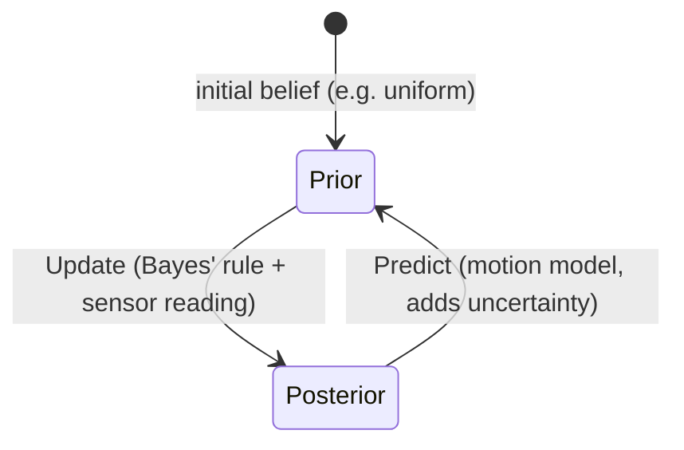

# Basic Maths for Robotics — Unit 4: Probability

No sensor is perfect and no motor moves exactly as commanded, so every real robot has to reason under uncertainty. Probability gives you the vocabulary — random variables, distributions, and Bayes' rule — to combine noisy evidence into a trustworthy estimate of the world.

The diagram below shows the predict/update cycle that turns a prior belief into a sharpened posterior and back into a new prior as the robot keeps sensing and moving, which the rest of this unit builds toward.



## Basics of probability and random variables
A **random variable** is a quantity whose value is uncertain but follows a known pattern — a sensor reading, a dice roll, a robot's true position given a noisy GPS fix. Its behavior is fully described by a probability distribution, which assigns likelihoods to possible outcomes. Two flavors matter here: **discrete** random variables (finite outcomes, e.g. "which grid cell is the robot in") described by a probability mass function, and **continuous** random variables (a continuum of outcomes, e.g. "exact x position") described by a probability density function (PDF).

```python
import numpy as np

# Simulate a noisy distance sensor: true distance 5.0m, Gaussian noise
true_distance = 5.0
readings = true_distance + np.random.normal(loc=0.0, scale=0.2, size=1000)
print(f"mean reading: {readings.mean():.3f}, std: {readings.std():.3f}")
```

## Foundations of probabilistic reasoning: joint, conditional, and Bayes' rule
- **Joint probability** `P(A, B)` is the probability of both `A` and `B` happening together (e.g. "robot is at cell 3 AND sensor reads 'wall ahead'").
- **Conditional probability** `P(A | B) = P(A, B) / P(B)` is the probability of `A` given that `B` is already known.
- **Chain rule**: `P(A, B) = P(A | B) P(B)`, generalizing to any number of variables.
- **Bayes' rule**, derived directly from the chain rule: `P(A | B) = P(B | A) P(A) / P(B)`.

Bayes' rule is the single most important formula in robot state estimation: it lets you update a **prior** belief `P(A)` (what you believed before) into a **posterior** `P(A | B)` (what you believe after observing evidence `B`), weighted by how likely that evidence is under each hypothesis.

```python
# A door detector that's 90% accurate. Prior belief: 50% chance the door is open.
p_open = 0.5
p_detect_open_given_open = 0.9      # true positive rate
p_detect_open_given_closed = 0.2    # false positive rate

p_detect_open = p_detect_open_given_open * p_open + p_detect_open_given_closed * (1 - p_open)
posterior_open = (p_detect_open_given_open * p_open) / p_detect_open
print(f"P(door open | sensor says open) = {posterior_open:.3f}")
```

## Probability distributions: uniform, cumulative, and Gaussian
- **Uniform distribution**: every outcome in a range is equally likely — the natural choice for "I have absolutely no idea where the robot starts" (e.g. global localization before any sensor reading).
- **Cumulative distribution function (CDF)**: `F(x) = P(X <= x)`, the running total of probability up to `x`; useful for sampling and for answering "what's the probability the error is below this threshold?"
- **Gaussian (normal) distribution**: `f(x) = (1 / (sigma * sqrt(2*pi))) * exp(-(x - mu)^2 / (2*sigma^2))`, defined by mean `mu` and standard deviation `sigma`. It's the default noise model for sensors and motion because of the Central Limit Theorem, and because it's closed under Bayesian updates (Gaussian prior + Gaussian likelihood = Gaussian posterior), which is the entire premise behind the Kalman filter you'll meet in a later course.

```python
from scipy.stats import norm

x = np.linspace(4, 6, 200)
pdf = norm.pdf(x, loc=5.0, scale=0.2)
cdf = norm.cdf(5.2, loc=5.0, scale=0.2)
print(f"P(reading <= 5.2) = {cdf:.3f}")
```

## Beliefs and Bayesian filtering
A **belief** is a full probability distribution over possible states, not just a single best guess — e.g., instead of saying "the robot is at x=5.0", a belief says "the robot is at x=5.0 with 80% confidence, spread across x=4.8-5.2." A **Bayesian filter** maintains and updates this belief over time in two alternating steps: **predict** (apply the motion model, which spreads the belief out due to motion uncertainty) and **update** (apply Bayes' rule using a new sensor reading, which sharpens the belief back down). This predict/update cycle is the backbone of every localization and tracking algorithm in robotics, from simple 1D grid filters to the Kalman and particle filters used in real navigation stacks.

## Try it yourself
Extend the door-detector example above into a two-step belief update: start with prior `P(open) = 0.5`, get one "sensor says open" reading and update the posterior (as shown), then treat that posterior as your new prior and apply a *second* independent "sensor says open" reading. Print the belief after each update and confirm it moves closer to certainty — this is exactly the "update" half of a Bayesian filter running twice in a row.
