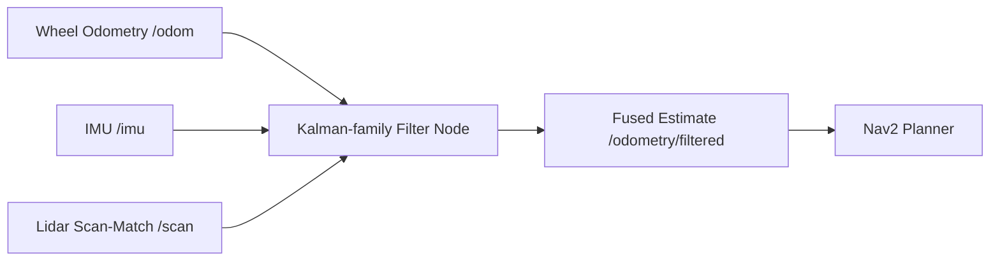

# Kalman Filters in ROS 2 — Unit 1: Introduction to the Course

This unit orients you before the math starts: what problem Kalman filters solve in a real ROS 2 stack, what a working filter feels like from the outside, and what you need installed to follow along.

The diagram below shows where a Kalman-family filter node sits in a ROS 2 stack, fusing several noisy sensor topics into one fused estimate that the rest of navigation trusts.



## The problem: your robot doesn't know where it is

Every mobile robot has to answer "where am I?" continuously, and it never gets a direct answer. Wheel encoders report how far the wheels *appear* to have turned, not how far the robot actually moved (slip, uneven floors, tire deformation all lie a little). An IMU drifts. A GPS fix can be off by meters or vanish indoors. Even a good lidar scan-matcher can be ambiguous in a long, feature-poor corridor. Every one of these is a noisy, partial estimate of the true state.

A Kalman filter — and its relatives you'll meet later in this course (EKF, UKF, particle filter) — is the standard engineering answer to combining several noisy, partial estimates into one estimate that is provably better than any single input. In ROS 2 this isn't just theory: packages like `robot_localization` and `nav2_amcl` run these algorithms on real topics (`/odom`, `/imu`, `/scan`) to publish a `/odometry/filtered` or map-frame pose that the rest of the navigation stack trusts.

## A taste of it in action

Picture a differential-drive robot in simulation, publishing noisy odometry and a noisy lidar-based pose estimate on two separate topics. Without fusion, `nav2`'s planner would see the odometry drift away from the map over a couple of minutes. With a Kalman filter node subscribed to both topics, the fused estimate stays anchored: when odometry and lidar agree, confidence goes up and the estimate barely moves between updates; when they disagree, the filter leans toward whichever source it currently trusts more, weighted by each source's declared covariance. You can see this directly — later units have you fuse two signals with a few lines of Python, and then again with `robot_localization`'s `ekf_node`, and compare the two.

## Robots and tools used in this course

Everything here is taught against a simulated differential-drive mobile robot (the same kind you've likely already met in earlier ROS 2 units) so you can run every example without owning hardware. You'll use:
- A ROS 2 distribution with `rclpy` for the Python-side filter nodes.
- A simulator (Gazebo or similar) to generate noisy sensor data on demand — real hardware never gives you a "clean" ground truth to compare against, simulation does.
- `rqt_plot` and `ros2 topic echo` to watch filter estimates converge in real time.
- The `robot_localization` and `nav2_amcl` packages for the production-grade EKF/UKF and particle filter implementations you'll configure in later units.

## Requirements before you start

You should already be comfortable writing and running ROS 2 nodes in Python (publishers, subscribers, launch files) and reading basic linear algebra notation (vectors, matrices, matrix multiplication). You do not need prior exposure to probability theory or estimation — Unit 2 builds that up from first principles. If your ROS 2 CLI muscle memory (`ros2 topic`, `ros2 launch`, `ros2 param`) is rusty, it's worth a quick refresher before continuing, since later units lean on it heavily.

## Try it yourself

Before moving on, spin up whatever simulated mobile robot you have available from earlier units and run:

```bash
ros2 topic echo /odom --once
ros2 topic hz /odom
```

Note the covariance fields inside the `Odometry` message and the publish rate. You'll come back to exactly these two numbers — a covariance and a rate — as the raw ingredients a Kalman filter consumes once you reach Unit 3.
