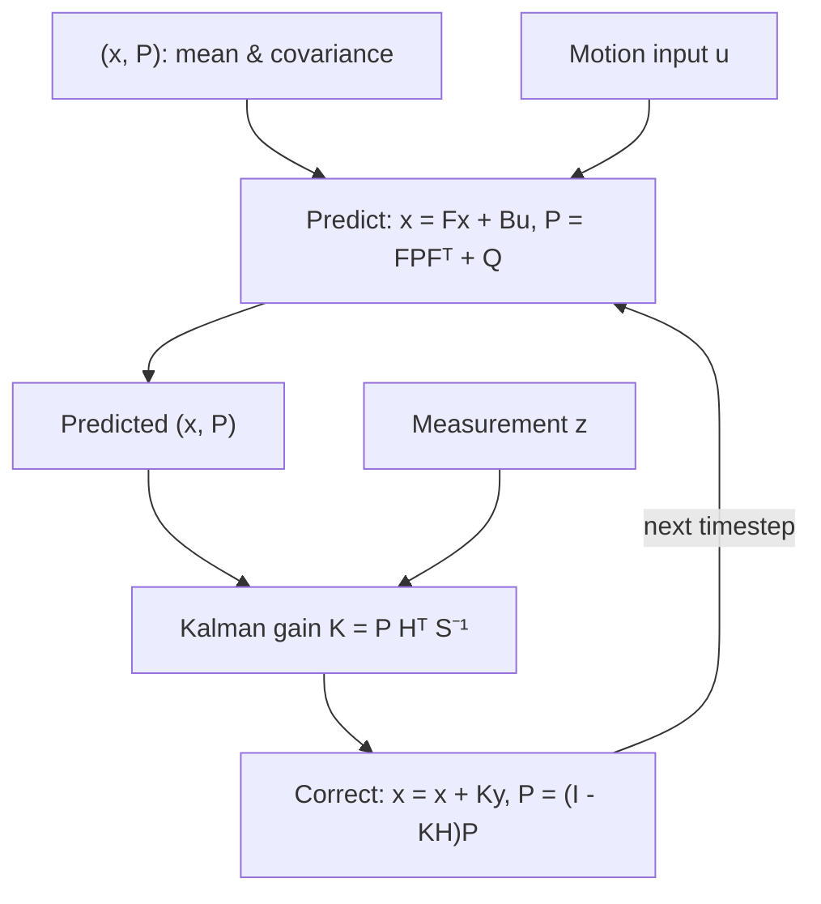

# Kalman Filters in ROS 2 — Unit 3: Kalman Filters

The Bayes filter from Unit 2 works on any distribution but is expensive: a fine grid over a 6D robot state (x, y, theta, and their velocities) is computationally hopeless. A Kalman filter is the same predict/correct recursion restricted to **Gaussian** beliefs, which collapses "update a whole distribution" into "update a mean and a covariance matrix with matrix algebra" — cheap enough to run at hundreds of Hz on real hardware.

The diagram below shows the same predict/correct recursion from Unit 2, now expressed as matrix updates to a mean/covariance pair `(x, P)` with the Kalman gain deciding how much a new measurement moves the estimate.



## From histograms to Gaussians

A histogram belief needs one number per grid cell. A Gaussian belief needs only two numbers, mean `μ` and variance `σ²`, regardless of how fine you'd want the grid to be — and crucially, the sum or product of two Gaussians is itself a Gaussian, so the predict and correct steps stay closed-form forever instead of needing renormalization over an ever-larger grid. The tradeoff: a Gaussian belief can only represent one "hump" of confidence. If the robot might genuinely be in one of two rooms, a single Gaussian can't represent that — you'd need a particle filter (Unit 5) for that case.

## The one-dimensional Kalman filter

Track a single scalar state, e.g. position along a rail, with mean `x` and variance `P`.

**Correct step** — fuse the prediction with a new measurement `z` (variance `R`), weighted by the Kalman gain `K`:

```python
def kf_correct(x, P, z, R):
    K = P / (P + R)          # Kalman gain: how much to trust the new measurement
    x_new = x + K * (z - x)  # nudge estimate toward measurement, scaled by trust
    P_new = (1 - K) * P      # uncertainty always shrinks after a correct step
    return x_new, P_new
```

**Predict step** — advance the state through a motion model (here: add a commanded velocity `u` over `dt`) and inflate uncertainty by process noise `Q`:

```python
def kf_predict(x, P, u, dt, Q):
    x_new = x + u * dt
    P_new = P + Q             # uncertainty always grows after a predict step
    return x_new, P_new
```

Initialization matters: start `x` at your best guess and `P` large if you're unsure — an overconfident (too-small) initial `P` makes the filter distrust correct early measurements, which can take a long time to recover from.

```python
x, P = 0.0, 1.0   # initial belief: position 0, quite uncertain
for u, z in zip(commanded_velocities, sensor_readings):
    x, P = kf_predict(x, P, u, dt=0.1, Q=0.01)
    x, P = kf_correct(x, P, z, R=0.25)
```

## Visualizing the filter in action

Wire this loop into a ROS 2 node that publishes `x` on a `std_msgs/Float64` topic alongside the raw sensor reading and the raw odometry integration, then compare all three live:

```bash
ros2 run rqt_plot rqt_plot /kf_estimate/data /raw_sensor/data /raw_odom/data
```

You should see the raw odometry drift, the raw sensor jitter, and the filtered estimate track a smooth line between them — hugging whichever input currently has lower declared variance.

## The multidimensional Kalman filter

Real robot state is a vector (position, velocity, heading, ...), so `x` becomes a vector, `P` becomes a covariance matrix, and the scalar arithmetic above becomes matrix algebra:

```
predict:  x = F x + B u        P = F P Fᵀ + Q
correct:  y = z - H x          S = H P Hᵀ + R
          K = P Hᵀ S⁻¹
          x = x + K y          P = (I - K H) P
```

`F` is the state-transition matrix (how state evolves with no input), `H` maps state into measurement space (a GPS sensor might only measure position, not velocity), and `Q`/`R` are the process- and measurement-noise covariance matrices — the multidimensional generalization of the scalar `Q`/`R` above. This is exactly the math `robot_localization`'s `ekf_node` runs internally once you configure it in Unit 4; you're deriving what's under the hood before treating it as a black box.

## Appendix: simulating sensor noise in Gazebo

To have anything realistic to filter, your simulated sensors need noise added deliberately — a noiseless simulated sensor teaches you nothing about fusion. Most Gazebo sensor plugins (odometry, IMU, lidar) expose a `<noise>` block with a Gaussian `mean` and `stddev`; setting a nonzero `stddev` there is what makes `R` in the equations above meaningful rather than academic.

## Try it yourself

Take the 1D `kf_predict`/`kf_correct` loop above and run it against a synthetic ground truth: generate `commanded_velocities` as a constant 1.0, and `sensor_readings` as the true position plus `np.random.normal(0, 0.5)` noise. Plot true position, raw sensor readings, and filtered `x` over 50 steps. Confirm the filtered line has lower error than the raw sensor alone.
