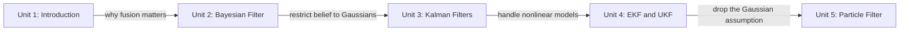

# Kalman Filters in ROS 2

Robot localization is fundamentally a problem of combining several noisy, partial sources of information — wheel odometry, IMU readings, lidar scans, GPS — into one trustworthy estimate of where the robot actually is. This course builds that ability from the ground up: starting with the general Bayesian filtering framework, specializing it into the closed-form Kalman filter for linear Gaussian systems, extending it to the nonlinear motion and sensor models real robots actually have (EKF, UKF), and finally dropping the Gaussian assumption entirely with the particle filter for cases where belief can be multimodal. Each unit pairs the underlying math with a hands-on ROS 2 implementation, culminating in configuring and running the production-grade `robot_localization` and `nav2_amcl` packages.

The diagram below shows how each unit's concept builds directly on the one before it, from the general framework down to the specific ROS 2 packages you configure at the end.

1. [Introduction to the Course](01-introduction-to-the-course.md) — Why localization needs filtering, a first taste of fusion in action, and the tools and robots used throughout the course.
2. [Bayesian Filter](02-bayesian-filter.md) — The general recursive predict/correct framework built from scratch over a discrete probability grid.
3. [Kalman Filters](03-kalman-filters.md) — The closed-form Gaussian special case, from one-dimensional to multidimensional state estimation.
4. [Extended Kalman Filter and Unscented Kalman Filter](04-extended-kalman-filter-and-unscented-kalman-filter.md) — Handling nonlinear motion and sensor models via linearization (EKF) or sigma-point sampling (UKF), and configuring `robot_localization`.
5. [Particle Filter](05-particle-filter.md) — Representing multimodal belief with weighted samples, and configuring AMCL for global localization.
