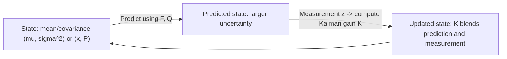

# Kalman Filters — Unit 3: Kalman Filters

Unit 2 built the Bayes Filter over discrete histograms. This unit specializes it to the case where beliefs and noise are Gaussian — the assumption that turns an expensive grid convolution into a handful of closed-form matrix equations: the Kalman filter.

The diagram below shows the same predict/update cycle from Unit 2, now specialized to the closed-form Gaussian math and centered on the Kalman gain `K`.



## From histograms to Gaussian distributions

A histogram belief needs one probability value per grid cell — fine in 1D, intractable once you track position, velocity, and heading together (the grid size explodes combinatorially). A **Gaussian** distribution instead represents an entire belief with just two numbers per dimension: a mean `μ` (the best estimate) and a variance `σ²` (the uncertainty). The Kalman filter's core assumption is that if your prior belief, motion noise, and sensor noise are all Gaussian, and your motion/sensor models are linear, then the posterior belief is *exactly* Gaussian too — no approximation needed, and no grid required. That's why it's cheap: predict and update become closed-form updates to `(μ, σ²)` instead of a convolution over every possible state.

## The one-dimensional Kalman filter

For a single scalar state (say, 1D position), the filter tracks `(μ, σ²)` and cycles through:

**Predict** (motion model `x' = x + u` with process noise `σ²_u`):
```
μ_pred = μ + u
σ²_pred = σ² + σ²_u
```

**Update** (measurement `z` with sensor noise `σ²_z`), via the same fusion formula from Unit 1:
```
K = σ²_pred / (σ²_pred + σ²_z)        # Kalman gain: how much to trust the measurement
μ = μ_pred + K * (z - μ_pred)
σ² = (1 - K) * σ²_pred
```

`K` (the Kalman gain) is the crux of the whole algorithm — it's a self-tuning weighting between "trust my prediction" (`K → 0`, low measurement confidence) and "trust the sensor" (`K → 1`, low prediction confidence).

```python
def kf_1d_predict(mu, var, u, process_var):
    return mu + u, var + process_var

def kf_1d_update(mu, var, z, sensor_var):
    K = var / (var + sensor_var)
    mu = mu + K * (z - mu)
    var = (1 - K) * var
    return mu, var

mu, var = 0.0, 1.0
for u, z in [(1.0, 1.1), (1.0, 1.9), (1.0, 3.2)]:
    mu, var = kf_1d_predict(mu, var, u, process_var=0.1)
    mu, var = kf_1d_update(mu, var, z, sensor_var=0.3)
    print(f"mu={mu:.3f} var={var:.3f}")
```

## The multivariate Kalman filter

Real robot state is a vector — e.g. `x = [position, velocity]ᵀ`. The equations generalize directly, with matrices replacing scalars:

- **State transition matrix `F`**: how the state evolves without control (`x' = F x + B u`).
- **Process noise covariance `Q`**: uncertainty added by the motion model.
- **Measurement matrix `H`**: maps state space to measurement space (you might only measure position, not velocity, directly).
- **Measurement noise covariance `R`**.

```
Predict:  x_pred = F x + B u
          P_pred = F P Fᵀ + Q

Update:   y = z - H x_pred                      # innovation (measurement residual)
          S = H P_pred Hᵀ + R                    # innovation covariance
          K = P_pred Hᵀ S⁻¹                       # Kalman gain (now a matrix)
          x = x_pred + K y
          P = (I - K H) P_pred
```

A constant-velocity position tracker with `dt` between steps:

```python
import numpy as np

dt = 0.1
F = np.array([[1, dt], [0, 1]])       # position += velocity*dt; velocity constant
H = np.array([[1, 0]])                # we only measure position
Q = np.eye(2) * 0.01
R = np.array([[0.5]])

x = np.array([[0.0], [1.0]])          # start at position 0, velocity 1
P = np.eye(2)

def predict(x, P):
    return F @ x, F @ P @ F.T + Q

def update(x, P, z):
    y = z - H @ x
    S = H @ P @ H.T + R
    K = P @ H.T @ np.linalg.inv(S)
    x = x + K @ y
    P = (np.eye(2) - K @ H) @ P
    return x, P

for z in [[0.12], [0.21], [0.29]]:
    x, P = predict(x, P)
    x, P = update(x, P, np.array(z))
print(x.ravel(), "\n", P)
```

Note this recovers both position *and* velocity from position-only measurements — the filter infers velocity from how position changes across updates, using the motion model.

## Try it yourself

Modify the multivariate example to track `[position, velocity, acceleration]` (a 3-state constant-acceleration model). You'll need to extend `F` to a 3x3 matrix reflecting `position += velocity*dt + 0.5*acceleration*dt²`, `velocity += acceleration*dt`, and adjust `H`, `Q`, and the initial `x`/`P` shapes accordingly. Feed it the same style of noisy position-only measurements and check that acceleration converges toward a sensible value.
