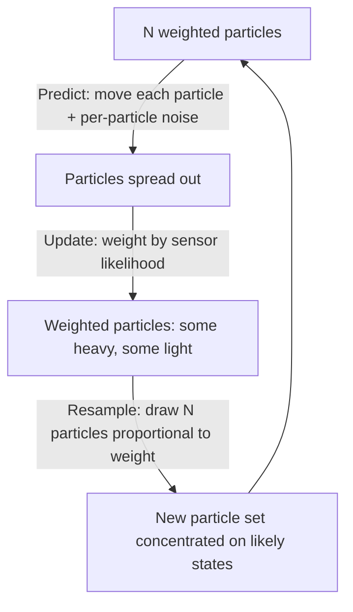

# Kalman Filters — Unit 5: Particle Filter

The EKF and UKF still assume the belief can be represented as a single Gaussian bump. Sometimes it can't — a robot placed in a symmetric building might genuinely believe it's in one of several rooms at once. This unit covers the particle filter, which drops the Gaussian assumption entirely and represents belief as a swarm of weighted samples.

The diagram below shows the three-phase predict/update/resample cycle that distinguishes the particle filter from the two-phase Bayes and Kalman filters seen in earlier units.



## Properties of the particle filter

A particle filter represents the belief `bel(x)` as a set of `N` weighted samples ("particles") `{(x_i, w_i)}`, each a full hypothesis of the robot's state. Dense clusters of particles represent high-probability regions; sparse areas represent low-probability regions. Unlike a Gaussian, this representation can be **multimodal** (several separate clusters, e.g. "probably in room A, but maybe room B"), non-symmetric, and can represent belief over discontinuous or non-Euclidean state spaces without any linearization. The tradeoff is computational: accuracy scales with the number of particles, and in high-dimensional state spaces you may need a very large `N` to cover the space adequately — this is sometimes called the curse of dimensionality for particle filters.

## The main filter steps

Each cycle of a particle filter runs three phases:

1. **Prediction (sampling)**: move every particle according to the motion model, adding noise sampled per-particle (not a single shared uncertainty — each particle gets its *own* random perturbation).
2. **Update (weighting)**: for each particle, compute how likely the actual sensor reading would be *if that particle's hypothesized state were true*, and set the particle's weight proportional to that likelihood.
3. **Resampling**: draw a new set of `N` particles from the current set, with probability proportional to weight. Likely particles get duplicated; unlikely ones are discarded. This concentrates computational effort where the probability mass actually is, and prevents "particle depletion" where nearly all weight ends up on one particle while the rest are wasted.

```python
import numpy as np

def predict(particles, u, motion_noise):
    noise = np.random.normal(0, motion_noise, size=particles.shape)
    return particles + u + noise

def update_weights(particles, z, landmark, sensor_noise):
    predicted_range = np.abs(particles - landmark)
    likelihood = np.exp(-0.5 * ((predicted_range - z) / sensor_noise) ** 2)
    weights = likelihood + 1e-300  # avoid all-zero weights
    return weights / weights.sum()

def resample(particles, weights):
    idx = np.random.choice(len(particles), size=len(particles), p=weights)
    return particles[idx]

N = 1000
particles = np.random.uniform(0, 20, size=N)   # uniform prior over a 1D hallway
for u, z in [(1.0, 6.2), (1.0, 5.1), (1.0, 4.0)]:
    particles = predict(particles, u, motion_noise=0.3)
    weights = update_weights(particles, z, landmark=10.0, sensor_noise=0.5)
    particles = resample(particles, weights)

print(f"estimate: {particles.mean():.2f}  spread: {particles.std():.2f}")
```

## Adaptive Monte Carlo Localization (AMCL)

AMCL is the standard particle-filter localization algorithm for a robot navigating a known occupancy grid map, using a lidar (or other rangefinder) to correct wheel-odometry drift. "Adaptive" refers to AMCL dynamically varying the number of particles: it uses more particles when uncertainty is high (e.g. right after a "kidnapped robot" global relocalization) and fewer once the belief has converged tightly, saving computation. AMCL ships as a standard package in the ROS navigation stack ([Nav2](https://docs.nav2.org/) in ROS 2), and is typically configured rather than written from scratch.

## Using AMCL with a rangefinder-equipped robot

A typical AMCL setup needs three inputs already running: a static map (from `map_server`), a transform tree with a laser-to-base-link transform, and a live scan topic. Launching it and giving an initial pose estimate looks like:

```bash
ros2 launch nav2_bringup localization_launch.py map:=my_map.yaml

# publish a rough initial pose (e.g. from RViz's "2D Pose Estimate" tool,
# or directly on the topic):
ros2 topic pub -1 /initialpose geometry_msgs/msg/PoseWithCovarianceStamped \
  "{header: {frame_id: 'map'}, pose: {pose: {position: {x: 1.0, y: 2.0, z: 0.0}}}}"

ros2 topic echo /amcl_pose
```

As the robot drives and its lidar scans match against the known map, `/amcl_pose`'s covariance should shrink — the particle cloud converging around the true pose, visible in RViz as the particle cluster tightening around the robot icon.

## Try it yourself

Modify the 1D particle filter code above to place *two* landmarks at `10.0` and `14.0`, and give the robot a sensor that reports distance to whichever landmark is closer (so early on, with wide particle spread, the belief may split into two clusters — one hypothesis near each landmark). Run several predict/update/resample cycles and watch whether the particle cloud stays bimodal or collapses onto the correct landmark once enough motion has occurred to disambiguate them.
