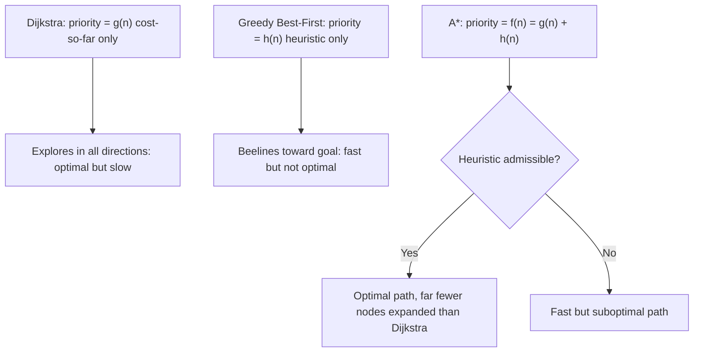

# Path Planning Basics — Unit 3: A* Search Algorithm

A* is the algorithm most people reach for first in real path-planning code, because it keeps Dijkstra's optimality guarantee while cutting the wasted exploration you measured in Unit 2. This unit builds up to it via heuristics and Greedy Best-First Search, so you understand exactly what A* is trading off.

The diagram below contrasts the three priority functions this unit builds up through, and what each one costs or buys you.


## Informed search and heuristics
Dijkstra is "uninformed" — it only knows the cost accumulated so far, `g(n)`. An *informed* search additionally uses a heuristic function `h(n)` that estimates the remaining cost from node `n` to the goal, letting the search prioritize nodes that seem to be heading in the right direction. The two most common grid heuristics are:
- **Euclidean distance**: `h(n) = sqrt((nx-gx)^2 + (ny-gy)^2)` — straight-line distance, appropriate when the robot can move in any direction.
- **Manhattan distance**: `h(n) = |nx-gx| + |ny-gy|` — appropriate for grids that only allow 4-connected (up/down/left/right) moves, since diagonal movement isn't possible anyway.
Using a heuristic that doesn't match the grid's actual movement model (e.g. Manhattan distance on an 8-connected grid) can overestimate true cost and break optimality guarantees — this is why the heuristic choice isn't cosmetic.

## Greedy Best-First Search
The simplest way to use a heuristic is to ignore `g(n)` entirely and always expand the node with the smallest `h(n)` — the one that *looks* closest to the goal:
```python
frontier = [(heuristic(start, goal), start)]
```
This is fast because it beelines toward the goal, but it's not optimal: it can walk straight into a dead end or around a long obstacle, since it never accounts for cost already spent. Testing it against the same grid/simulator setup from Unit 2 usually exposes this quickly — Greedy BFS finds *a* path fast, but often a visibly longer one than Dijkstra's, and can behave erratically near concave obstacles (it will hug the obstacle boundary chasing the heuristic instead of routing around efficiently).

## A*'s special secret
A* combines both signals into a single priority: `f(n) = g(n) + h(n)` — actual cost so far, plus estimated cost remaining. This keeps the "head toward the goal" efficiency of Greedy BFS while retaining Dijkstra's guarantee against underestimating a path's true cost, *provided* the heuristic is **admissible** (never overestimates the true remaining cost). Euclidean distance is admissible for a robot that can move freely in continuous directions; Manhattan distance is admissible for a 4-connected grid. With an admissible heuristic, A* is guaranteed to find the optimal path, and in practice explores dramatically fewer nodes than Dijkstra to do it.

## A* search, full details
The algorithm is Dijkstra's with one change: the priority queue is ordered by `f(n) = g(n) + h(n)` instead of `g(n)` alone.
```python
import heapq

def a_star(grid, start, goal, heuristic):
    frontier = [(heuristic(start, goal), start)]
    g_score = {start: 0}
    came_from = {start: None}

    while frontier:
        _, current = heapq.heappop(frontier)
        if current == goal:
            break
        for nxt in grid.neighbors(current):
            new_g = g_score[current] + grid.cost(current, nxt)
            if nxt not in g_score or new_g < g_score[nxt]:
                g_score[nxt] = new_g
                f_score = new_g + heuristic(nxt, goal)
                heapq.heappush(frontier, (f_score, nxt))
                came_from[nxt] = current

    if goal not in came_from:
        return None
    path, node = [], goal
    while node is not None:
        path.append(node)
        node = came_from[node]
    return list(reversed(path))
```
Note that unlike the Dijkstra version, there's no separate "current cost" check on pop — with an admissible, *consistent* heuristic on a grid this simple implementation is fine, though production implementations often add a closed-set check to avoid re-expanding finalized nodes.

## Testing A* with ROS 2 and Gazebo
Reuse the same waypoint-publishing setup from Unit 2, but instrument both planners so you can compare them directly on the same map:
```bash
ros2 topic pub /goal_pose geometry_msgs/msg/PoseStamped "{...}"
ros2 topic echo /planned_path   # if you publish nav_msgs/msg/Path from your planner
```
Run Dijkstra and A* on the same start/goal/obstacle configuration and log nodes-expanded and path-length for each. This is the most convincing way to see the theory turn into a number: A* should expand visibly fewer nodes than Dijkstra while producing the identical (optimal) path length.

## A* search limitations
A* is still a grid/graph search — its runtime and memory both scale with the number of nodes explored, which grows fast in large or high-resolution maps, and it degrades toward Dijkstra's behavior when the heuristic is weak or the map is maze-like with many dead ends. It also assumes a static, fully known map; if the environment changes after planning, you must replan from scratch (or use a variant like D* that's built to reuse prior search effort). None of this is specific to A* — it's inherent to any planner that discretizes space into a grid, which is exactly the assumption RRT (Unit 4) drops.

## Conclusions
A* is Dijkstra plus a goal-aware heuristic, and that one addition is enough to make it the default choice for grid-based global planning in most robotics stacks. You've now implemented, tested, and directly compared three search strategies (Dijkstra, Greedy BFS, A*) on identical maps — the next unit leaves grids behind entirely.

## Try it yourself
On your Unit 1 grid, run Greedy Best-First Search, Dijkstra, and A* side by side and record each one's path length and node-expansion count in a small table. Then intentionally make the heuristic inadmissible (e.g. multiply Euclidean distance by 3) and rerun A* — confirm for yourself that it now returns a suboptimal path, which is the practical meaning of "admissibility" beyond the textbook definition.
