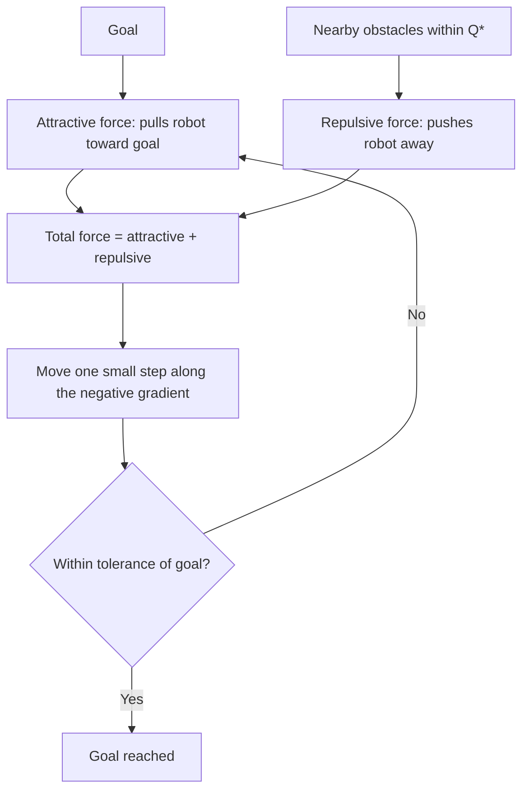

# Path Planning Basics — Unit 5: Artificial Potential Fields

Artificial Potential Fields (APF) is a fundamentally reactive, local approach: instead of searching a graph or tree for a path in advance, it treats the goal as attractive and obstacles as repulsive, and moves the robot by "rolling downhill" along the combined field at every timestep. It's the go-to conceptual model behind reactive local planners and costmap-based obstacle avoidance.

The diagram below shows how the attractive and repulsive fields combine into the per-timestep control loop that this unit builds toward.


## Attractive potentials
The goal generates an attractive field that pulls the robot toward it, analogous to a ball rolling into a valley. A simple **conical** potential grows linearly with distance to the goal:
```
U_att(q) = k_att * distance(q, goal)
```
and a **quadratic** potential grows with squared distance:
```
U_att(q) = 0.5 * k_att * distance(q, goal)^2
```
The quadratic form produces a force (its negative gradient) that scales with distance — strong pull far from the goal, gentle pull close to it, which converges smoothly. The conical form produces a constant-magnitude pull regardless of distance, which avoids huge forces far from the goal but can overshoot/oscillate near it. A common practical compromise is quadratic close to the goal and conical (capped) further away.

## Repulsive fields and costmaps
Each obstacle generates a repulsive field that pushes the robot away, active only within some influence radius `Q*`:
```
U_rep(q) = 0.5 * k_rep * (1/d(q) - 1/Q*)^2   if d(q) <= Q*
U_rep(q) = 0                                  if d(q) > Q*
```
where `d(q)` is the robot's distance to the nearest obstacle. This should look familiar if you've seen a ROS 2 costmap (as in Nav2's `costmap_2d`): costmaps assign a cost that decays with distance from an obstacle out to an inflation radius, which is exactly a discretized, precomputed repulsive field. Understanding APF gives you real intuition for why costmap inflation parameters behave the way they do.

**Repulsive field parameters** worth tuning deliberately: `k_rep` (how strongly obstacles push back) and `Q*` (how far their influence reaches). Too small a `Q*` and the robot won't react until it's dangerously close; too large and obstacles influence the robot's path from unnecessarily far away, potentially blocking otherwise-clear routes.

## Expanding obstacles and buffer zones
Two practical techniques make APF (and costmap-based planning generally) robust to robot size and modeling error:
- **Expanding map obstacles**: inflate every obstacle cell outward by (at least) the robot's radius before computing distances, so a point-robot approximation of `d(q)` still guarantees the actual robot body won't collide.
- **Adding a buffer zone**: inflate a bit further still, as a safety margin against localization error, sensor noise, and control tracking error — the robot won't graze walls it planned to just barely avoid.

## Generating the total field and following it
The total potential is the sum of the attractive field and every obstacle's repulsive field:
```
U_total(q) = U_att(q) + sum(U_rep_i(q) for each obstacle i)
```
The robot moves by **gradient descent**: at each step, compute the negative gradient of `U_total` at the current position (the direction of steepest decrease) and move a small step that way.
```python
def apf_step(pos, goal, obstacles, k_att=1.0, k_rep=100.0, q_star=2.0, step=0.1):
    force = attractive_force(pos, goal, k_att)
    for obs in obstacles:
        d = distance(pos, obs)
        if d <= q_star:
            force += repulsive_force(pos, obs, k_rep, q_star, d)
    unit_force = force / norm(force)
    return pos + step * unit_force
```
Running this in a loop until the robot is within tolerance of the goal produces a smooth, real-time-reactive trajectory, in contrast to the pre-computed paths of Units 2-4.

## Testing with ROS 2 and Gazebo
Because APF recomputes at every step from current sensor/pose data rather than planning once, it maps naturally onto a ROS 2 control loop: subscribe to `/scan` or a live costmap, subscribe to `/odom` for current pose, compute `apf_step`, and publish the resulting heading as a `geometry_msgs/msg/Twist` on `/cmd_vel` at a fixed rate (e.g. 10-20 Hz). This is worth running against a simulated robot with a couple of obstacles between it and the goal so you can watch it curve around them live, rather than following a pre-planned polyline.

## Pros and cons
**Pros**: computationally cheap per step, naturally reactive to dynamic/unforeseen obstacles, no need to build or search a graph. **Cons**: the classic failure mode is **local minima** — a U-shaped or concave obstacle can create a point where attractive and repulsive forces exactly cancel, trapping the robot short of the goal with zero net force. APF also gives no completeness guarantee (unlike Dijkstra/A*) and no optimality guarantee (unlike RRT*). In practice, APF-style reactive control is usually paired with a global planner (Units 2-4) that keeps it out of large-scale traps, using the field only for local, short-horizon obstacle avoidance.

## Conclusions
Potential fields reframe path planning as a continuous control problem rather than a discrete search problem, and directly explain the intuition behind costmap-based local planning used throughout ROS 2 navigation stacks. The final unit brings global planning back into the picture with a real-world map source.

## Try it yourself
Construct a concave, U-shaped obstacle in a small test environment (three walls forming a pocket, open on one side facing away from the goal) and run your `apf_step` loop with the robot starting inside the pocket. Confirm it gets stuck at a local minimum, then try increasing `k_att` relative to `k_rep` and observe whether that's enough to escape — this is the practical tradeoff every APF tuning session runs into.
