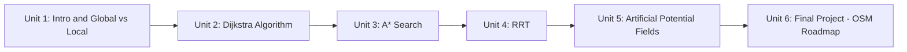

# Path Planning Basics

Path planning is the piece of the autonomy stack that turns "here's a map and a goal" into a concrete, collision-free sequence of positions for a robot to follow. This course builds up the field's core algorithms from first principles — starting with Dijkstra's classic shortest-path search, adding heuristics to get A*, dropping grid discretization entirely for the sampling-based RRT, and reframing planning as continuous reactive control with artificial potential fields — then closes with a final project that applies the very first algorithm you learn to a real-world road network via OpenStreetMap. Each unit pairs the underlying theory with a working Python implementation and a way to test it against a simulated robot.

The diagram below shows how each unit builds directly on the algorithm or concept introduced in the one before it.

1. [Introduction to the Course](01-introduction-to-the-course.md) — What path planning is, how it fits into the navigation stack, and the global-vs-local distinction that frames the rest of the course.
2. [Dijkstra Algorithm](02-dijkstra-algorithm.md) — The classic optimal shortest-path search over a grid graph, implemented in Python and tested against a simulated robot.
3. [A* Search Algorithm](03-a-star-search-algorithm.md) — Adding heuristics (via Greedy Best-First Search) to Dijkstra to search faster while keeping optimality.
4. [Rapidly-Exploring Random Tree (RRT)](04-rapidly-exploring-random-tree-rrt.md) — A sampling-based planner for continuous, high-dimensional configuration spaces where grids don't scale.
5. [Artificial Potential Fields](05-artificial-potential-fields.md) — Reactive, gradient-descent-based local planning using attractive and repulsive fields, and its link to ROS 2 costmaps.
6. [Final Project: Roadmap Based Path Planning](06-final-project-roadmap-based-path-planning.md) — Applying Dijkstra to a real road network extracted from OpenStreetMap.
