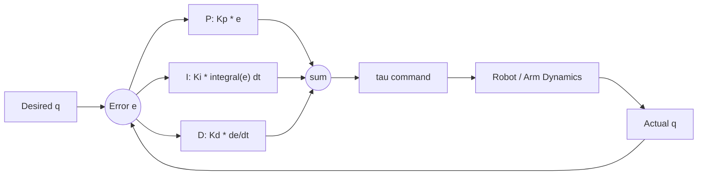

# Robot Control Basics — Unit 2: PID Control

Proportional-Integral-Derivative (PID) control is the workhorse feedback law behind most single-joint robot controllers, from hobby servos to industrial arm joint controllers. This unit builds PID up term by term against the dynamics of a 2DOF robotic arm so you understand not just the formula but why each term exists.

The diagram below shows how the P, I, and D terms each read the same error signal and sum together into the torque command that closes the loop around the robot.



## Robot dynamics review
Any rigid-link manipulator obeys an equation of motion of the general form:

```
M(q) * q_ddot + C(q, q_dot) * q_dot + G(q) = tau
```

where `q` is the joint-position vector, `M(q)` is the (configuration-dependent) inertia matrix, `C(q, q_dot)` captures Coriolis/centripetal coupling between joints, `G(q)` is the gravity torque vector, and `tau` is the vector of joint torques you command. This is nonlinear and coupled — moving joint 1 changes the effective inertia felt by joint 2, and gravity's effect on each joint depends on the whole arm's pose. Feedback control (this unit) largely treats these effects as disturbances to reject; Unit 4 (Multivariable Control) shows how to explicitly cancel them.

## Example 1: 2DOF arm with gravity
For a 2-link planar arm with link masses concentrated near the elbow and end-effector, `G(q)` has nonzero terms that depend on `cos(q1)` and `cos(q1+q2)`. Practically: holding the arm horizontal requires constant nonzero torque just to counteract gravity, even at rest (`q_dot = q_ddot = 0`). Any controller that ignores this will show steady-state droop — the arm settles below the commanded angle because the P-term alone can't fully cancel a constant disturbance.

## Example 2: 2DOF arm without gravity
Strip `G(q)` out (imagine the arm moving in a horizontal plane instead of vertical) and the same P-only controller behaves much better at rest — no constant disturbance to fight, so steady-state error goes to zero without needing an I-term. Comparing these two cases side by side is the clearest way to see *why* the integral term exists: it's specifically there to cancel constant or slowly-varying disturbances like gravity or friction offset that pure proportional control can't remove.

## Actuator dynamics
Real motors aren't ideal torque sources. A DC motor with gearbox has its own dynamics — armature inductance/resistance, back-EMF, gear friction, and backlash — that sit between your commanded torque and the torque actually delivered to the joint. For learning purposes it's common to approximate the actuator as a first-order lag (`tau_actual = tau_commanded / (1 + s*T_actuator)` in the Laplace domain) or simply ignore it for a first pass and treat commanded torque as instantaneous. Be aware, though, that actuator lag is one of the most common reasons a controller that's stable in simulation oscillates on real hardware — it adds phase delay that erodes your stability margin.

## Proportional control
Proportional control commands torque proportional to the current position error:

```
tau = Kp * (q_desired - q)
```

Larger `Kp` means a stiffer response and faster correction, but push it too high and you overshoot or excite unmodeled dynamics (actuator lag, structural flex) into oscillation. P-only control on a gravity-loaded joint always leaves steady-state error, because at the point where `tau = G(q)` (equilibrium), the error is exactly `G(q)/Kp` — not zero.

## Derivative control
Derivative control commands torque proportional to the rate of change of error:

```
tau = Kd * (q_dot_desired - q_dot) = -Kd * q_dot   (if q_dot_desired = 0)
```

This acts like added damping — it resists fast motion, which suppresses overshoot and oscillation from the P-term. D-term alone does nothing to correct a static position error (if the arm isn't moving, `q_dot = 0` regardless of how far off `q` is), so it's always paired with P, never used alone.

## Integral control
Integral control accumulates the error over time and feeds that accumulation back as torque:

```
tau = Ki * integral(q_desired - q) dt
```

As long as any steady error persists, the integral term keeps growing until it produces enough torque to eliminate it — this is exactly what's needed to cancel the constant gravity offset from Example 1. The tradeoffs: integral action adds phase lag (can destabilize a fast loop) and can "wind up" — the accumulated sum keeps growing while the actuator is saturated (e.g., hitting a torque limit), causing large overshoot once the error finally reverses. Anti-windup (clamping the integral term or the output) is a standard practical fix.

## PD control
Combining P and D gives fast, damped response with no steady-state-error correction:

```
tau = Kp * (q_desired - q) + Kd * (q_dot_desired - q_dot)
```

PD is the most common controller for trajectory tracking where a small residual position error is acceptable, or where gravity is separately compensated (feedforward `G(q)` added to the PD output — a preview of Unit 4).

## PI control
Combining P and I removes steady-state error but sacrifices some damping/speed:

```
tau = Kp * (q_desired - q) + Ki * integral(q_desired - q) dt
```

PI is less common in joint-position control (where D-damping is usually valuable) but shows up often in velocity or force loops where fast transients matter less than eliminating offset.

## PID control
Putting all three together:

```
tau = Kp * e + Ki * integral(e) dt + Kd * de/dt      where e = q_desired - q
```

This is the standard form. A simple discrete-time implementation you can drop into a control loop running at fixed timestep `dt`:

```python
class PIDController:
    def __init__(self, kp, ki, kd, dt):
        self.kp, self.ki, self.kd, self.dt = kp, ki, kd, dt
        self.integral = 0.0
        self.prev_error = 0.0

    def compute(self, desired, actual):
        error = desired - actual
        self.integral += error * self.dt
        derivative = (error - self.prev_error) / self.dt
        self.prev_error = error
        return self.kp * error + self.ki * self.integral + self.kd * derivative
```

Tuning is usually done experimentally: raise `Kp` until the response is fast but starts to ring, add `Kd` to damp the ringing, then add a small `Ki` only if steady-state error remains a problem.

## Conclusions
PID gives you three independent knobs — correct current error, resist rate of change, and eliminate accumulated offset — that combine into the single most common feedback law in robotics. The next unit applies this per-joint, and Unit 4 shows what you gain by going beyond independent per-joint loops to a model-based multivariable controller.

## Try it yourself
Using the 1-link pendulum from Unit 1, implement the `PIDController` class above and drive it toward a setpoint of `theta = 45 degrees` starting from `theta = 0`. First try P-only and note the steady-state error caused by gravity. Then add a small `Ki` and watch the error decay to zero over several seconds. Finally add `Kd` and see how it reduces overshoot as you increase `Kp`.
