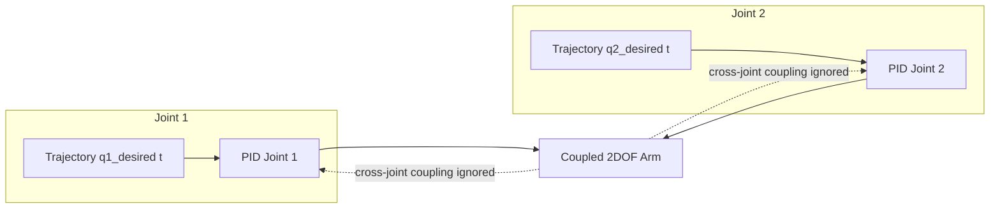

# Robot Control Basics — Unit 3: Independent Joint Control

Independent joint control is the practical way most industrial and hobby manipulators are actually controlled: instead of solving one big coupled multivariable problem, you run a separate PID (or similar) loop on each joint, treating cross-joint coupling as a disturbance. This unit covers setpoint tracking and — just as important — how to generate the setpoints (trajectories) that those loops track.

The diagram below shows each joint getting its own trajectory and its own PID loop, with the physical coupling between joints in the shared arm left uncompensated.



## Quick recap: controlling joint angles
Recall from Unit 2 that a single joint's torque command is `tau = Kp*e + Ki*integral(e) + Kd*de/dt`. "Independent joint control" means you instantiate one of these loops per joint (`n` joints -> `n` independent PID controllers), each running against its own `q_desired[i]`, `q[i]`, `q_dot[i]`. This is an approximation: joint `i`'s true dynamics depend on the whole arm's configuration and motion (the `C(q,q_dot)` coupling term from Unit 2), but for many arms — especially those with high gear ratios where each joint's own actuator inertia dominates — the approximation works well enough in practice.

## Set point tracking
"Setpoint tracking" is the general term for the controller's job: given a target value (a setpoint) for the controlled variable, drive the actual variable to match it and keep it there. In independent joint control, the setpoint for joint `i` is `q_desired[i]`, and the loop from Unit 2 runs at each control-cycle timestep (e.g., every 1-10 ms for a typical joint servo loop):

```python
for i, joint_pid in enumerate(joint_pids):
    tau[i] = joint_pid.compute(q_desired[i], q[i])
```

The key design question isn't the loop itself but what `q_desired[i]` should be at each instant — jumping it directly from the current angle to the final target produces a huge initial error, a torque spike, and often overshoot or saturation. That's what trajectory generation (below) solves.

## Set point tracking exercise
Take the `PIDController` from Unit 2 and run a step response test: command a joint from 0 to 90 degrees instantaneously and plot (or print) position vs. time. You should see the classic step-response shape — rise, overshoot, settle — and you can directly relate the overshoot amount and settling time to your `Kp`/`Kd` choices. Now repeat with a *ramped* setpoint that moves gradually from 0 to 90 degrees over 1 second instead of jumping instantly, and compare peak torque and overshoot. This exercise is the practical motivation for trajectory generation.

## Trajectory generation
Rather than commanding a joint's final target directly, you generate a time-parameterized path `q_desired(t)` from the start position to the goal, and feed the controller a moving setpoint. A good trajectory is smooth in position, velocity, and ideally acceleration — discontinuities in any of these translate into torque spikes (jerk) that stress hardware and excite vibration. Trajectory generation is a distinct problem from *path planning* (which decides the geometric route, covered in a separate course) — here we assume the start and end joint values are known and we only need to interpolate a smooth motion between them.

## Trajectory interpolation, general method
The general recipe for point-to-point trajectory generation:
1. Pick a time duration `T` for the motion (or compute the minimum `T` given velocity/acceleration limits).
2. Choose a interpolating function `q(t)` for `t in [0, T]` satisfying `q(0) = q_start`, `q(T) = q_goal`, and (usually) `q_dot(0) = q_dot(T) = 0`.
3. Differentiate `q(t)` analytically to get `q_dot(t)` and `q_ddot(t)` as feedforward references, alongside the position setpoint.

Common choices for `q(t)` include cubic polynomials (smooth velocity, but acceleration jumps at the endpoints), quintic polynomials (smooth through acceleration too, at the cost of more coefficients to solve for), and the piecewise scheme covered next: LSPB.

## Linear Segments with Parabolic Blends (LSPB)
LSPB is a widely used trapezoidal-velocity trajectory: constant acceleration to ramp up to a cruise speed, constant velocity ("linear segment") for the middle portion, then constant deceleration ("parabolic blend") to stop exactly at the goal. Concretely, split total time `T` into three phases — accelerate for `t_b` (the blend time), cruise at constant velocity `v` for `T - 2*t_b`, decelerate for `t_b`:

```python
def lspb(q0, qf, T, tb, t):
    """Position at time t along an LSPB trajectory from q0 to qf over duration T,
    with blend (accel/decel) time tb at each end."""
    v = (qf - q0) / (T - tb)          # cruise velocity
    a = v / tb                          # constant accel/decel magnitude
    if t < tb:
        return q0 + 0.5 * a * t**2
    elif t < T - tb:
        return q0 + a * tb * (t - tb / 2)
    else:
        td = T - t
        return qf - 0.5 * a * td**2
```

LSPB is popular because it's cheap to compute, has a physically intuitive constant-velocity cruise phase, and — unlike a single cubic polynomial — lets you directly bound peak velocity and acceleration, which maps naturally onto real actuator limits.

## Conclusions
Independent joint control turns an `n`-joint manipulator into `n` decoupled single-input single-output (SISO) problems, each solved with the PID toolkit from Unit 2. The remaining piece — deciding what setpoint to feed each loop moment by moment — is trajectory generation, and LSPB is a simple, hardware-friendly way to produce smooth, velocity/acceleration-bounded setpoints. Unit 4 revisits the coupling between joints that independent control ignores, and shows a model-based alternative.

## Try it yourself
Implement the `lspb` function above for a single joint moving from 0 to 90 degrees over `T = 2s` with a blend time `tb = 0.5s`. Sample it every 10 ms, feed each sample as the setpoint into your PID controller from Unit 2, and compare the resulting torque profile against the instantaneous-step-setpoint case from the tracking exercise. You should see a much smaller peak torque with LSPB.
