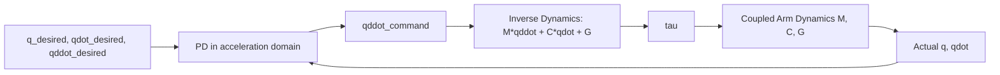

# Robot Control Basics — Unit 4: Multivariable Control

Independent joint control (Unit 3) treats each joint as its own isolated loop and lets the coupling between joints show up as an uncompensated disturbance. Multivariable control instead models the whole arm as one coupled system and designs a controller that explicitly accounts for — and cancels — that coupling. This unit introduces the idea and its most important instance for robotics: inverse dynamics (computed torque) control.

The diagram below shows the inverse dynamics architecture: a PD correction in the acceleration domain is fed through the full dynamics model to compute a torque that cancels the arm's coupling.



## What is Multivariable Control?
A multivariable (MIMO — multi-input, multi-output) system is one where each output depends on more than one input, and vice versa. For an `n`-joint arm, the equation of motion from Unit 2, `M(q)*q_ddot + C(q,q_dot)*q_dot + G(q) = tau`, is inherently multivariable: `M(q)` is a full (not diagonal) matrix in general, meaning applying torque at joint 1 accelerates joint 2 as well, and vice versa, with the coupling strength changing as the arm moves. Independent joint control (n separate SISO PID loops) ignores the off-diagonal terms of `M(q)` and the whole `C(q,q_dot)` term, relying on high gains and gearing to make the approximation good enough. Multivariable control instead designs `tau` as a function of the full state `(q, q_dot)` across all joints simultaneously, so it can compensate for coupling that varies with configuration instead of just resisting it.

## PD Control revisited
Recall PD control from Unit 2: `tau = Kp*e + Kd*de/dt`. In the multivariable setting, `Kp` and `Kd` become matrices (often diagonal, one gain per joint) and `e = q_desired - q` is a vector:

```
tau = Kp @ (q_desired - q) + Kd @ (q_dot_desired - q_dot)
```

This is exactly independent joint control written in matrix form — `Kp` and `Kd` diagonal means each row of the equation only involves one joint's error, so it's mathematically identical to `n` separate PD loops. The multivariable view becomes genuinely different once we stop treating `tau` as *only* a function of error and instead use the dynamics model itself to cancel the nonlinear terms — that's inverse dynamics.

## Inverse Dynamics
Inverse dynamics control (also called computed torque control) uses the known (or estimated) dynamics model to compute exactly the torque needed to achieve a desired acceleration, then adds a feedback correction term on top. Rearranging the equation of motion for `tau`:

```
tau = M(q) @ q_ddot_command + C(q, q_dot) @ q_dot + G(q)
```

Choose `q_ddot_command` as the sum of a desired feedforward acceleration plus a PD correction on the *acceleration-domain* error:

```
q_ddot_command = q_ddot_desired + Kd @ (q_dot_desired - q_dot) + Kp @ (q_desired - q)
```

Substituting back, if your model of `M`, `C`, `G` is accurate, the closed-loop error dynamics reduce to a clean linear, decoupled second-order system per joint: `e_ddot + Kd*e_dot + Kp*e = 0`. This is the powerful result — even though the real system is nonlinear and coupled, the *controller* makes it behave, from the perspective of tracking error, like `n` independent simple linear systems. You get to pick `Kp`/`Kd` per joint using ordinary linear control intuition (natural frequency, damping ratio) with no cross-joint interaction to worry about, because the model-based feedforward term (`M`, `C`, `G`) already cancelled the coupling.

```python
import numpy as np

def inverse_dynamics_torque(M, C, G, q_dot, q_ddot_desired, q_dot_desired, q_desired,
                             q, Kp, Kd):
    error = q_desired - q
    d_error = q_dot_desired - q_dot
    q_ddot_command = q_ddot_desired + Kd @ d_error + Kp @ error
    tau = M @ q_ddot_command + C @ q_dot + G
    return tau
```

The catch: this requires an accurate model of `M(q)`, `C(q,q_dot)`, and `G(q)` computed online at every control cycle. Model error (mass estimates, unmodeled friction, payload changes) directly leaks into tracking error, since the cancellation is only as good as the model. In practice, inverse dynamics is often combined with a robust or adaptive outer loop to handle that residual model uncertainty.

## Conclusions
Multivariable control reframes joint control as one coupled problem instead of `n` independent ones. Diagonal-gain PD control is the degenerate (decoupled) special case; inverse dynamics control is the general case, using the dynamics model itself as a feedforward term that cancels coupling and nonlinearity so a simple linear feedback law can handle what's left. This is the same idea Unit 5 borrows to control force instead of position, and Unit 6's final project uses inverse dynamics directly.

## Try it yourself
Take your 2-link arm's `M(q)`, `C(q,q_dot)`, `G(q)` (derive them, or use a known reference formula for a 2-link planar arm) and implement `inverse_dynamics_torque` above. Command a `q_ddot_desired = 0` trajectory that just holds a fixed pose, and verify the arm holds still with near-zero steady-state error — even at an off-vertical pose where gravity compensation alone (Unit 1's demo) would be needed. Then intentionally use a wrong mass value in `M`/`G` (e.g., 20% too low) and observe how tracking error appears — this is the model-sensitivity tradeoff inverse dynamics control has compared to plain PID.
