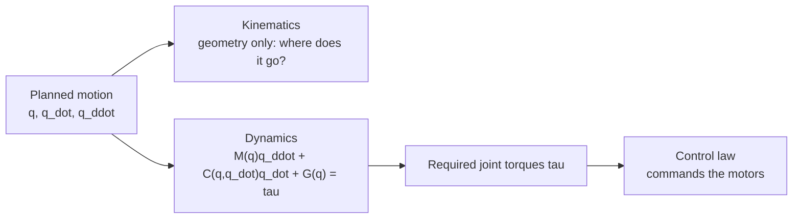

# Robot Dynamics and Control — Unit 1: Introduction

This unit orients you to the course: what "dynamics" adds on top of the kinematics you may already know, the mathematical notation used throughout, and the tools you'll use to model and simulate the systems in later units.

The flowchart below shows where dynamics sits between pure motion planning and actually commanding a robot's motors.



## Kinematics vs. dynamics: why "why" matters
Kinematics answers "where does the robot go if joint 1 rotates 30 degrees" — pure geometry, no forces involved. Dynamics answers "how much torque do I need at joint 1 to make that happen in 0.5 seconds, given the arm's mass and the load it's carrying, and given that gravity is trying to pull it down the whole time." Kinematics is necessary for planning; dynamics is necessary for actually executing the plan on real hardware. A trajectory that's perfectly valid kinematically (positions, velocities within joint limits) can still be physically unrealistic if it demands torques the motors can't deliver, or it can produce nasty vibration if it excites the arm's structural resonance. This course is about building the models (dynamics) and the control laws that use those models (control) to move a robot the way you intend, not just describe how it could move.

## Notation and math background
Throughout the course, `q` denotes the vector of joint positions (angles for revolute joints, displacements for prismatic joints), `q_dot` and `q_ddot` its first and second time derivatives (velocity, acceleration), and `tau` the vector of joint torques/forces you command. Bold capital letters (`M`, `C`) denote matrices; the manipulator equation of motion you'll derive in Unit 3 has the general shape:

```
M(q) * q_ddot + C(q, q_dot) * q_dot + G(q) = tau
```

You need to be comfortable with vectors and matrices (dot products, matrix multiplication, inverses), basic calculus (derivatives, integrals, chain rule), and ideally have seen a rotation matrix before — if not, a quick refresher on 3D rotations pays off immediately in Unit 2. No prior exposure to Lagrangian mechanics or control theory is assumed; both are built from scratch.

## Tools for this course
You can work through every unit with nothing more than Python and NumPy/SciPy (or C++ and Eigen, if you prefer) — write the equations of motion as a function, integrate them with a simple numerical integrator (Euler or `scipy.integrate.solve_ivp`), and plot the result with Matplotlib. A physics simulator (Gazebo, PyBullet, or MuJoCo) is useful for the final project and for sanity-checking your hand-derived models against a trusted physics engine, but is not required for Units 1-4. A minimal setup:

```bash
pip install numpy scipy matplotlib
```

## How the course is organized
- Unit 2 (Rigid Body Dynamics): Newton's and Euler's laws for a single rigid body in 3D — the building block for everything after.
- Unit 3 (Dynamic Modeling): combining rigid-body dynamics across a chain of links to get the full equations of motion for a simple manipulator.
- Unit 4 (Feedback Control): using a linearized dynamic model to design a full-state feedback controller that can balance a system.
- Unit 5 (Project — Ball Kicking): applying everything to a concrete task on a simulated 2-link arm (RRBot).

Each unit builds directly on the previous one's model — by Unit 5 you'll be using the exact same equation-of-motion structure you first wrote down in Unit 3.

## Try it yourself
Before touching any dynamics, write a two-line Python function `def gravity_feels_like(mass, g=9.81): return mass * g` and compute the weight force for a 1 kg end-effector payload. Then ask yourself: at a robot joint 0.5 m from that payload, how much torque (N·m) does the joint motor need just to hold the arm horizontal, ignoring the arm's own mass? Keep that number in mind — Unit 3 will show you how to compute it properly as part of `G(q)`.
