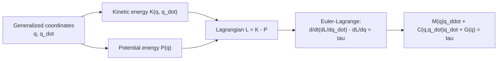

# Robot Dynamics and Control — Unit 3: Dynamic Modeling

Unit 2 gave you the physics of one rigid body. This unit shows how to combine that across a chain of connected links to get the full equations of motion for a simple robotic system — the model that every controller in this course (and most controllers you'll meet outside it) is built on top of.

The flowchart below traces the Euler-Lagrange derivation from generalized coordinates to the final manipulator equation of motion.



## The Euler-Lagrange approach
Rather than tracking forces and torques link by link (Newton-Euler, from Unit 2), the Lagrangian approach derives equations of motion from a single scalar function, the Lagrangian `L = K - P` (total kinetic energy minus total potential energy of the whole system, both expressed in terms of the generalized coordinates `q` and their derivatives `q_dot`). The equations of motion drop out of:

```
d/dt (dL/dq_dot) - dL/dq = tau
```

applied once per generalized coordinate (once per joint). It's more algebra up front than Newton-Euler for a computer to grind through automatically, but it's usually easier for a human to do by hand for a small system, because you only ever have to write down two scalar energy expressions instead of tracking vector forces at every joint.

## Kinetic and potential energy of a manipulator
For a manipulator, total kinetic energy is the sum over links of `(1/2) * m_i * v_i^2 + (1/2) * omega_i^T * I_i * omega_i` (translational plus rotational kinetic energy per link), where `v_i` and `omega_i` are each link's center-of-mass linear and angular velocity — both of which are functions of `q` and `q_dot` through the manipulator's kinematics. Total potential energy is just gravitational: `P = sum(m_i * g * h_i(q))`, where `h_i(q)` is the height of link `i`'s center of mass, itself a function of joint angles. Notice that both `K` and `P` are expressed purely in terms of `q` and `q_dot` — this is the payoff of the Lagrangian method: you never have to reason about internal joint reaction forces directly.

## The manipulator equation: M(q), C(q, q_dot), G(q)
Grinding through the Euler-Lagrange equations for a chain of links always produces an equation of the same structural form:

```
M(q) * q_ddot + C(q, q_dot) * q_dot + G(q) = tau
```

- `M(q)` — the (symmetric, positive-definite) mass/inertia matrix. Configuration-dependent because the arm's effective inertia as seen at each joint changes with pose (a straightened arm feels "lighter" to rotate at the shoulder than a folded one).
- `C(q, q_dot)` — Coriolis and centripetal terms, capturing how motion of one joint couples into apparent forces on another. Quadratic in `q_dot` — negligible at low speeds, significant at high speeds.
- `G(q)` — gravity torque vector, the same quantity you estimated informally in Unit 1.

This is the model every controller in Units 4-5 either compensates for (feedback) or explicitly cancels (feedforward/computed-torque, briefly touched on in Unit 4).

## Worked example: a 1-link pendulum-arm
A single revolute joint carrying a rod of mass `m`, length `l`, with all mass concentrated at the tip (a common simplification), swinging under gravity `g`. Kinetic energy: `K = (1/2) * m * l^2 * q_dot^2`. Potential energy (measuring height from the pivot): `P = m * g * l * cos(q)` for `q` measured from the downward vertical. Applying Euler-Lagrange:

```
d/dt (dL/dq_dot) - dL/dq = tau
m * l^2 * q_ddot + m * g * l * sin(q) = tau
```

So `M(q) = m*l^2` (constant here, since there's only one link), `C = 0` (no coupling with only one joint), and `G(q) = m*g*l*sin(q)`. In Python:

```python
import numpy as np

def equations_of_motion(q, q_dot, tau, m=1.0, l=0.5, g=9.81):
    M = m * l**2
    G = m * g * l * np.sin(q)
    q_ddot = (tau - G) / M
    return q_ddot
```

Simulate this with `tau=0` starting near `q = pi/2` (horizontal) and you'll see the pendulum swing down and oscillate, exactly matching the intuition from Unit 1.

## Try it yourself
Extend `equations_of_motion` to a 2-link planar arm (two revolute joints, both masses lumped at each link's tip) using the standard textbook result `M(q)` has an off-diagonal term proportional to `cos(q2)`, and `C`, `G` each have two components. You don't need to derive it from scratch — look up the standard 2-link planar RR arm equations of motion (Spong, Hutchinson & Vidyasagar's *Robot Modeling and Control* has the full derivation) and implement them as a Python function `def eom_2link(q, q_dot, tau, m1, m2, l1, l2, g=9.81)`. Confirm that with `q2 = 0` (arm fully extended) the effective inertia at joint 1 is larger than with `q2 = pi` (arm folded back on itself).
