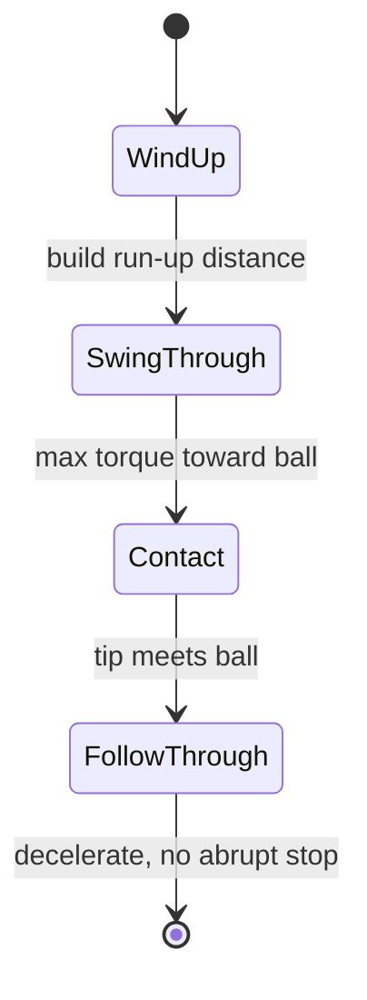

# Robot Dynamics and Control — Unit 5: Project. Ball Kicking

This project pulls together every previous unit into one concrete task: program a dynamic controller for a 2-link arm (RRBot — "Revolute-Revolute Robot", a standard teaching model in Gazebo/ROS tutorials) that swings its tip through a ball resting on the floor, kicking it forward.

The state diagram below shows the three-phase motion the kicking controller must drive the arm through in sequence.



## Understanding the RRBot arm
RRBot is a planar 2-link, 2-joint arm mounted on a fixed base, with both joints revolute — mechanically identical to the 2-link arm you extended the equations of motion for in Unit 3's "Try it yourself." If you're working in simulation, RRBot ships as a standard example URDF/SDF in many ROS/Gazebo tutorial packages; if you don't have a simulator set up, the same task works perfectly well against your own Python equations-of-motion model from Unit 3, treating "kicking" as a purely dynamics/control problem and checking the outcome analytically (tip velocity and position at the moment of contact) rather than visually. Either way, the two things you need before writing any control code are: (1) `M(q), C(q,q_dot), G(q)` for this specific arm (masses, link lengths — either from the URDF's `<inertial>` tags or your own assumed values), and (2) the forward kinematics mapping `q -> (x_tip, y_tip)` so you know where the ball needs to be for the tip to reach it.

## Planning the kicking motion
A kick is not a balance task (Unit 4) — it's a trajectory-tracking task where the goal is to arrive at the ball's location with high tip *velocity*, not to hold still there. Break the motion into three phases: (1) a wind-up, moving the arm away from the ball to build a run-up distance; (2) a swing-through, accelerating hard toward and past the ball's position; (3) a follow-through, decelerating after contact rather than commanding an abrupt stop. A simple way to generate phase 2 is a minimum-time or maximum-torque profile: apply the largest torque the "motors" can deliver (respecting whatever torque limit you decide the arm has) in the direction of the swing for as long as possible, since the goal is speed at the target angle, not smoothness. Compute the required joint velocities at the moment of contact by inverting the forward-kinematics Jacobian relationship `v_tip = J(q) * q_dot` for your desired `v_tip` (magnitude and direction you want the tip moving when it reaches the ball).

## Implementing the torque controller
With a target trajectory (a sequence of desired `q(t), q_dot(t)` from the planning step) in hand, drive the arm along it using a PD-plus-gravity-compensation controller — the same principle from the Robot Control Basics course's PID unit, but now with an explicit feedforward term computed from your Unit 3 model:

```python
def kick_controller(q, q_dot, q_des, q_dot_des, m1, m2, l1, l2, g=9.81,
                     Kp=np.diag([80, 80]), Kd=np.diag([10, 10])):
    G = gravity_vector(q, m1, m2, l1, l2, g)      # from your Unit 3 model
    e, e_dot = q_des - q, q_dot_des - q_dot
    tau = Kp @ e + Kd @ e_dot + G                  # PD + gravity feedforward
    return tau
```

Gravity compensation matters more here than in a slow tracking task: during the fast swing-through phase you want essentially all your torque budget going into acceleration, not fighting a drooping arm. Clip `tau` to your assumed torque limits and check afterward whether the trajectory you planned was actually achievable — if the controller saturates for a large fraction of the swing, the plan was too aggressive for the "motors" you specified.

## Testing and iterating
Judge success by three numbers at the moment the tip passes the ball's `(x, y)` position: tip speed (did the kick have enough power), tip direction (did it kick forward, not sideways or into the ground), and timing accuracy (did the arm arrive at the ball's position at all, or overshoot/undershoot it). If you're in a simulator, add a simple contact/collision check with a ball object and read back its resulting velocity as a second confirmation. If you're purely analytical, compute the ball's expected launch velocity from an idealized elastic/inelastic collision model given your tip velocity at contact and compare it against the target you planned for in step 2. Iterate on the wind-up distance, the torque limits, and the PD gains — this is the same tuning loop as any other real controller, just judged against a task-specific success metric instead of a generic tracking-error plot.

## Try it yourself
Using your Unit 3 two-link equations of motion, implement `kick_controller` above along with a simple three-phase reference trajectory (wind-up angle, swing-through target angle and desired tip speed, small follow-through). Simulate the closed loop with `scipy.integrate.solve_ivp` and plot tip x-velocity over time. Tune `Kp`/`Kd` and the wind-up distance until the tip reaches at least 2 m/s in the forward direction at the ball's location — then note how much torque that required, and check it against a torque limit you'd consider realistic for a small desktop arm (a few N·m per joint).
