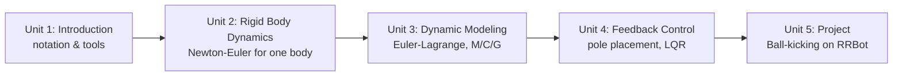

# Robot Dynamics and Control

Kinematics tells you how a robot's joints relate to where it ends up; dynamics tells you *why* it moves that way and what torques you have to supply to make it happen. This course builds that missing piece step by step — starting from Newton's and Euler's laws for a single rigid body, assembling them into the full equations of motion for a simple manipulator, using those equations to design a full-state feedback controller that can hold an unstable system balanced, and finally applying the whole pipeline to a hands-on project: programming a two-link arm to kick a ball.

The diagram below shows how each unit's model builds directly on the one before it, in the order you should work through them.

1. [Introduction](01-introduction.md) — Course objectives, the kinematics-vs-dynamics distinction, notation, and the tools used throughout.
2. [Rigid Body Dynamics](02-rigid-body-dynamics.md) — Solving for the motion of rigid bodies in 3D space with Newton's and Euler's laws.
3. [Dynamic Modeling](03-dynamic-modeling.md) — Deriving the equations of motion for a simple robotic system via the Euler-Lagrange method.
4. [Feedback Control](04-feedback-control.md) — Designing a full-state feedback controller (pole placement, LQR) so a robotic system can balance.
5. [Project. Ball Kicking](05-project-ball-kicking.md) — Programming a dynamic controller for the RRBot arm to kick a ball on the floor.
